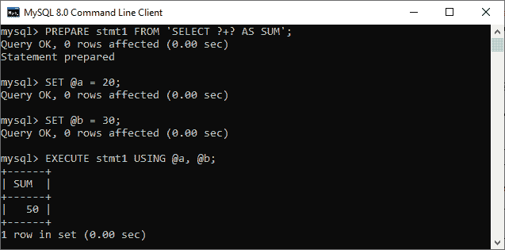
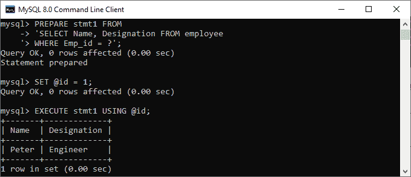
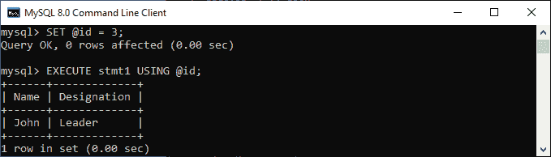
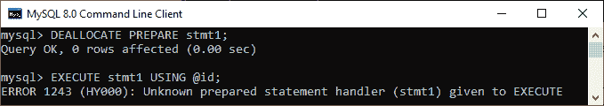
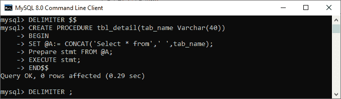
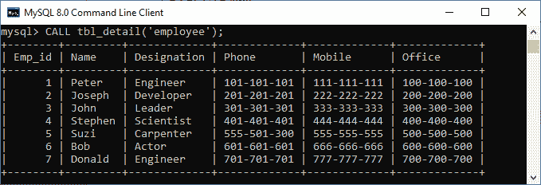

# MySQL 准备声明

> 原文：<https://www.javatpoint.com/mysql-prepared-statement>

在 [MySQL 版本](https://www.javatpoint.com/mysql-versions) 4.1 之前，每个查询都是以文本格式发送到 MySQL Server，并使用文本协议，将数据返回给客户端。在将结果返回给客户端之前，MySQL 已经完全解析了查询，并将结果集转换为一个**字符串**。这里，解析意味着提交的查询在语法和语义上得到验证，权限也得到验证。

向客户端返回数据的文本协议存在严重的性能问题。为了克服这个问题，从 4.1 版本开始，MySQL 提供了一个名为 prepared statement 的新特性。

**利用准备好的语句或参数化语句，高效地重复执行相同的语句**。它利用了客户机/服务器二进制协议。Prepared 语句传递包含**占位符(？)**到 MySQL Server。请参见下面的示例:

```sql

mysql> SELECT * FROM student WHERE studentId = ?; 

```

当 MySQL 使用 **studentId** 的不同值执行上述语句时，它无法完全解析该语句。因此， [MySQL](https://www.javatpoint.com/mysql-tutorial) 执行语句的速度会更快，尤其是多次执行同一个查询的时候。

准备好的语句包含占位符(？)，这有助于避免许多 [SQL](https://www.javatpoint.com/sql-tutorial) 注入变体，并使我们的应用程序更加安全。

## 准备报表的优势

以下是 MySQL 中准备好的语句的优点:

*   我们可以多次重复执行准备好的语句。
*   每次执行时，都会计算绑定变量的当前值并将其发送到服务器。不会再次分析该语句。语句模板不会再次传输到服务器。

## 准备报表的基本工作流程

编制报表的基本工作流程主要包括两个阶段。但是，它有一个可选阶段，总结如下:

1.  准备
2.  执行
3.  解除分配(可选)

### 准备阶段

在准备阶段，一个**语句模板被发送到数据库服务器**。服务器执行语法检查并初始化内部服务器资源供以后使用。简而言之，它为执行准备了一个语句。

**语法**

以下是准备阶段的语法:

```sql

PREPARE stmt_name FROM preparable_stmt;

```

### 执行阶段

在执行阶段，**客户端绑定参数值并发送给服务器**。服务器从语句模板和绑定值创建一个语句，以使用以前创建的内部资源来执行它。简而言之，一旦准备好的语句准备好了查询，我们就可以执行该查询了。

**语法**

以下是执行准备好的语句的语法:

```sql

EXECUTE stmt_name [USING @var_name [, @var_name]....]

```

### 解除分配/删除阶段

是最后一个也是可选的阶段，用于**发布准备好的报表**。

**语法**

以下是解除分配准备好的语句的语法:

```sql

{DEALLOCATE | DROP} PREPARE stmt_name;

```

### 与准备报表相关的要点

*   在一个会话中创建的准备好的语句对其他会话不可用。这意味着准备好的语句是特定于会话的。
*   当会话正常或异常结束时，其准备好的语句不再存在于内存中。
*   在存储程序中创建的准备好的语句在程序完成执行后继续存在，以后可以在程序外执行。

### MySQL 准备语句示例

通过一些例子，让我们了解如何使用 MySQL 准备语句。

在这里，我们将直接在 PRESENT 语句的帮助下创建一个语句，如下所示:

```sql

mysql> PREPARE stmt1 FROM 'SELECT ?+? AS SUM';

```

接下来，我们将这两个值分配到两个变量中，这两个变量可用于占位符(？):

```sql

mysql> SET @a = 20;
mysql> SET @b = 30;

```

现在，我们可以在 execute 语句的帮助下执行查询:

```sql

mysql> EXECUTE stmt1 USING @a, @b;

```

执行后，我们将得到一个**和**的结果。请参见下图了解结果:



以下示例将使用包含以下数据的示例数据库中的**员工**表。


首先，我们准备一份报表，返回员工 **id** 指定的员工**姓名**和**称号**:

```sql

mysql> PREPARE stmt1 FROM 
'SELECT Name, Designation FROM employee 
WHERE Emp_id = ?';

```

接下来，我们需要声明一个名为 id 的变量，并将其值设置为“1”:

```sql

mysql> SET @id = 1;

```

现在，我们可以在 execute 语句的帮助下执行准备好的语句:

```sql

mysql> EXECUTE stmt1 USING @id;

```

执行后，我们将获得包含员工姓名和职务的结果。请参见下图了解查询执行:



同样，我们将为变量 id 分配另一个值:

```sql

mysql> SET @id = 3;

```

现在，使用新员工 id 执行准备好的语句。我们将看到如下输出:



最后，我们可以手动发布准备好的语句。但是，当会话关闭时，它们将被自动删除。

```sql

mysql> DEALLOCATE PREPARE stmt1;

```

如果我们在执行上述查询后尝试执行准备好的语句，我们将得到如下错误:



### 我们如何在存储过程中使用准备好的语句？

我们可以通过将准备好的语句写入 **BEGIN** 和 **END** 块来使用存储过程中的准备好的语句。我们可以通过创建一个示例来理解它，该示例通过将表的名称作为存储过程的参数传递来返回表中的所有记录。

按照以下方式创建存储过程:

```sql

DELIMITER $$  
CREATE PROCEDURE tbl_detail(tab_name Varchar(40))  
BEGIN  
SET @A:= CONCAT('Select * from',' ',tab_name);
Prepare stmt FROM @A;
EXECUTE stmt;
END$$  
DELIMITER ;  

```

请参见下图以执行存储过程:



创建成功后，我们可以通过指定表名作为参数**调用**这个过程。

```sql

mysql> CALL tbl_detail('employee');

```

它将显示该表的所有记录。请参见下图:



## 报表与准备报表

以下是 MySQL 中语句和准备好的语句之间的主要区别:

| 声明 | 准备的声明 |
| 当我们只想执行一次 SQL 查询时，就会用到它。 | 当我们想要多次执行 SQL 查询时，就会用到它。 |
| 它用于 DDL 语句。 | 它可以用于任何 SQL 查询。 |
| 它不能用来读写二进制数据。 | 它可以用来读写二进制数据。 |
| 它是静态的，这意味着我们不能在运行时传递参数。 | 它是动态的，这意味着我们可以在运行时传递参数。 |
| 执行的速度很慢。 | 执行性能快。 |
| 这并不妨碍 SQL 注入。 | 这有助于防止 SQL 注入袭击。 |
| 它使用文本协议进行通信。 | 它使用二进制协议进行通信。 |

## 存储过程与准备好的语句

以下是 MySQL 中存储过程和准备好的语句之间的主要区别:

| 存储过程 | 准备的声明 |
| 存储过程是访问关系数据库管理系统的一系列 SQL 语句。 | 准备好的语句是包含占位符而不是实际值的查询。 |
| 它可以存储在数据库服务器中。 | 它不能存储在数据库中。 |

* * *