# MySQL 存储过程

> 原文：<https://www.javatpoint.com/mysql-procedure>

过程(通常称为存储过程)是存储在数据库中的预编译的 SQL 语句的集合。它是常规计算语言中的子程序。**过程总是包含名称、参数列表和 SQL 语句**。我们可以使用触发器、其他过程和应用程序来调用过程，如 [Java](https://www.javatpoint.com/java-tutorial) 、 [Python](https://www.javatpoint.com/python-tutorial) 、 [PHP](https://www.javatpoint.com/php-tutorial) 等。最早是在 MySQL **第 5 版**中引入的。目前，几乎所有的关系数据库系统都支持它。

如果我们考虑企业应用程序，我们总是需要定期在数据库上执行特定的任务，如数据库清理、处理工资单等。这样的任务涉及多个 [SQL](https://www.javatpoint.com/sql-tutorial) 语句来执行每个任务。如果我们将这些任务组合成一个任务，这个过程可能会很容易。通过在数据库中创建一个存储过程，我们可以在 [MySQL](https://www.javatpoint.com/mysql-tutorial) 中满足这个要求。

当一个过程调用自己时，它被称为**递归存储过程**。大多数数据库系统支持递归存储过程。但是，它在 MySQL 中没有得到很好的支持。

### 存储过程功能

*   存储过程提高了应用程序的性能。一旦存储过程被创建，它们就被编译并存储在数据库中。
*   存储过程减少了应用程序和数据库服务器之间的流量。因为应用程序必须只发送存储过程的名称和参数，而不是发送多个 SQL 语句。
*   存储过程是可重用的，对任何应用程序都是透明的。
*   程序总是安全的。数据库管理员可以向访问数据库中存储过程的应用程序授予权限，而无需授予对数据库表的任何权限。

### 如何创建程序？

以下语法用于在 MySQL 中创建存储过程。它可以通过参数返回一个或多个值，或者有时根本不返回。默认情况下，过程与我们当前的数据库相关联。但是我们也可以通过将名称指定为**database _ name . procedure _ name**，从当前数据库创建到另一个数据库中。请参见完整的语法:

```

DELIMITER &&
CREATE PROCEDURE procedure_name [[IN | OUT | INOUT] parameter_name datatype [, parameter datatype]) ]  
BEGIN  
    Declaration_section  
    Executable_section  
END &&
DELIMITER ; 

```

### 参数说明

过程语法具有以下参数:

| 参数名称 | 描述 |
| 过程名 | 它表示存储过程的名称。 |
| 参数 | 它表示参数的数量。它可以是一个或多个。 |
| 声明 _ 部分 | 它表示所有变量的声明。 |
| 可执行部分 | 它表示函数执行的代码。 |

**MySQL 程序参数有三种模式之一:**

**输入参数**

这是默认模式。它接受一个参数作为输入，比如一个属性。当我们定义它时，调用程序必须向存储过程传递一个参数。此参数的值始终受到保护。

**输出参数**

它用于传递参数作为输出。它的值可以在存储过程中更改，更改后的(新)值会传递回调用程序。请注意，程序启动时无法访问输出参数的初始值。

**INOUT 参数**

它是输入和输出参数的组合。这意味着调用程序可以传递参数，过程可以修改 INOUT 参数，然后将新值传递回调用程序。

### 如何调用存储过程？

我们可以使用 **CALL 语句**来调用存储过程。该语句通过其参数(输入、输出或输入输出)将值返回给调用者。以下语法用于调用 MySQL 中的存储过程:

```

CALL procedure_name ( parameter(s))

```

### 例子

让我们通过例子来了解如何在 MySQL 中创建一个过程。首先，我们需要选择一个数据库来存储新创建的过程。我们可以使用以下语句选择数据库:

```

mysql> USE database_name;

```

假设这个数据库有一个名为 **student_info** 的表，其中包含以下数据:

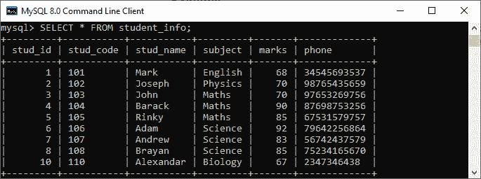

### 无参数过程

假设我们希望**显示这个表中所有标记大于 70 的记录**，并统计所有的表行。下面的代码创建了一个名为**的过程:**

```

DELIMITER &&
CREATE PROCEDURE get_merit_student ()
BEGIN
	SELECT * FROM student_info WHERE marks > 70;
	SELECT COUNT(stud_code) AS Total_Student FROM student_info;  
END &&
DELIMITER ;

```

如果该代码成功执行，我们将获得以下输出:

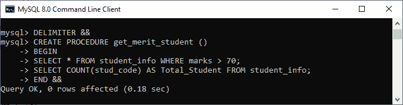

让我们调用过程来验证输出:

```

mysql> CALL get_merit_student();

```

它将给出如下输出:

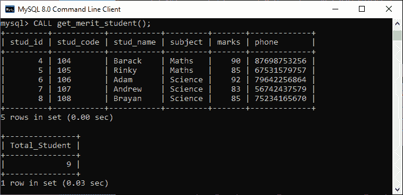

### 带输入参数的程序

在这个过程中，我们使用了整数类型的 In 参数作为 **'var1** '来接受来自用户的数字。它的主体部分使用 [**SELECT** 语句](https://www.javatpoint.com/mysql-select)从表中获取记录，并且只返回那些将由用户提供的行。它还返回指定表的总行数。请参见程序代码:

```

DELIMITER &&
CREATE PROCEDURE get_student (IN var1 INT)
BEGIN
	SELECT * FROM student_info LIMIT var1;
	SELECT COUNT(stud_code) AS Total_Student FROM student_info;  
END &&
DELIMITER ;

```

成功执行后，我们可以按如下方式调用该过程:

```

mysql> CALL get_student(4);

```

我们将获得以下输出:

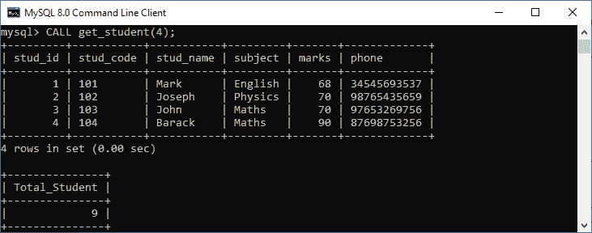

### 带输出参数的程序

在此过程中，我们使用了 OUT 参数作为整数类型的**“最高标记”**。其主体部分使用**最大()功能**从表格中获取最大标记。请参见程序代码:

```

DELIMITER &&
CREATE PROCEDURE display_max_mark (OUT highestmark INT)
BEGIN
	SELECT MAX(marks) INTO highestmark FROM student_info; 
END &&
DELIMITER ;

```

该程序的参数将从**学生信息**表中获得最高分。当我们调用过程时，OUT 参数告诉数据库系统它的值从过程中输出。现在，我们将它的值传递给 CALL 语句中的会话变量 **@M** ，如下所示:

```

mysql> CALL display_max_mark(@M);
mysql> SELECT @M;

```

以下是输出:

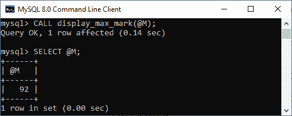

### 带输入输出参数的程序

在此过程中，我们使用 INOUT 参数作为整数类型的**‘var1’**。它的主体部分首先用指定的 **id** 从表中获取标记，然后将其存储到同一个变量 var1 中。var1 首先作为输入参数，然后作为输出参数。因此，我们可以称之为 INOUT 参数模式。请参见程序代码:

```

DELIMITER &&
CREATE PROCEDURE display_marks (INOUT var1 INT)
BEGIN
	SELECT marks INTO var1 FROM student_info WHERE stud_id = var1; 
END &&
DELIMITER ;

```

成功执行后，我们可以按如下方式调用该过程:

```

mysql> SET @M = '3';
mysql> CALL display_marks(@M);
mysql> SELECT @M;

```

我们将获得以下输出:

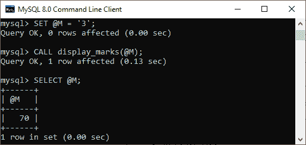

### 如何在 MySQL 中显示或列出存储过程？

当我们在 MySQL 服务器中有几个过程时，列出所有的过程是非常重要的。这是因为在许多数据库中，有时过程名是相同的。在这种情况下，这个查询非常有用。我们可以列出当前 MySQL 服务器上存储的所有过程，如下所示:

```

SHOW PROCEDURE STATUS [LIKE 'pattern' | WHERE search_condition]

```

**该语句显示所有存储过程名称，包括它们的特征**。如果我们想在特定的数据库中显示过程，我们需要使用[**WHERE 子句**](https://www.javatpoint.com/mysql-where)**。如果我们想用一个特定的词列出存储过程，我们需要使用 [**LIKE** 子句](https://www.javatpoint.com/mysql-like)。**

 **我们可以使用下面的语句列出 MySQL **mystudentsb** 数据库中的所有存储过程:

```

mysql> SHOW PROCEDURE STATUS WHERE db = 'mystudentdb';

```

它将给出下面的输出，我们可以看到 mystudentdb 数据库包含**四个存储过程**:

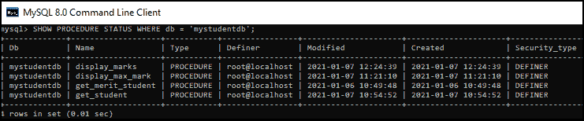

### 如何删除/删除 MySQL 中的存储过程？

MySQL 还允许命令删除该过程。当删除该过程时，它也会从数据库服务器中删除。以下语句用于删除 MySQL 中的存储过程:

```

DROP PROCEDURE [ IF EXISTS ] procedure_name;  

```

假设我们想从 mystudentdb 数据库中删除名为 **display_marks** 的过程。我们可以这样做，首先选择数据库，然后使用如下语法删除该过程:

```

mysql> DROP PROCEDURE display_marks;

```

我们可以通过使用**显示程序状态**命令在指定的数据库中列出程序来验证。请参见以下输出:

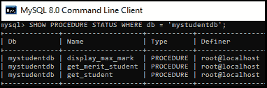

### 如何在 MySQL 工作台创建一个过程？

我们首先启动工具，使用用户名和密码登录，在 [MySQL 工作台](https://www.javatpoint.com/mysql-workbench)中创建程序。现在，我们需要执行以下步骤来创建存储过程:

1.转到**导航选项卡**并点击**模式菜单**，其中所有先前创建的数据库都可用。选择您想要的数据库(例如，**雇员 b** )。它将弹出以下选项。

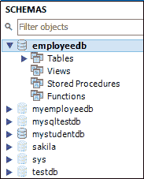

2.右键点击**存储过程**，我们会得到默认的过程代码。请参见下面的屏幕:

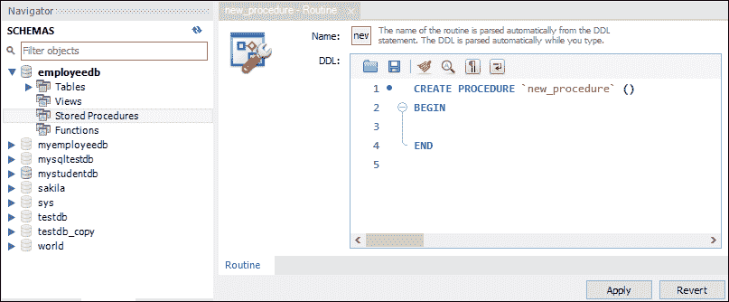

3.完成程序代码，点击**应用按钮**。在下一个窗口中，我们将再次检查过程代码，如果没有发现错误，请单击“应用”按钮。

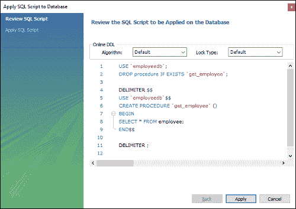

4.点击应用按钮后，点击**完成**按钮完成。

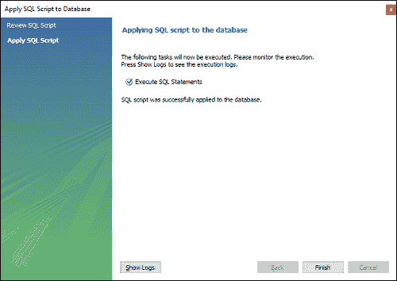

5.我们可以再次导航到模式菜单来验证这个新创建的过程。这意味着首先选择您的数据库并展开它以显示其子菜单。在**子菜单**中，展开存储过程选项将显示新创建的过程。请参见下图:

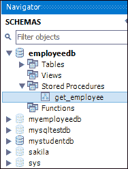

6.我们可以通过点击红色的矩形框来调用这个过程，或者简单地执行 call 语句。

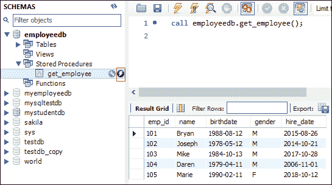

### 如何改变 MySQL 中的过程？

MySQL 不允许任何命令改变 MySQL 中的过程。但是，它提供了一个用于更改存储过程特性的命令。此命令可能会更改过程中的多个更改，但不会修改存储过程的参数或主体。如果我们想要进行这样的更改，我们必须使用 DROP PROCEDURE 和 CREATE PROCEDURE 语句**删除并重新创建过程**。

**以下语句用于改变一个程序的特性，而不是实际的程序**:

```

ALTER PROCEDURE procedure_name [characteristics ...]

characteristics: {
    COMMENT 'string'
  | LANGUAGE SQL
  | { CONTAINS SQL | NO SQL | READS SQL DATA | MODIFIES SQL DATA }
  | SQL SECURITY { DEFINER | INVOKER }
}

```

假设我们想要**给现有的过程添加一个注释**。在这种情况下，我们可以使用如下的 **ALTER** 语句来完成这个任务:

```

mysql> ALTER PROCEDURE get_merit_student
COMMENT 'It displays all records';

```

执行此语句后，我们可以使用以下语句进行验证:

```

mysql> SHOW CREATE PROCEDURE get_merit_student \G;

```

它将显示下面的输出，我们可以看到**注释**添加成功。

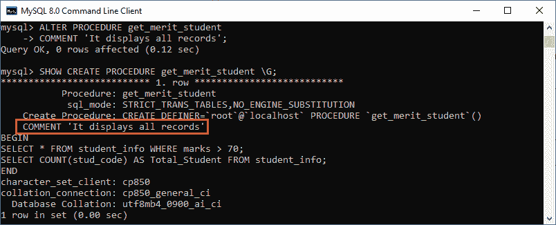

需要注意的是**我们可以使用工作台工具**在 MySQL 中修改存储过程的主体。所以打开这个工具，导航到模式菜单，展开包含存储过程的数据库。现在，选择您的程序，右键单击它并选择**更改存储过程**选项。请参见下面的屏幕:

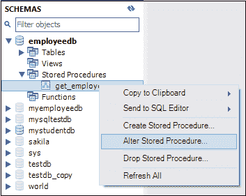

单击此选项后，我们将获得一个包含过程代码的窗口。请参见下面包含程序代码的屏幕，以显示所有员工:

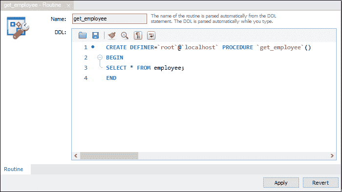

现在，我们将修改这段代码。假设我们只想显示男性员工。为此，我们可以从下面的代码中更改该代码，并点击**应用按钮**:

```

SELECT * FROM employee WHERE gender = 'M';

```

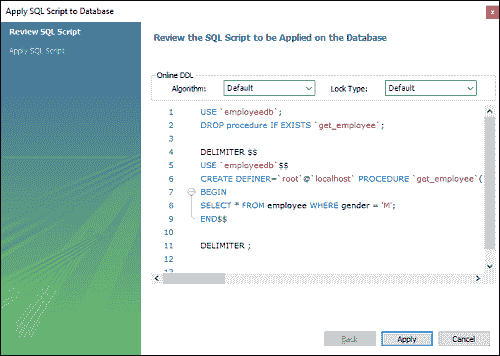

在该窗口中，我们将再次检查程序代码，如果没有发现错误，单击**应用- >应用- >完成**按钮完成该过程。

### 使用存储过程的缺点

*   如果我们使用存储过程，那么使用这些存储过程的每个连接的内存使用量都会大大增加。此外，如果我们过度使用存储过程中的许多逻辑应用程序，CPU 的使用将会增加。这是因为数据库服务器没有很好地设计用于逻辑操作。
*   存储过程的构造不是为了开发复杂而灵活的业务逻辑而设计的。
*   调试存储过程很困难。只有少数数据库管理系统允许我们调试存储过程。不幸的是，MySQL 不提供调试存储过程的工具。
*   开发和维护存储过程并不容易。开发和维护存储过程通常需要一套专业技能，但并非所有应用程序开发人员都具备这一技能。它可能会导致应用程序开发和维护阶段出现问题。

* * ***