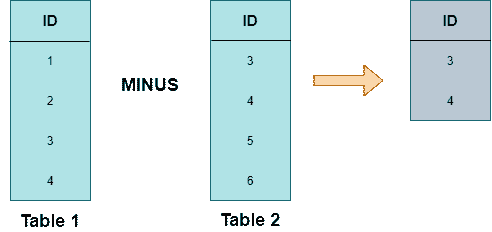
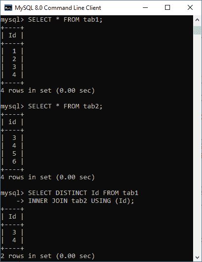
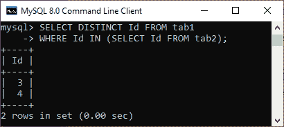

# MySQL INTERSECT

> 原文：<https://www.javatpoint.com/mysql-intersect>

交集运算符是 SQL 中的一种集合运算，包括联合、联合所有、减和交集。**INTERSECT 运算符从两个或多个表**中返回两组或公共记录中的不同(公共)元素。换句话说，它比较两个查询获得的结果，并生成唯一的行，这是两个查询返回的结果。

### 句法

以下是说明 INTERSECT 运算符使用的语法:

```

SELECT column_lists FROM table_name WHERE condition
INTERSECT
SELECT column_lists FROM table_name WHERE condition; 

```

#### 注意:MySQL 不支持 INTERSECT 操作符。本文向我们展示了如何在 MySQL 中使用 JOin 和 IN 子句模拟 INTERSECT 查询。

**以下是使用 INTERSECT 运算符的查询规则:**

*   所有 SELECT 语句中的列数和顺序必须相同。
*   两个 SELECT 语句中相应列的数据类型必须相同或可转换。

我们可以用下面的可视化表示来理解 INTERSECT 运算符。在这里，该运算符比较两个查询获得的结果，并从两个查询中仅生成不同的行:



### MySQL INTERSECT 算子的仿真

由于 [MySQL](https://www.javatpoint.com/mysql-tutorial) 不支持 INTERSECT 操作符。但是，我们可以使用[](https://www.javatpoint.com/mysql-inner-join)**和 [**IN 子句**](https://www.javatpoint.com/mysql-in) 来模拟这个运算符。**

 **让我们首先用下面的结构创建**两个表**来理解 INTERSECT 运算符:

**表 1 结构和数据:**

```

mysql> CREATE TABLE tab1 (
    Id INT PRIMARY KEY
);

mysql> INSERT INTO tab1 VALUES (1), (2), (3), (4);

```

**表 2 结构及数据:**

```

mysql> CREATE TABLE tab2 (
    id INT PRIMARY KEY
);

mysql> INSERT INTO tab2 VALUES (3), (4), (5), (6);

```

### 使用 DISTINCT 和 INNER JOIN 子句的交集运算符

以下语句使用 [DISTINCT](https://www.javatpoint.com/mysql-distinct) 运算符和 INNER JOIN 子句从两个表中返回不同的行:

```

mysql> SELECT DISTINCT column_list FROM table_name1
INNER JOIN table_name2 USING(join_condtion);

```

**示例:**

```

mysql> SELECT DISTINCT Id FROM tab1
INNER JOIN tab2 USING (Id);

```

**输出:**

执行上述查询后，我们应该得到如下图所示的输出:



### 使用输入和子查询的交集运算符

以下语法使用 IN 和子查询子句从两个表中返回不同的行:

```

mysql> SELECT DISTINCT column_list FROM table_name1
WHERE column_name IN (SELECT column_list FROM table_name2);

```

**示例:**

```

mysql> SELECT DISTINCT Id FROM tab1
WHERE Id IN (SELECT Id FROM tab2);

```

**输出:**

执行上述查询后，我们应该得到如下图所示的输出:



* * ***