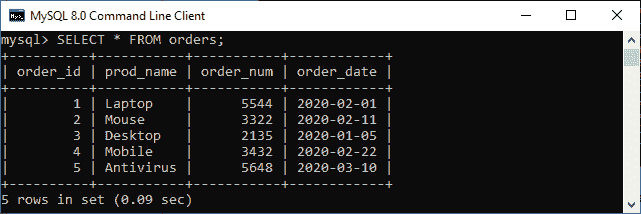
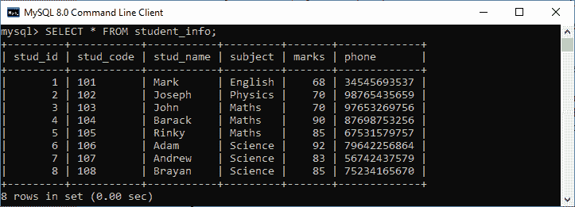
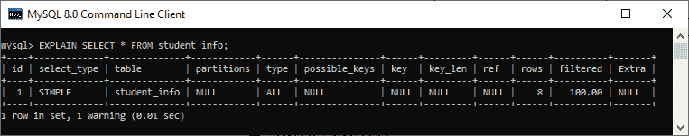
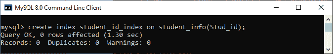
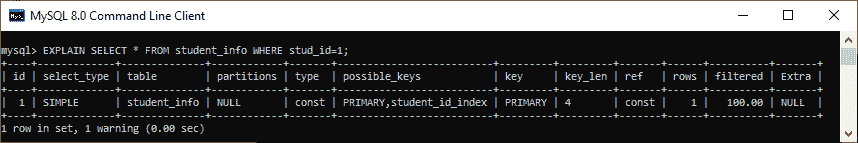
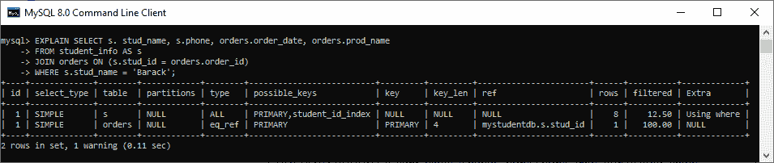
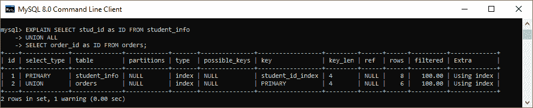
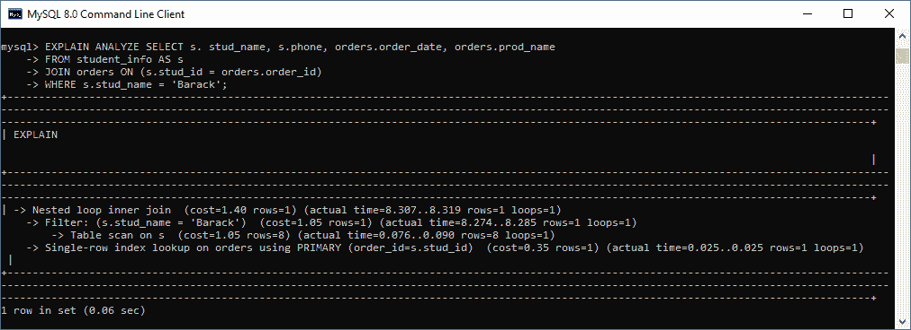

# MySQL DELAY

> 原文：<https://www.javatpoint.com/mysql-explain>

解释关键字是**，用于获取关于我们的 SQL 数据库如何在 MySQL** 中执行查询的信息。它是 DESCRIBE 语句的同义词。实际上，description 关键字提供了表结构信息，而 EXPLAIN 关键字给出了查询执行计划。它是理解和优化 [MySQL](https://www.javatpoint.com/mysql-tutorial) 中查询的强大工具，但是开发人员很少使用它。

它可以与 [INSERT](https://www.javatpoint.com/mysql-insert) 、 [SELECT](https://www.javatpoint.com/mysql-select) 、 [DELETE](https://www.javatpoint.com/mysql-delete) 、 [UPDATE](https://www.javatpoint.com/mysql-update) 、 [REPLACE 查询](https://www.javatpoint.com/mysql-replace)一起工作。从**到 MySQL 8.0.19 及更高版本**，也可以使用 TABLE 语句。当我们在查询中使用这个关键字时，它将处理语句并提供关于执行计划中每个步骤的信息，例如表是如何连接的、表的顺序、估计的分区等。它返回解释执行计划的每个部分和执行顺序的单行或多行。

让我们借助一个例子来理解它。

### 例子

假设样本数据库中有一个名为“ **student_info** ”和“ **orders** ”的表，其中包含以下数据:




如果我们想要显示一个 **SELECT 语句**的执行计划，我们可以使用如下查询:

```sql

mysql> EXPLAIN SELECT * FROM student_info;

```

**输出:**

该查询产生以下信息:



有时我们不想扫描整个表格。在这种情况下，我们需要使用 INDEX 来查看基于指定条件的信息。执行以下语句在 student_info 表中创建一个索引:

```sql

mysql> create index student_id_index on student_info(stud_id);

```

如果索引创建成功，它将产生以下输出:



现在，执行以下查询以避免数据库中的完整表扫描:

```sql

mysql> EXPLAIN SELECT * FROM student_info WHERE stud_id = 1;

```

它将产生如下图所示的输出:



```sql

EXPLAIN SELECT s. stud_name, s.phone, orders.order_date, orders.prod_name
FROM student_info AS s
JOIN orders ON (s.stud_id = orders.order_id)
WHERE s.stud_name = 'Barack';

```

**输出:**

执行后，我们将获得如下图所示的输出:



在上面的输出中，我们可以看到两个表的 select_type 都是 SIMPLE。两个表都遵循一对多关系。student_info 表的主键被用作 orders 表的外键。因此，第二行的可能 _ keys 值是 order_id。学生信息表第一行的过滤值是 12.50%，因为“巴拉克”是该表的第四个条目。对于订单表，第二行中的筛选值为 100%。这是因为必须检查 orders 表的所有值才能检索数据。

### 使用联合所有运算符解释选择查询中的关键字

UNION ALL 是一个运算符，它在使用 SELECT 查询时从相关表中返回所有具有重复项的匹配列值。下面的语句显示了在 student_info 和 orders 表之间使用 [UNION ALL](https://www.javatpoint.com/mysql-union-vs-union-all) 运算符的解释输出。

```sql

EXPLAIN SELECT stud_id as ID FROM student_info
UNION ALL
SELECT order_id as ID FROM orders;

```

**输出:**

它将产生下面的输出，我们可以看到第二行的 select_type 的值是 UNION，而 Extra 列的值是 index:



### MySQL 解释关键字限制

以下是 MySQL 中 DELAY 关键字最常见的限制:

*   解释没有提供任何关于触发器、存储函数或 UDF 将如何影响我们的查询的信息。
*   解释关键字不能用于存储过程。
*   它没有告诉你 MySQL 在查询执行过程中所做的优化。
*   它产生的估计统计数据可能非常不准确。
*   它不会生成关于查询执行计划的所有信息。

### MySQL 解释分析

这是一个查询分析工具，它显示了关于 MySQL 在查询执行上花费的时间以及原因的信息。它将计划查询、检测查询并执行查询，同时对行进行计数并测量在执行计划的不同点花费的时间。当执行完成时，它将打印计划和测量，而不是查询结果。

**示例:**

```sql

EXPLAIN ANALYZE SELECT s. stud_name, s.phone, orders.order_date, orders.prod_name
FROM student_info AS s
JOIN orders ON (s.stud_id = orders.order_id)
WHERE s.stud_name = 'Barack'; 

```

**输出:**



* * *