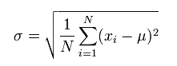
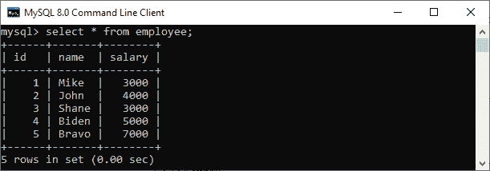
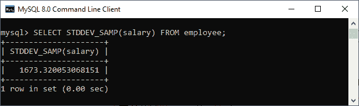
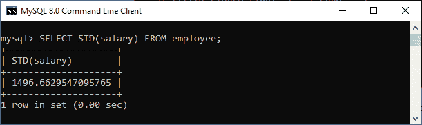
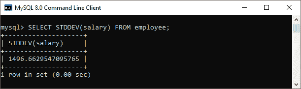
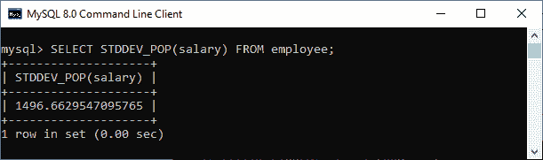

# MySQL 标准偏差

> 原文：<https://www.javatpoint.com/mysql-standard-deviation>

标准偏差是**统计量，测量一组值相对于平均值**的变化或离散的数量。当数据点远离平均值时，标准差较高。因此，数据越分散，其标准差就越大。当标准差较低时，意味着数值更接近平均值。它还测量了与平均值之间的差异。

标准偏差也可以定义为方差的平方根。我们可以使用以下几点计算标准偏差:

1.  通过计算数据集中所有值的平均值来求平均值。例如，如果我们有一个包含值 2、4 和 6 的数据集，则平均值为(2+4+6)/3 = 4。
2.  接下来，对于每个值，计算平均值的差值，然后对每个结果进行平方。例如，(2-4) <sup>2</sup> = (-2) <sup>2</sup> = 4，(4-4) <sup>2</sup> = (0) <sup>2</sup> = 0，(6-4) <sup>2</sup> = (2) <sup>2</sup> = 4。
3.  接下来，根据步骤 2 中的值计算平均值，得出方差。例如((4+0+4)/3)= 5.333333333。
4.  最后，取在数据集中产生标准差的方差的平方根。例如，(5.33333333)的平方根= 2.3094010768。

### 样本标准偏差与总体标准偏差

当计算中仅使用几个或一个子集的值时，标准偏差称为**样本标准偏差**。

当计算中使用所有数据集值时，标准偏差称为**总体标准偏差**。

标准差用**σ字母(σ)符号**表示。请参见下面的等式，解释我们如何计算样本标准偏差和总体标准偏差:

**简单标准差的公式:**


**总体标准差的方程:**



在上面的等式中，N 是数据集中可用的值的数量。

## MySQL 标准偏差函数

[MySQL](https://www.javatpoint.com/mysql-tutorial) 提供了一个函数，让我们可以方便快捷的计算样本标准差和总体标准差。MySQL 从**5.6 版和更高版本**支持这些功能。

**如果要计算样本标准差，可以使用下面的函数:**

### STDDEV_SAMP()函数

此函数用于返回表达式的样本标准差(VAR_SAMP()的平方根)。如果没有找到匹配的行，该函数返回**空值**。

我们可以如下使用这个函数:

```sql

STDDEV_SAMP(expr);

```

### 示例:

假设我们有一个名为“**员工**”的表，其中包含以下数据:



以下语句计算雇员表中工资的样本标准偏差:

```sql

mysql> SELECT STDDEV_SAMP (salary) FROM employee;

```

**输出:**

我们将得到以下结果:



**如果要计算总体标准差，可以使用以下函数:**

### 标准()功能

此函数用于返回给定表达式的总体标准差。它是 STDDEV _ POP()函数的同义词。如果没有找到匹配的行，STD()函数将返回**空值**。

我们可以如下使用这个函数:

```sql

STD(expr);

```

### 示例:

以下语句计算员工表中薪资的总体标准偏差:

```sql

mysql> SELECT STD(salary) FROM employee;

```

**输出:**

我们将得到以下结果:



### STDDEV()函数

此函数用于通过计算给定表达式的统计信息来返回总体标准差。如果没有找到匹配的行，STDDEV()函数返回**空值**。

我们可以如下使用这个函数:

```sql

STDDEV(expr);

```

### 示例:

以下语句计算雇员表中工资的样本标准偏差:

```sql

mysql> SELECT STDDEV(salary) FROM employee;

```

**输出:**

我们将得到以下结果:



### STDDEV_POP()函数

此函数用于返回给定表达式的总体标准差(VAR_POP()的平方根)。如果没有找到匹配的行，STDDEV _ POP()函数返回**空值**。

我们可以如下使用这个函数:

```sql

STDDEV_POP(expr);

```

### 示例:

以下语句计算雇员表中工资的样本标准偏差:

```sql

mysql> SELECT STDDEV_POP(salary) FROM employee;

```

**输出:**

我们将得到以下结果:



* * *