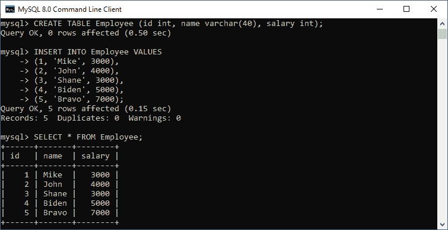
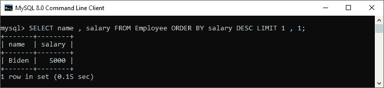
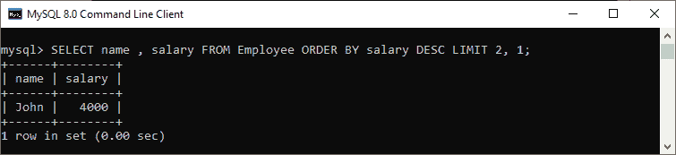
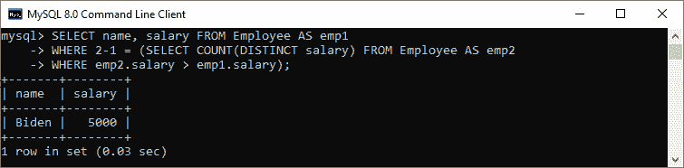

# 如何在 MySQL 中选择第 n 个最高记录

> 原文：<https://www.javatpoint.com/select-nth-highest-record-in-mysql>

在本节中，我们将学习如何在各种技术的帮助下选择数据库表中的第 n 个最高记录。

通过使用 **[MAX()](https://www.javatpoint.com/mysql-max) 或 [MIN()函数](https://www.javatpoint.com/mysql-min)** ，我们可以非常容易地获得数据库表中的最大(最高)或最小(最低)记录。但是假设我们想从表中获得第 n 个最高记录(例如**，从员工表中获得第二贵的工资)。在这种情况下，没有可用的功能来快速找到它，这使得它变得复杂。**

 **通过执行以下步骤，我们可以在 [MySQL](https://www.javatpoint.com/mysql-tutorial) 数据库表中选择第 n 个最高记录:

1.第一步是**按照升序**对所需的列进行排序，得到 n 个最高记录，这是结果输出中的最后一个记录。请参见下面的查询:

```

SELECT * FROM table_name ORDER BY colm_name ASC LIMIT N;

```

2.之后，我们需要**按照降序**对结果输出进行排序，得到第一条记录。

```

SELECT * FROM (
SELECT * FROM table_name 
ORDER BY colm_name ASC LIMIT N) AS temp_table
ORDER BY colm_name DESC LIMIT 1;

```

上述查询也可以通过使用 **LIMIT** 子句重写，该子句将结果输出中的行数约束如下:

```

SELECT  * FROM table_name ORDER BY colm_name DESC LIMIT n - 1, 1;

```

该查询将返回第 n 个最高记录 **n-1 行**之后的第一行。

### 示例:

让我们借助一个例子来了解如何从表中获取第 n 个最高记录。首先，我们将使用下面的查询创建一个**员工**表:

```

CREATE TABLE Employee (id int, name varchar(40), salary int);

```

接下来，使用以下查询插入记录:

```

INSERT INTO Employee VALUES 
(1, 'Mike', 3000),
(2, 'John', 4000),
(3, 'Shane', 3000),
(4, 'Biden', 5000),
(5, 'Bravo', 7000);

```

执行 [**选择**语句](https://www.javatpoint.com/mysql-select)验证记录:



假设我们想得到 employee 表中某个员工的第二高工资(n = 2)；我们可以使用以下语句:

```

mysql> SELECT name, salary FROM Employee ORDER BY salary DESC LIMIT 1, 1;

```

我们将看到如下输出:



假设我们想得到 employee 表中某个员工(n = 3)的**第三高工资**；我们可以使用以下语句:

```

mysql> SELECT name, salary FROM Employee ORDER BY salary DESC LIMIT 2, 1;

```

我们将看到如下输出:



### 使用子查询获取第 n 条最高记录

我们还可以在子查询的帮助下获得第 n 个最高记录，这取决于主查询，并针对主查询返回的每个记录进行处理。这种技术很少使用，因为它的性能/执行速度很慢。

请参见下面使用子查询返回第 n 条最高记录的查询:

```

SELECT name, salary FROM Employee AS emp1 
WHERE N-1 = (SELECT COUNT(DISTINCT salary) FROM Employee emp2 
WHERE emp2.salary > emp1.salary)

```

请参见下面的查询，该查询使用子查询从员工表中返回第二高工资**:**

```

SELECT name, salary FROM Employee AS emp1 
WHERE 2-1 = (SELECT COUNT(DISTINCT salary) FROM Employee AS emp2 
WHERE emp2.salary > emp1.salary);

```

我们将获得与前一个查询相同的输出:



* * *****