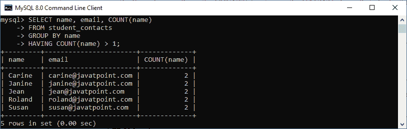
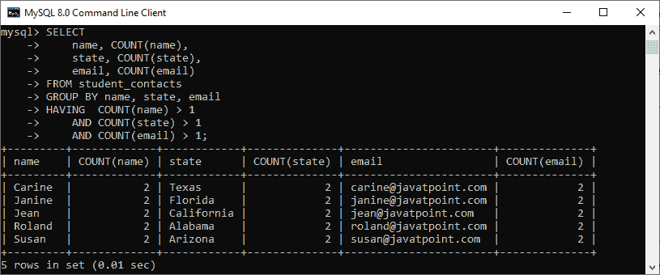

# MySQL 查找重复记录

> 原文：<https://www.javatpoint.com/mysql-find-duplicate-records>

MySQL 是一个数据库应用程序，它以行和列的形式将数据存储在表中。这个数据库应用程序可以在表中存储重复的记录，这会影响 MySQL 中数据库的性能。但是，由于各种原因会发生数据重复，在 MySQL 中使用数据库时，在表中查找重复值是一项重要的任务。

通常，最好总是在表上使用唯一约束来存储数据，以防止出现重复行。然而，有时使用数据库时，由于**人为错误、来自外部来源的未清理数据**或应用程序中的**错误，我们会发现许多重复的行。在本文中，我们将学习如何在 [MySQL](https://www.javatpoint.com/mysql-tutorial) 数据库中找到重复值。**

让我们借助一个例子来理解它。首先，我们将使用以下语句创建一个名为“ **student_contacts** ”的表:

```

CREATE TABLE student_contacts (
    id INT PRIMARY KEY AUTO_INCREMENT,
    name VARCHAR(50) NOT NULL,
    state VARCHAR(50) NOT NULL,
    email VARCHAR(255) NOT NULL
);

```

接下来，我们将使用 [**INSERT** 语句](https://www.javatpoint.com/mysql-insert)将记录填入表格，如下所示:

```

INSERT INTO student_contacts (name, state, email) 
VALUES ('Carine', 'Texas', 'carine@javatpoint.com'),
('Carine', 'Texas', 'carine@javatpoint.com'),
('Peter', 'New York', 'peter@javatpoint.com'),
('Janine ', 'Florida', 'janine@javatpoint.com'),
('Janine ', 'Florida', 'janine@javatpoint.com'),
('Jonas ', 'Atlanta', 'jonas@javatpoint.com'),
('Jean', 'California', 'jean@javatpoint.com'),
('Jean', 'California', 'jean@javatpoint.com'),
('Mark ', 'Florida', 'mark@javatpoint.com'),
('Roland', 'Alabama', 'roland@javatpoint.com'),
('Roland', 'Alabama', 'roland@javatpoint.com'),
('Julie', 'Texas', 'julie@javatpoint.com'),
('Shane', 'New York', 'shane@javatpoint.com'),
('Susan', 'Arizona', 'susan@javatpoint.com'),
('Susan', 'Arizona', 'susan@javatpoint.com');

```

执行 [**选择**语句](https://www.javatpoint.com/mysql-select)验证记录:


在该表中，我们可以看到有各种具有重复值的行。让我们学习如何使用 [SQL](https://www.javatpoint.com/sql-tutorial) 查询找到它们。

### 在单个列中查找重复数据

我们可以通过以下步骤在表格中找到重复条目:

1.  首先，我们将使用 **GROUP BY** 子句根据所需的列对所有行进行分组。所需的列是我们将基于其检查重复记录的列。
2.  其次，我们将使用 **HAVING** 子句中的 **COUNT()** 函数来检查具有多个元素的组。

以下语法解释了上述步骤:

```

SELECT column, COUNT(column)
FROM table_name
GROUP BY column
HAVING COUNT(column) > 1;

```

借助上述语法，我们可以使用下面的语句在 student_contacts 表中查找具有重复名称的行:

```

SELECT name, email, COUNT(name)
FROM student_contacts
GROUP BY name
HAVING COUNT(name) > 1;

```

执行上述语句后，我们将获得以下输出，其中显示了重复的姓名和电子邮件:



### 在多列中查找重复数据

有时我们需要根据多列找到重复的值。在这种情况下，我们可以使用如下语法:

```

SELECT 
    column1, COUNT(column1),
    column2, COUNT(column2),……
FROM table_name
GROUP BY column1, column2, .......
HAVING 
       (COUNT(column1) > 1) AND 
       (COUNT(column2) > 1) AND …....

```

**需要注意的是，在多列查找重复项时，只有当列的组合重复时**行才会重复。因此，我们需要在 [**HAVING** 子句](https://www.javatpoint.com/mysql-having)中使用**和**运算符。

例如，如果我们想在 student_contacts 表中查找在**姓名、州名、**和**电子邮件列**中包含重复值的行，可以使用以下查询:

```

SELECT 
    name, COUNT(name),
    state, COUNT(state),
    email, COUNT(email)
FROM student_contacts
GROUP BY name, state, email
HAVING  COUNT(name) > 1
    AND COUNT(state) > 1
    AND COUNT(email) > 1;

```

执行上述语句后，我们将获得以下输出，其中显示了重复的名称、状态和电子邮件列:



* * *