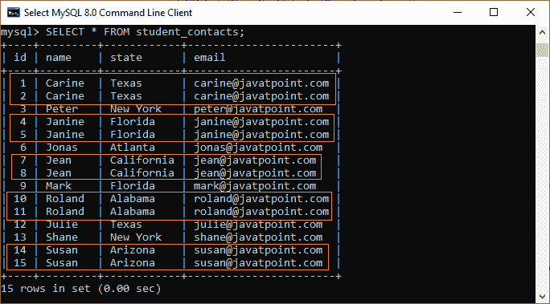
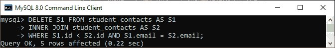
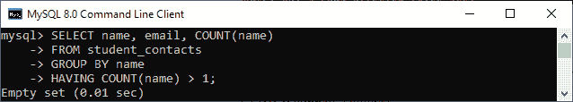
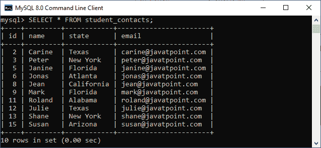
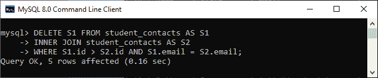
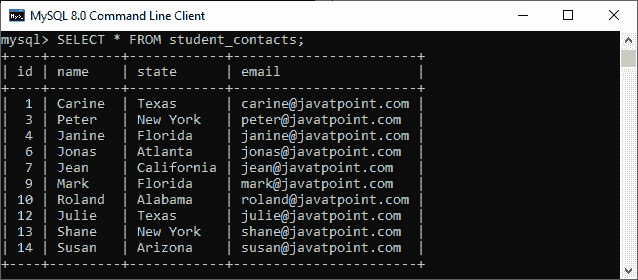
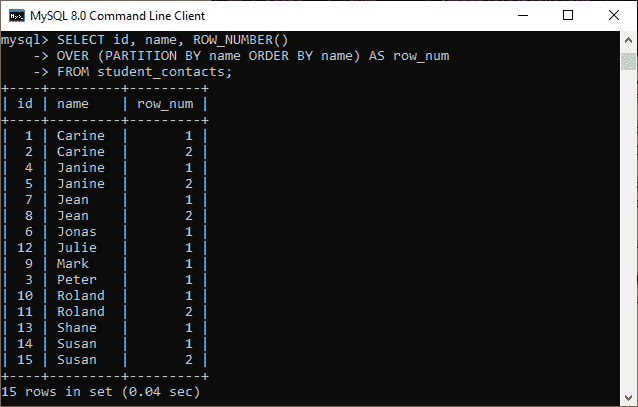
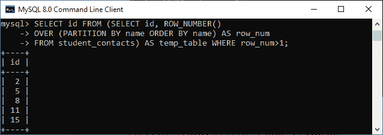
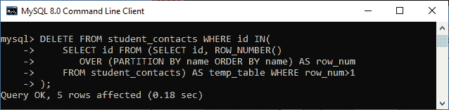
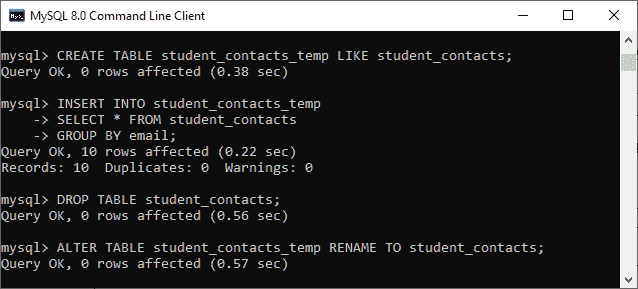

# MySQL 删除重复记录

> 原文：<https://www.javatpoint.com/mysql-delete-duplicate-records>

MySQL 是一个数据库应用程序，它以行和列的形式将数据存储在表中。这个数据库应用程序可以在表中存储重复的记录，这会影响数据库在 MySQL 中的性能。但是，由于各种原因会发生数据重复，在使用 [MySQL](https://www.javatpoint.com/mysql-tutorial) 中的数据库时，删除表中的重复值是一项重要的任务。

通常，最好总是在表上使用唯一约束来存储数据，以防止出现重复行。**在本文中，我们将学习如何从 MySQL 数据库**中删除重复记录。

让我们借助一个例子来理解它。假设我们有一个名为**“student _ contacts”**的表，其中包含许多重复的记录:



现在，我们将看到如何从表中删除重复的记录。MySQL 主要通过三种方式去除重复记录。

### 1.使用删除连接删除重复记录

我们可以使用 MySQL 中的 [DELETE JOIN 语句，该语句允许我们快速删除重复的记录。以下语句从表中删除重复的行，并保留最大的 id:](https://www.javatpoint.com/mysql-delete-join)

```sql

DELETE S1 FROM student_contacts AS S1
INNER JOIN student_contacts AS S2 
WHERE S1.id < S2.id AND S1.email = S2.email;

```

**该查询两次引用了 student_contacts 表**。因此，我们将使用表别名 **S1** 和 **S2** 。执行该语句后，我们将获得以下输出:



以上输出表示**五条记录**已从表中删除。我们可以通过执行下面的查询来验证这一点，该查询返回表的重复记录。

```sql

SELECT name, email, COUNT(name)
FROM student_contacts
GROUP BY name
HAVING COUNT(name) > 1;

```

它将返回如下输出:**显示一个空集**。这意味着已成功从表中删除重复记录。



我们也可以使用 [SELECT 语句](https://www.javatpoint.com/mysql-select)进行验证。在下图中，我们可以看到表中没有重复的记录。



假设我们想要删除重复的记录，并在表中保留最低的 id。在这种情况下，我们将使用如下语句:

```sql

DELETE S1 FROM student_contacts AS S1
INNER JOIN student_contacts AS S2 
WHERE S1.id > S2.id AND S1.email = S2.email;

```

需要注意的是，在执行查询之前，我们需要再次创建一个包含重复记录的表。执行该语句后，我们将获得以下输出:



我们也可以使用 SELECT 语句来验证它。在下图中，我们可以看到具有较高 id 的重复记录已被删除。



### 2.使用行号()函数删除重复记录

函数的作用是:返回分区内每一行的序号，从 1 开始，一直到分区内存在的行数。

我们可以使用下面的语句，该语句使用 [ROW_NUMBER()函数](https://www.javatpoint.com/mysql-row_number-function)为每一行分配一个序列号。如果此查询发现表中的**名称**列重复，它将分配大于 1 的**行号**。

```sql

SELECT id, name, ROW_NUMBER() 
OVER (PARTITION BY name ORDER BY name) AS row_num 
FROM student_contacts;

```

执行后，我们将得到如下输出:



如果您只想获取重复的 id 行，请使用下面的语句:

```sql

SELECT id FROM (SELECT id, ROW_NUMBER() 
OVER (PARTITION BY name ORDER BY name) AS row_num 
FROM student_contacts) AS temp_table WHERE row_num>1;

```

此语句重新运行以下输出:



我们现在可以在 [**DELETE** 语句](https://www.javatpoint.com/mysql-delete)和 [**WHERE** 子句](https://www.javatpoint.com/mysql-where)中的一个 **[子查询](https://www.javatpoint.com/mysql-subquery)** 的帮助下，从 **student_contacts** 表中删除重复的记录。请参见以下声明:

```sql

DELETE FROM student_contacts WHERE id IN(
    SELECT id FROM (SELECT id, ROW_NUMBER() 
       OVER (PARTITION BY name ORDER BY name) AS row_num 
    FROM student_contacts) AS temp_table WHERE row_num>1
);

```

执行后，我们将获得如下图所示的输出，在这里我们可以看到该语句已经从表中删除了五条记录。您可以使用 SELECT 语句验证是否删除了重复行。



### 3.使用中间表删除重复行

我们还可以使用中间表从表中删除重复的记录。以下是借助中间表删除重复记录的要点:

1.创建一个新表，其结构与我们将用来删除重复记录的原始表相同。

```sql

mysql> CREATE TABLE new_table_name LIKE source_table_name;

```

2.将原始表的唯一(不同)行插入新创建的表中。

```sql

mysql> INSERT INTO new_table_name
SELECT * FROM source_table_name
GROUP BY column; //It is the name of a column that contains duplicate values.

```

3.删除原始表，并将新创建的表重命名为原始表。

```sql

mysql> DROP TABLE source_table_name;
mysql> ALTER TABLE new_table_name RENAME TO source_table_name;

```

让我们借助下面的查询来理解上面的步骤，这些查询使用中间表删除重复的记录:

**第一步:**

```sql

mysql> CREATE TABLE student_contacts_temp LIKE student_contacts;

```

**第二步:**

```sql

mysql> INSERT INTO student_contacts_temp
SELECT * FROM student_contacts 
GROUP BY email; //It is the name of column that contains duplicate values.

```

**第三步:**

```sql

mysql> DROP TABLE student_contacts;
mysql> ALTER TABLE student_contacts_temp RENAME TO student_contacts;

```

见下图了解以上步骤。



* * *