# MySQL 摘录

> 原文：<https://www.javatpoint.com/mysql-extract>

MySQL 中的 EXTRACT()函数与 DATE 和 DATETIME 函数相关。**用于提取日期和日期时间值的一部分**。例如，我们可以提取年部分、月部分、日部分、分钟、秒、微秒等。从函数参数中指定的 DATE 和 DATETIME 值。MySQL 支持**4.0 版和更高版本**的提取功能。

### 语法:

以下是说明在 MySQL 中使用 EXTRACT 函数的语法:

```

EXTRACT(unit_value FROM date_value);

```

在上图中，我们可以看到 EXTRACT()函数采用了两个参数， **unit_value** 和 **date_value** 。这里，date_value 表示我们想要从中提取部分的[日期](https://www.javatpoint.com/mysql-date-function)和[日期时间](https://www.javatpoint.com/mysql-date-time)值。unit_value 表示我们想要提取的日期部分。

unit_value 参数可以使用 [MySQL](https://www.javatpoint.com/mysql-tutorial) 中的以下有效间隔:

*   天
*   日 _ 小时
*   DAY _ 微秒
*   日 _ 分钟
*   第二天
*   小时
*   小时 _ 微秒
*   小时 _ 分钟
*   小时 _ 秒
*   微秒
*   分钟
*   MINUTE _ 微秒
*   分钟 _ 秒
*   月
*   四分之一
*   第二
*   秒 _ 微秒
*   周
*   年
*   年 _ 月

### MySQL 提取函数示例

让我们通过各种例子来学习如何在 MySQL 中使用 EXTRACT 函数。

**从日期时间中提取日期**

执行以下语句从[日期时间](https://www.javatpoint.com/mysql-date-and-time)中提取日期:

```

mysql> SELECT EXTRACT(DAY FROM '2020-07-15 08:06:44') AS DAY;

```

**输出:**

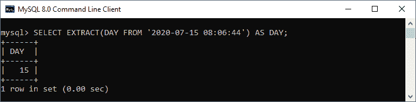

**从日期时间中提取 DAY _ HOUR】**

执行以下语句从 DATETIME 中提取日期和小时:

```

mysql> SELECT EXTRACT(DAY_HOUR FROM '2020-07-15 08:06:44') AS DAY;

```

**输出:**

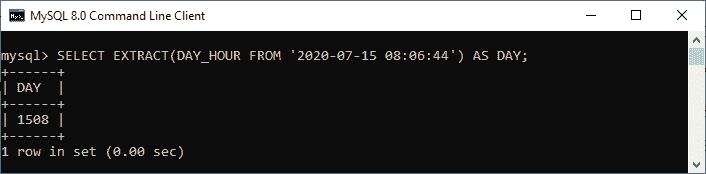

**从日期时间中提取 DAY _ 微秒**

执行以下语句从 DATETIME 中提取日期和微秒:

```

mysql> SELECT EXTRACT(DAY_MICROSECOND FROM '2020-07-15 08:06:44') AS DAY_MS;

```

**输出:**

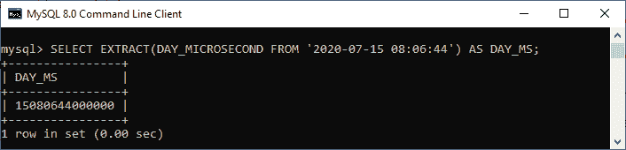

**从日期时间**中提取 DAY_MINUTE

执行以下语句从 DATETIME 中提取日期和分钟:

```

mysql> SELECT EXTRACT(DAY_MINUTE FROM '2020-07-15 08:06:44') AS DAY_Min;

```

**输出:**

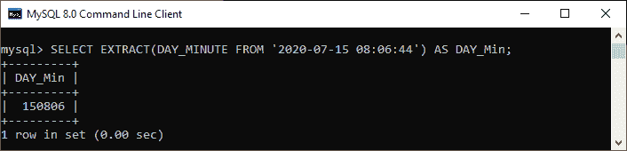

**从日期时间**中提取 DAY_SECOND

执行以下语句从 DATETIME 中提取日期和秒:

```

mysql> SELECT EXTRACT(DAY_SECOND FROM '2020-07-15 08:06:44') AS DAY_Sec;

```

**输出:**

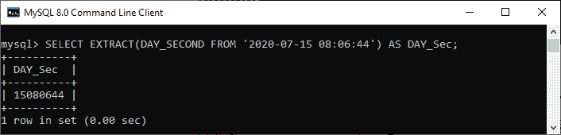

**从日期时间**中提取小时

执行以下语句从 DATETIME 中提取小时:

```

mysql> SELECT EXTRACT(HOUR FROM '2020-07-15 08:06:44') AS Hrs;

```

**输出:**

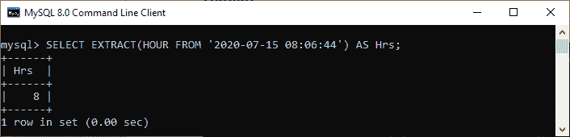

**从日期时间中提取小时 _ 微秒**

执行以下语句从 DATETIME 中提取小时和微秒:

```

mysql> SELECT EXTRACT(HOUR_MICROSECOND FROM '2020-07-15 08:06:44') AS Hrs_MS;

```

**输出:**

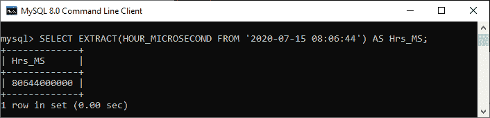

**从日期时间中提取小时分钟**

执行以下语句从 DATETIME 中提取小时和分钟:

```

mysql> SELECT EXTRACT(HOUR_MINUTE FROM '2020-07-15 08:06:44') AS Hrs_Min;

```

**输出:**

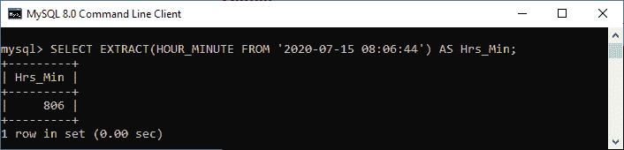

**从日期时间中提取小时 _ 秒**

执行以下语句从 DATETIME 中提取小时和秒:

```

mysql> SELECT EXTRACT(HOUR_SECOND FROM '2020-07-15 08:06:44') AS Hrs_Sec;

```

**输出:**

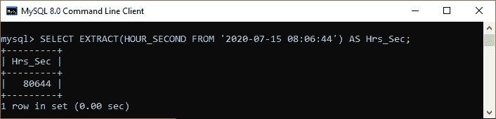

**从日期时间**中提取微秒

执行以下语句从 DATETIME 中提取微秒:

```

mysql> SELECT EXTRACT(MICROSECOND FROM '2020-07-15 08:06:44') AS MS;

```

**输出:**

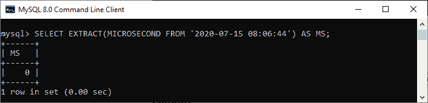

**从日期时间**中提取分钟

执行以下语句从 DATETIME 中提取分钟:

```

mysql> SELECT EXTRACT(MINUTE FROM '2020-07-15 08:06:44') AS Min;

```

**输出:**

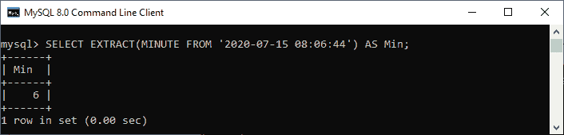

**从日期时间中提取秒**

执行以下语句从 DATETIME 中提取第二个:

```

mysql> SELECT EXTRACT(SECOND FROM '2020-07-15 08:06:44') AS Sec;

```

**输出:**

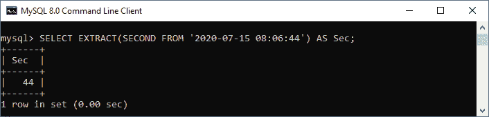

**从日期时间**中提取月份

执行以下语句从 DATETIME 中提取月份:

```

mysql> SELECT EXTRACT(MONTH FROM '2020-07-15 08:06:44') AS Month;

```

**输出:**

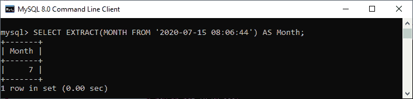

**从日期时间中提取年份**

执行以下语句从 DATETIME 中提取年份:

```

mysql> SELECT EXTRACT(YEAR FROM '2020-07-15 08:06:44') AS Yr;

```

**输出:**

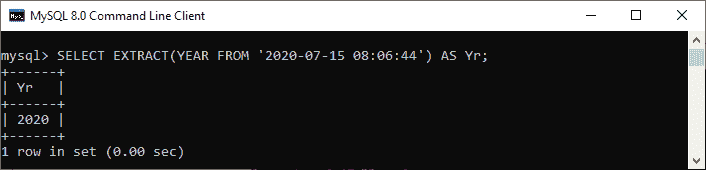

**从日期时间**中提取星期

执行以下语句从 DATETIME 中提取星期:

```

mysql> SELECT EXTRACT(WEEK FROM '2020-07-15 08:06:44') AS WK;

```

**输出:**

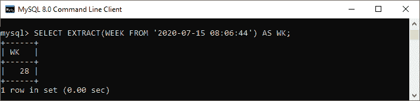

**从日期时间**中提取季度

执行以下语句从 DATETIME 中提取季度:

```

mysql> SELECT EXTRACT(QUARTER FROM '2020-07-15 08:06:44') AS QT;

```

**输出:**

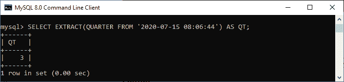

* * *