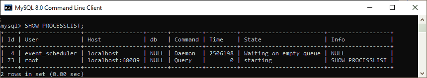

# MySQL SHOW PROCESSLIST

> 原文：<https://www.javatpoint.com/mysql-show-processlist>

MySQL 中的“SHOW PROCESSLIST”命令用于**显示当前用户账号**相关的所有运行线程信息。当 MySQL 服务器返回太多连接错误消息时，此命令非常有用。我们必须确保用户帐户拥有**进程权限**来查看所有正在运行的线程；否则，我们将只看到与当前帐户相关联的线程。 [MySQL](https://www.javatpoint.com/mysql-tutorial) 提供 **KILL** 语句来终止我们想要杀死的线程。如果使用的是终端，可以使用 **CTRL+C** 命令终止当前运行的线程。

### 句法

以下是显示过程信息的语法:

```

mysql> SHOW PROCESSLIST;

```

如果我们收到一条**“连接太多”的错误消息**，并且想要确定哪些语句正在执行，我们可以使用如下语法:

```

mysql> SHOW FULL PROCESSLIST;

```

需要注意的是，如果我们没有使用 **FULL** 子句，那么语句在输出的 Info 字段中只显示每个语句的前 100 个字符。

### MySQL SHOW PROCESSLIST 示例

让我们用一个例子来理解它。执行下面的语句，我们可以看到以下输出:

```

mysql> SHOW PROCESSLIST;

```



SHOW PROCESSLIST 的输出显示以下几列:

*   **标识**:表示连接标识或客户端进程的标识。它与线程内的 CONNECTION_ID()函数返回的值相同。
*   **用户**:表示与线程关联的用户名，或者是谁发出的语句。
*   **主机**:表示发出声明的客户端的主机名。换句话说，它是客户端所连接的主机名。
*   **数据库**:表示默认数据库名称。如果我们没有选择任何数据库，它将返回空值。
*   **命令**:是线程代表客户端执行的命令类型。如果会话处于空闲状态，它将处于睡眠模式。
*   **时间**:表示线程停留在当前状态的时间。
*   **状态**:是表示动作、事件或状态的线程状态，表示线程正在执行什么。注意，如果一个线程长时间处于当前状态，可能会出现一个需要调查的问题。
*   **信息**:包含一条语句，正在被线程执行。如果线程没有执行任何语句，它将返回空值。**例如**，如果一条语句执行包含 SELECT 语句的过程，该字段显示 SELECT 语句。

* * *