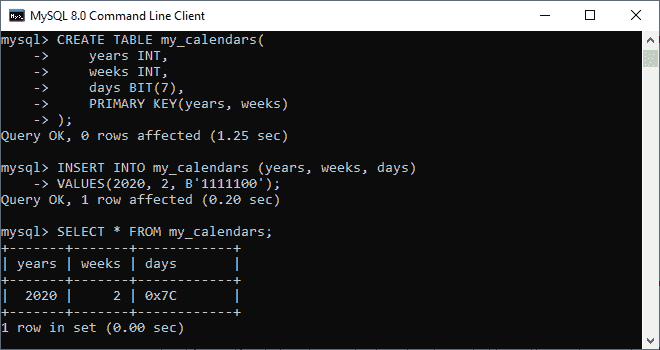
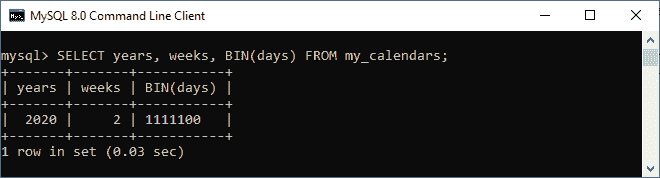
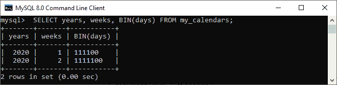
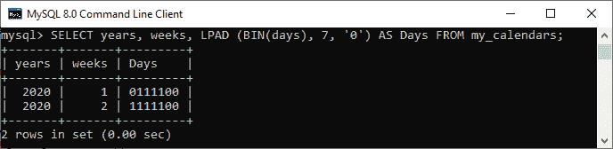

# MySQL BIT

> 原文：<https://www.javatpoint.com/mysql-bit>

BIT 是 MySQL 中使用的一种数据类型，允许我们**存储比特值**。比特值在 1-64 的**范围内。它将只存储 0 和 1 中的值。如果我们存储像 2 这样的位值，它将返回一条错误消息。通常，我们可以用创建表或定义语句来定义位值。**

### 语法:

以下是在 MySQL 中定义位[数据类型的语法:](https://www.javatpoint.com/mysql-data-types)

```sql

BIT (M);

```

这里关键字 **BIT** 代表二进制值的存储，其值在变量 **M** 中提到。M 的值可以在 1-64 的范围内。如果我们没有指定 M 的任何值，它包含的默认值是 1。因此，以下陈述是等效的:

```sql

column_name BIT(1);
OR 
column_name BIT;

```

如果我们想指定位值文字，我们可以使用 **b'value'** 或 **0bvalue 符号**。在这种表示法中，值代表只能用 0 和 1 写入的二进制值。例如，b'111 '和 b'10000000 '分别代表 7 和 128。

位值文字的默认字符集是二进制字符串。请参见以下声明:

```sql

mysql> SELECT CHARSET(B'); -- binary

```

### MySQL BIT 示例

让我们通过一个例子来理解 [MySQL](https://www.javatpoint.com/mysql-tutorial) 中 BIT 的概念。首先，我们将创建一个名为 **my_calendars** 的新表，其中包含作为 BIT(7)的**‘days’**列。请参见以下声明:

```sql

CREATE TABLE my_calendars(
    years INT,
    weeks INT,
    days BIT(7),
    PRIMARY KEY(years, weeks)
);

```

“天数”列值指示是工作日还是休息日。这里 1 代表工作日，0 代表休息日。

假设**2020**年的**周六**和**周日**不是工作日。在这种情况下，我们可以将记录插入 my_calendars 表，如下所示:

```sql

mysql> INSERT INTO my_calendars (years, weeks, days) 
VALUES(2020, 2, B'1111100');

```

接下来，执行以下查询从 my_calendar 表中检索数据:

```sql

mysql> SELECT * FROM my_calendars;

```

我们应该得到如下输出:



我们可以看到检索到的结果没有以我们期望的格式显示数据。因此，我们将使用 **BIN()函数**以二进制形式检索数据。为此，我们需要专门将“天数”列称为 BIN()。

```sql

mysql> SELECT years, weeks, BIN(days) FROM my_calendars;

```

执行之后，我们将以我们期望的方式获得输出。



如果我们在长度小于 M 位的位列中插入一个值，MySQL 会自动在指定位值的左边添加零。假设第三周的第 1 <sup>st</sup> 天不上班；我们可以在“天数”栏中插入 01111100。请参见以下声明:

```sql

mysql> INSERT INTO my_calendars (years, weeks, days) 
VALUES(2020, 1, B'111100');

```

验证数据后，您可以看到它工作得很完美。



我们可以看到，检索到的输出在返回结果之前移除了前导零。因此，我们将使用 **LPAD()** 函数来正确检索数据:

```sql

mysql> SELECT years, weeks, LPAD (BIN(days), 7, '0') FROM my_calendars;

```

请参见以下输出:



### BIT 和 TINYINT 的区别

BIT 和 TINYINT 在 MySQL 中都有不同的用法。

一种**位数据类型**用于存储 1 位的值，该值可以是 0 或 1。它存储 1 到 64 范围内的值。如果我们试图在 BIT 列中插入其他值(例如 2)，MySQL 会发出一个错误。相比之下， **TINYINT 数据类型**用于存储 8 位整数值。它存储-128 到+127 或 0 到 256 范围内的值，并占用 1 个字节。如果我们试图在 TINYINT 列中插入其他值(例如 987)，MySQL 会发出一个错误。

在本文中，我们学习了如何在 MySQL 表中使用和存储 BIT 数据类型。

* * *