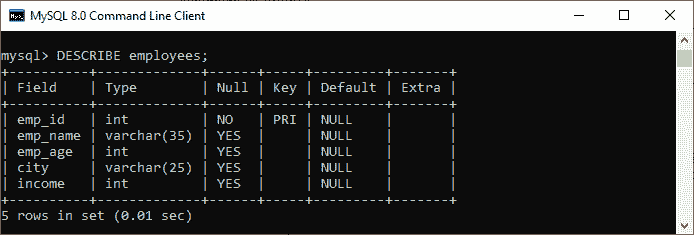
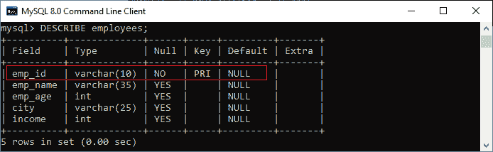
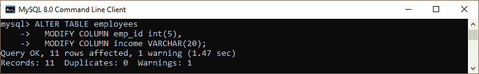
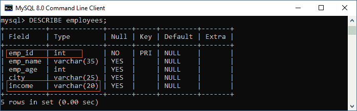
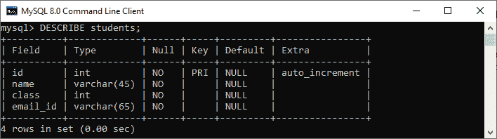
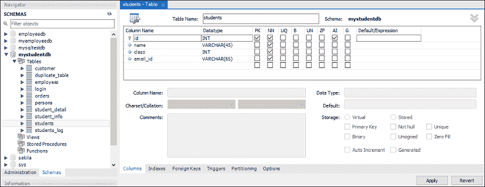
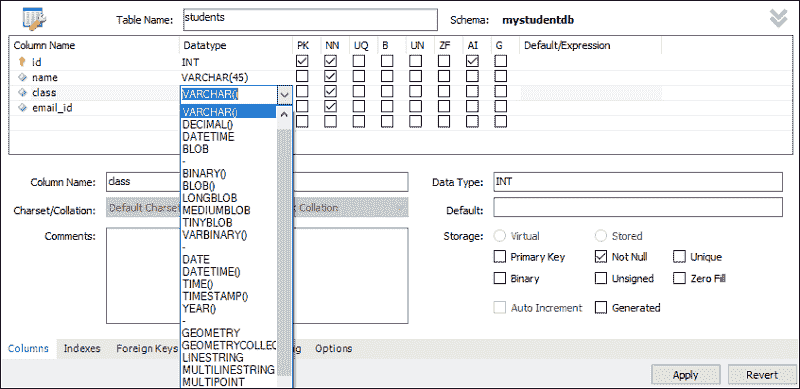
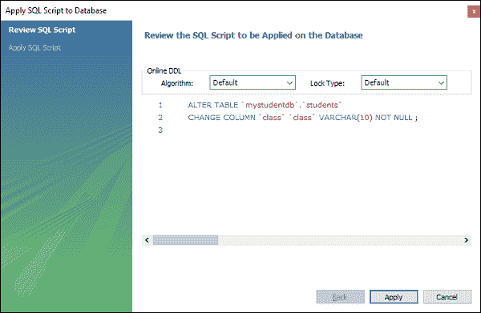
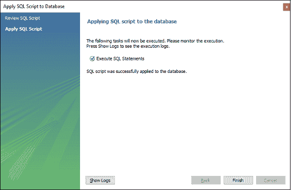
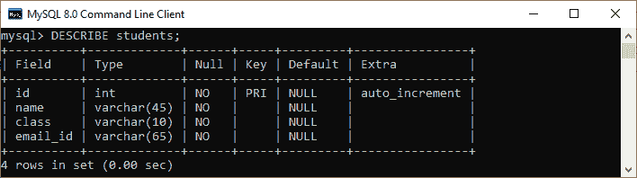

# MySQL 更改列类型

> 原文：<https://www.javatpoint.com/mysql-change-column-type>

随时更改列定义对于数据库来说都是非常有用的功能。MySQL 允许一个命令根据我们的需要改变列定义，如名称和类型。我们可以在 T2 MySQL 的 ALTER TABLE 语句的帮助下做到这一点。在本文中，我们将逐步了解如何使用 ALTER TABLE 命令更改列定义。

### 句法

以下是在 MySQL 中更改列数据类型的语法:

```

ALTER TABLE table_name  
MODIFY column_name datatype;

```

让我们详细了解一下声明的参数:

*   首先，我们将在包含我们要修改的列的 ALTER TABLE 关键字之后指定**表名**。
*   其次，我们将在 MODIFY 子句之后指定我们想要更改数据类型的**列名**。
*   最后，我们将为列指定新的**数据类型**来更改列类型。

如果我们想在一条语句中改变**多列**的数据类型，我们可以使用如下语句:

```

ALTER TABLE table_name  
MODIFY COLUMN column_name1 data_type,
MODIFY COLUMN column_name2 data_type ... ; 

```

### MySQL 更改列类型示例

通过各种改变列定义的例子，让我们了解一下 [ALTER TABLE 语句](https://www.javatpoint.com/mysql-alter-table)在 MySQL 中是如何工作的。假设我们有一个名为“**员工**的表，其中包含以下列描述:

**表名:员工**



在上图中，我们可以看到 **emp_id** 列数据类型是**整数**类型。现在假设我们想把 emp_id 的数据类型从 INT 改为 VARCHAR 我们可以执行下面的语句来做到这一点:

```

mysql> ALTER TABLE employees Modify column emp_id varchar(10);

```

执行该语句后，如果没有发现错误，应该会出现以下输出:


让我们通过**description**语句来验证表格信息:



在输出中，我们可以观察到 emp_id 列的数据类型已经从整数更改为 varchar。

假设您想使用一条语句更改“employees”表的多个列数据类型。在这种情况下，我们将使用**逗号(，)运算符**指定列名。请参见以下声明:

```

mysql> ALTER TABLE employees
  MODIFY COLUMN emp_id int(5),
  MODIFY COLUMN income VARCHAR(20);

```

执行该语句后，如果没有发现错误，应该会出现以下输出:



现在，通过 description 语句再次验证表信息:



在输出中，我们可以观察到 emp_id 列的数据类型已从 varchar 更改为 integer，而传入列已从 integer 更改为 varchar。

### 如何在 MySQL workbench 中更改列数据类型？

要使用 [MySQL 工作台](https://www.javatpoint.com/mysql-workbench)更改列数据类型，我们首先需要启动它，然后使用我们之前创建的用户名和密码登录。它将返回如下屏幕:


现在执行以下步骤来更改列定义，如名称或数据类型:

1.转到导航选项卡，点击包含 MySQL 服务器中所有可用数据库的**模式菜单**。

2.选择数据库(**如**、mystudentdb)，双击它，显示包含表、视图、函数和存储过程的子菜单。

3.展开**表格子菜单**，选择要更改列定义的表格。**例如**，**学生**表包含以下列定义:



4.如果我们想将**类**列类型从 INT 更改为 VARCHAR，那么**右键单击所选表格(学生)上的**，然后单击**更改表格**选项。我们应该得到如下屏幕:



5.点击要更改的列对应的**数据类型**框，选择所需类型，点击**应用**按钮。请参见下图:



6.我们将看到下面的屏幕。如果没有发现错误，点击**应用**按钮。



7.最后，点击**完成**按钮完成该过程。



8.现在，通过 DESCRIBE 语句再次验证表信息。



在输出中，我们可以观察到**类列**的数据类型已经从**整数更改为**varchar。

* * *