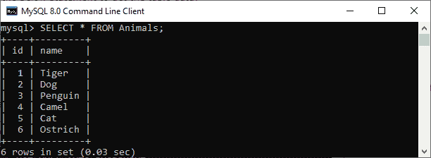
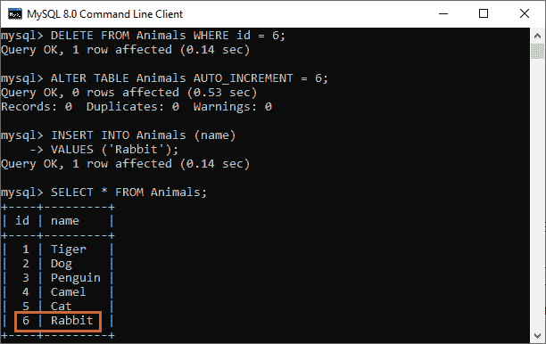

# MySQL 重置自动增量

> 原文：<https://www.javatpoint.com/mysql-reset-auto-increment>

自动增量是 MySQL 提供的一个有用的特性。它总是为表中每个新插入的行生成一个唯一的标识。通常，我们对表中的主键字段使用自动递增属性。每次我们向表中插入新记录时，MySQL 都会自动将值递增到自动递增列。

**例如**，我们有一个已经包含十行的表。接下来，如果我们添加一个新行，而没有给自动增量列赋值，MySQL 会自动添加一个新行，其 id 为 **id=11** 。

有时，我们需要删除这些行并重置自动递增列，以便在下一次插入表时，第一条记录的标识将具有主键值 1。

**MySQL 允许各种方式重置自动递增列值。这些方式是:**

1.  使用 ALTER TABLE 语句
2.  使用 TRUNCATE TABLE 语句
3.  使用一对删除表和创建表语句

首先，我们将创建一个名为“**动物**”的表，并为 **id 列**分配自动增量属性。请参见以下声明:

```

mysql> CREATE TABLE Animals(  
id int NOT NULL AUTO_INCREMENT,   
name CHAR(30) NOT NULL,   
PRIMARY KEY (id)); 

```

接下来，我们将在“动物”表中插入一些示例数据，如下所示:

```

mysql> INSERT INTO Animals (name) VALUES   
('Tiger'),('Dog'),('Penguin'),  
 ('Camel'),('Cat'),('Ostrich');

```

现在，我们将执行下面的语句来验证插入操作:

```

mysql> SELECT * FROM Animals; 

```

我们应该得到下面的输出。在 insert 语句中，我们没有为自动递增列指定任何值。但是我们可以在输出中观察到，MySQL 自动为这个字段生成一个序列顺序中唯一的数字。



让我们用这个表来详细演示重置自动递增列值的方法。

### 使用变更表语句

ALTER TABLE 语句用于更改表或任何表字段的名称。它还用于添加、删除或重置表中的现有列。MySQL 还允许这个语句在我们需要的时候重置自动递增的列值。

**语法**

以下是用于重置自动递增列值的 ALTER TABLE 语句的语法:

```

ALTER TABLE table_name AUTO_INCREMENT = value;

```

在这个语法中，我们首先在 ALTER TABLE 子句后指定了一个表的**名称**。接下来，我们在表达式中指定要重置的值为**自动增量=值**。

需要注意的是，MySQL 不允许重置小于或等于已用值的值。**例如**，如果我们使用的是 InnoDB，则该值不应小于或等于自动递增列的当前最大值。

对于 **MyISAM** ，如果指定值小于或等于 auto_increment 列的最大值，该值将被重置为当前最大值加 1。

对于 **InnoDB** ，如果指定值小于 auto_increment 列的当前最大值，MySQL 不发出任何错误，当前顺序也不变。

让我们删除表格中最低的一行 **id = 6** ，如下所示:

```

mysql> DELETE FROM Animals WHERE id = 6;

```

如果我们添加一条新的记录，MySQL 会给这条记录分配 **id = 7** 。但是如果我们想将此列重置为最后一个值，我们可以使用 **ALTER TABLE** 语句，如下所示:

```

mysql> ALTER TABLE Animals AUTO_INCREMENT = 6;

```

如果我们在这个表中插入新的记录，MySQL 开始生成 id 为 6 的行。执行以下查询:

```

mysql> INSERT INTO Animals (name)
VALUES ('Rabbit');

```

最后，查询表中的数据以查看效果。下面的输出更清楚地解释了为什么我们有六行，最后一个自动增量值是 6 而不是 7。



### 使用截断表语句

MySQL 中的 TRUNCATE TABLE 语句在不删除表结构的情况下完全删除了表的数据，并且总是将自动递增的列值重置为零。

**语法**

以下语法说明了重置自动递增列值的 TRUNCATE TABLE 语句:

```

TRUNCATE TABLE tab_name;

```

需要注意的是，在执行 TRUNCATE TABLE 语句后，我们无法从表中恢复删除的数据。

### 使用删除表和创建表语句

我们还可以使用一对 DROP TABLE 和 CREATE TABLE 语句来重置自动递增的列值。此方法从表中永久删除完整的记录。

类似于 TRUNCATE TABLE 查询，DROP TABLE 和 CREATE TABLE 语句对首先删除该表，然后重新创建它。因此，MySQL 将自动递增列值重置为零。

```

DROP TABLE table_name;
CREATE TABLE table_name( fiels_name(s) datatypes);

```

* * *