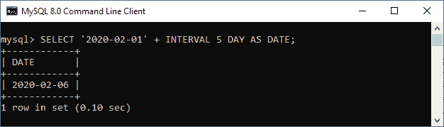
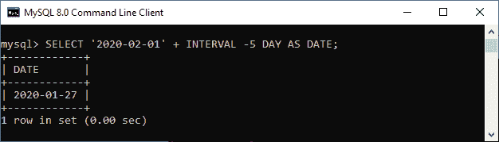
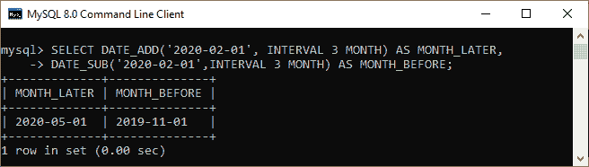
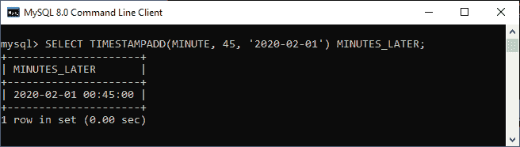
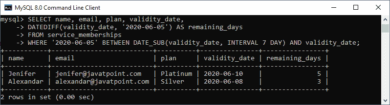

# MySQL INTERVAL

> 原文：<https://www.javatpoint.com/mysql-interval>

MySQL interval 是一个运算符，基于二分搜索法算法搜索项目，返回值从 0 到 n，主要是**用来计算日期和时间**值。

我们可以使用以下**语法**来创建一个间隔值:

```sql

INTERVAL expr unit

```

在上面的语法中，**表达式**用于确定区间值，**单位**表示区间单位。**例如**，如果我们想创建一个两天的间隔，我们可以使用如下表达式:

```sql

INTERVAL 2 DAY

```

需要注意的是**区间**和**单位**不区分大小写。因此，下面的表达式相当于前面的表达式:

```sql

interval 2 day

```

我们可以使用日期和时间的**间隔值**作为下面的陈述:

```sql

date + INTERVAL expr unit
date - INTERVAL expr unit

```

区间值也可以用于各种时态函数，如 DATE_SUB、DATE_ADD、TIMESTAMPDIFF、TIMESTAMPADD 等。

[MySQL](https://www.javatpoint.com/mysql-tutorial) 描述了与表达式相关的单位的**标准格式，如下表所示:**

| 单位 | 表达式 |
| 天 | 天 |  |
| 日 _ 小时 | 天数小时数 |  |
| DAY _ 微秒 | 天数小时:分钟:秒。'微秒' |  |
| 日 _ 分钟 | '天小时:分钟' |  |
| 第二天 | '天小时:分钟:秒' |  |
| 小时 | 小时 |  |
| 小时 _ 微秒 | 小时:分钟:秒。'微秒' |  |
| 小时 _ 秒 | “小时:分钟:秒” |  |
| 小时 _ 分钟 | 小时:分钟 |  |
| 微秒 | 微秒 |  |
| 分钟 | 分钟 |  |
| MINUTE _ 微秒 | 分钟:秒。'微秒' |  |
| 分钟 _ 秒 | '分钟:秒' |  |
| 月 | 月份 |  |
| 四分之一 | 四分之一 |  |
| 第二 | 秒 |  |
| 秒 _ 微秒 | 秒。'微秒' |  |
| 周 | 周末 |  |
| 年 | 年 |  |
| 年 _ 月 | 年-月 |  |

### MySQL 区间示例

让我们通过各种例子来理解如何在 MySQL 中使用区间表达式。以下**查询将 2020 年 2 月 1 日增加五天**，返回 2020 年 2 月 6 日:

```sql

mysql> SELECT '2020-02-01' + INTERVAL 5 DAY AS DATE;

```

它将返回以下输出:



如果我们在表达式的右侧将 [DATE 或 DATETIME](https://www.javatpoint.com/mysql-date-and-time) 的值指定为区间值，则可以使用 expr 的负值。请参见下面的示例:

```sql

mysql> SELECT '2020-02-01' + INTERVAL -5 DAY AS DATE;

```

我们将获得如下输出:



接下来，我们将看到使用 **DATE_SUB** 和 **DATE_ADD** 函数从日期值中加减日期/月/时间。请参见以下陈述:

```sql

mysql> SELECT DATE_ADD('2020-02-01', INTERVAL 3 MONTH) AS MONTH_LATER, 
DATE_SUB('2020-02-01',INTERVAL 3 MONTH) AS MONTH_BEFORE;

```

它将返回以下输出:



现在，我们将在下面的查询中使用**timestampad(单位、间隔、表达式)**函数，该函数将为时间戳值添加 45 分钟:

```sql

mysql> SELECT TIMESTAMPADD(MINUTE, 45, '2020-02-01') MINUTES_LATER;

```

我们将看到以下输出:



让我们看看 MySQL 表中间隔的用法。首先，我们将使用下面的语句创建一个名为 **service_memberships** 的新表:

```sql

CREATE TABLE service_memberships (
	id INT AUTO_INCREMENT PRIMARY KEY,
	name VARCHAR(55) NOT NULL,
	email VARCHAR(55) NOT NULL,
	plan VARCHAR(45) NOT NULL,
	validity_date DATE NOT NULL
);

```

接下来，我们将使用 [**INSERT** 语句](https://www.javatpoint.com/mysql-insert)将记录填入表格，如下所示:

```sql

INSERT INTO service_memberships(name, email, plan, validity_date)
VALUES('Stephen', 'stephen@javatpoint.com','Gold','2020-06-13'),
      ('Jenifer', 'jenifer@javatpoint.com','Platinum','2020-06-10'),
      ('david', 'david@javatpoint.com','Silver','2020-06-15'),
      ('julia', 'julia@javatpoint.com','Gold','2020-06-20'),
      ('Alexandar','alexandar@javatpoint.com','Silver','2020-06-08');

```

接下来，执行 [**选择**语句](https://www.javatpoint.com/mysql-select)验证记录:


假设我们想**找到从 2020-06-05 日期起 7 天内**会员资格到期的会员。我们可以通过以下查询找到这些详细信息:

```sql

SELECT name, email, plan, validity_date,
DATEDIFF(validity_date, '2020-06-05') AS remaining_days
FROM service_memberships
WHERE '2020-06-05' BETWEEN DATE_SUB(validity_date, INTERVAL 7 DAY) AND validity_date;

```

在本语句中，我们使用了 DATE_SUB 函数，该函数将剩余天数减去由间隔值指定的七天。执行该语句后，我们将获得以下输出:



* * *