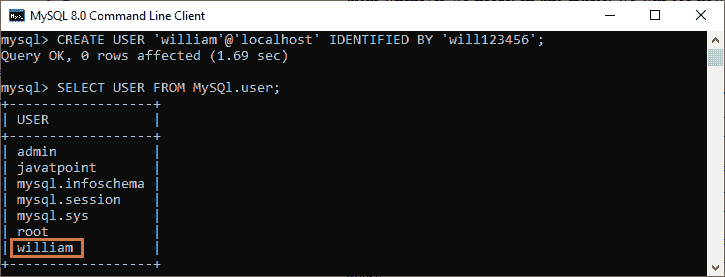
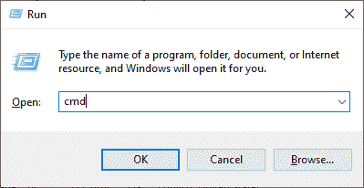
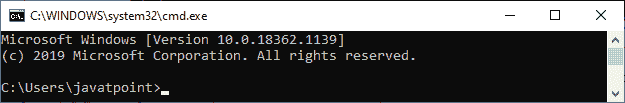
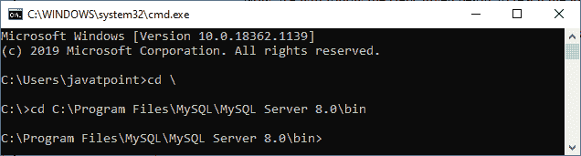

# 使用不同的用户帐户登录

> 原文：<https://www.javatpoint.com/mysql-login-with-different-user-account>

MySQL 中的用户账号包含 MySQL 账号的基本信息，如**登录信息、账号权限、**和**主机信息**。因此，为了访问和管理 MySQL 中的数据库，我们需要创建一个用户帐户。我们可以在 MySQL Server 上创建几个用户帐户，并在需要的时候使用它们。本文将介绍如何使用不同的帐户登录服务器。

### 句法

以下是在 [MySQL](https://www.javatpoint.com/mysql-tutorial) 服务器上以不同用户身份登录的语法:

```sql

mysql -u username -p 

```

按下回车键后，我们需要写入与用户相关联的相同密码:

```sql

Enter password: ********** 

```

让我们借助下面的解释来理解它。首先，我们将创建一个名为**【威廉】**的新用户，密码为**【威尔 123456】**。我们可以通过执行以下查询来做到这一点:

```sql

mysql> CREATE USER 'william'@'localhost' IDENTIFIED BY 'will123456';

```

接下来，我们将验证新创建的用户是否已经在 **MySQL.user** 表中成功创建。我们可以执行下面的查询来显示 MySQL.user 表中的所有用户:

```sql

mysql> SELECT USER FROM MySQl.user;

```

执行后，我们将获得如下输出:



接下来，我们需要**通过执行如下查询向新创建的用户帐户‘William’提供所有权限**:

```sql

mysql> GRANT ALL PRIVILEGES ON * . * TO 'william'@'localhost';

```

如果该查询成功，我们将获得以下消息:

```sql

Query OK, 0 rows affected (0.65 sec)

```

如果想登录不同的用户账号，需要通过执行搜索框中的 **RUN** 命令或按 **Windows + R** 快捷键**打开命令提示**。它将显示我们键入 **CMD** 并点击**确定**按钮的屏幕。请看下面的截图:



点击**确定**按钮后，可以看到如下命令提示:



现在，我们将按照下面给出的步骤到达 bin 目录的位置:

**步骤 1:** 假设我们的设备上的 **C 文件夹**中已经安装了[MySQL](https://www.javatpoint.com/how-to-install-mysql)。然后复制那个文件夹，粘贴到我们的命令提示符下，按**回车**键。

```sql

C:\Users\javatpoint>cd \
C:\>cd C:\Program Files\MySQL\MySQL Server 8.0\bin

```

按下回车键后，我们可以看到下面的输出:



**步骤 2:** 接下来，我们将使用我们在开头讨论过的语法(mysql -u username -p)。将“威廉”作为用户名&“威尔 123456”作为上面创建的密码，并按下**回车键**进入账户。请参见下面的查询:

```sql

mysql -u william -p
Enter Password: **********

```

按下回车键后，我们将获得以下输出，显示用户名已成功打开。


* * *