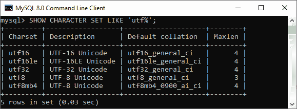
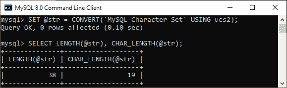
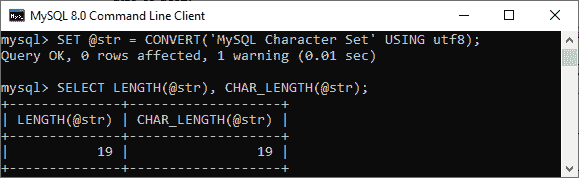
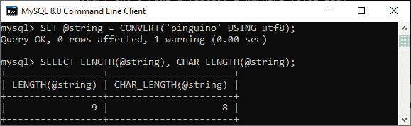
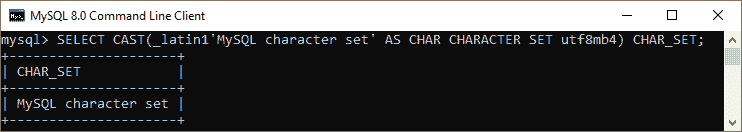

# MySQL 字符集

> 原文：<https://www.javatpoint.com/mysql-character-set>

MySQL 中的字符集是字符串中合法的一组**字符、编码、**和**符号**。本文解释了如何在 MySQL 中获取所有字符集，如何为客户端连接配置合适的字符集，以及如何在多个字符集之间转换字符串。

让我们用一个假想的字符集来理解它。假设我们有从 **A 到 B，或者 A 到 b** 的字母表。接下来，我们将为每个字母分配一个数字: **A = 0，B = 1** 。这里，字母 A 或 B 是符号，数字 0 或 1 是编码。我们称这些字母(A 到 B，或 A 到 B)及其相关编码的组合为**字符集**。

同样，如果我们想在两个字符串值之间进行比较，例如**A 和 B。最简单的方法是使用它们的编码，即 0 代表 A，1 代表 B。从编码中，很明显 0 小于 1，因此我们可以说 **A 小于 B** 。**

 **[MySQL](https://www.javatpoint.com/mysql-tutorial) 支持各种字符集，每个字符集始终至少使用一种排序规则。排序规则定义了一组用于比较字符集内字符的规则。字符集允许我们在字符串中存储任何字符。我们可以使用下面的语句来查看 MySQL 数据库服务器中可用的所有字符集:

```sql

SHOW CHARACTER SET;

```

它将返回以下输出:


默认情况下，上面的语句会生成 MySQL 中所有可用的字符集。如果我们想要获得任何特定字符集系列的名称，请使用可选的 **LIKE 或 [WHERE](https://www.javatpoint.com/mysql-where)** 子句返回匹配的字符集名称。以下语句显示了一些基于 UTF (Unicode 转换格式)的 **Unicode 字符集**:

```sql

SHOW CHARACTER SET LIKE 'utf%';

```

我们可以看到如下输出:



在此图像中， **Maxlen** 列中的值表示字符集中保存一个字符的字节数。MySQL 中的每个字符集要么包含一个**单字节字符**，如 latin1、latin2、cp850，要么包含**多字节字符**。

**latin1** 是 MySQL 中使用的默认字符集。如果我们将不同语言的字符或符号存储在一列中，我们将使用 Unicode 字符集，如 utf8 或 ucs2。

MySQL **LENGTH()** 函数返回字符串的长度(以字节为单位)，而 **CHAR_LENGTH()** 函数用于查找字符串的长度(以字符为单位)。如果我们使用 LENGTH()函数来计算包含多字节字符的字符串长度，我们将得到比 CHAR_LENGTH()更高的结果。以下示例更清楚地解释了使用 ucs2 字符集的情况。

```sql

SET @str = CONVERT('MySQL Character Set' USING ucs2);
SELECT LENGTH(@str), CHAR_LENGTH(@str);

```

我们可以看到如下输出，其中 LENGTH 函数返回的结果大于 CHAR_LENGTH()的结果:



**CONVERT** 功能用于将字符串转换为特定的字符集。上面的示例将 MySQL 字符集字符串转换为 ucs2 字符集。由于字符集 ucs2 包含两个字节的字符， **@str** 的字节长度大于其字符长度。

同样，我们将看到另一个例子。需要注意的是，许多字符集包含多字节字符，但它们的字符串只包含单字节字符，如 utf8，如下语句所示:

```sql

SET @str = CONVERT('MySQL Character Set' USING utf8);
SELECT LENGTH(@str), CHAR_LENGTH(@str);

```

我们可以看到如下输出:



但是，如果字符集 utf8 字符串包含任何**特殊字符**，则其长度(以字节为单位)是不同的。请参见下面的示例:

```sql

SET @string = CONVERT('pingino' USING utf8);
SELECT LENGTH(@string), CHAR_LENGTH(@string);

```

我们将获得如下输出:



### 字符集转换

MySQL 主要提供两个函数来执行不同字符集之间的字符串转换。这些功能是 **CONVERT()** 和 **CAST()** 。在上面的例子中，我们已经看到了 CONVERT 函数的工作原理。在这里，我们将只看到类似于 CONVERT 函数的 CAST 函数的工作。

以下是 **CONVERT()函数的基本语法:**

```sql

CONVERT(expression USING character_set_name)

```

以下是 **CAST()函数的基本语法:**

```sql

CAST(string AS character_type CHARACTER SET character_set_name)

```

参见下面使用 CAST 函数在不同字符集之间进行转换的示例:

```sql

SELECT CAST(_latin1 'MySQL character set' AS CHAR CHARACTER SET utf8mb4) CHAR_SET;

```

它将返回如下输出:



### 为客户端连接配置字符集

当数据库应用程序与 MySQL Server 交换数据时，它使用名为 latin1 的默认字符集。如果应用程序将 Unicode 字符串存储在字符集 UTF8 中，则数据库应用程序中的默认字符集 latin1 可能不够用。因此，当我们的应用程序连接到 MySQL 数据库服务器时，需要指定一个合适的字符集。

我们可以使用以下方法之一为客户端连接配置字符集:

*   当客户端连接到 MySQL 数据库服务器时，我们可以使用**设置名称**命令。例如，如果需要为客户端连接设置 **UTF8MB4** Unicode 字符集，我们将使用以下语句:

```sql

SET NAMES 'utf8mb4';

```

*   在 MySQL 中，MySQL 连接器提供了一些其他的字符集。假设我们使用的是 **PHP PDO，**那么我们可以将数据源名称中的字符集设置为如下语句:

```sql

$dsn ="mysql:host=$host;dbname=$db;charset=utf8";

```

*   如果我们的数据库应用程序支持- **默认字符集**选项，我们也可以使用来设置字符集。例如，MySQL Client Tool 始终支持该选项，可以使用下面的语句在配置文件中进行如下设置:

```sql

[mysql]
default-character-set= utf8

```

这是为了确保我们使用的是哪种方式，我们的数据库应用程序使用的字符集应该与 MySQL Server 中存储的字符集相匹配。

* * ***