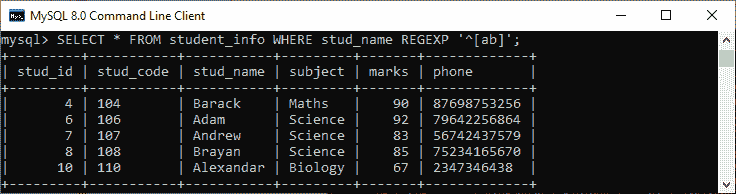
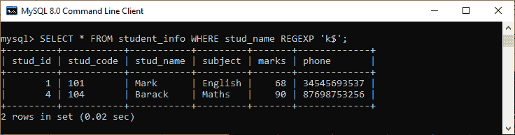
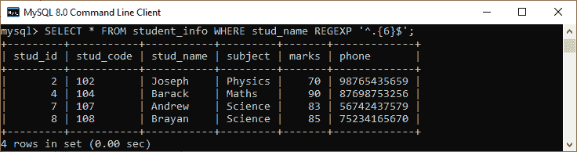
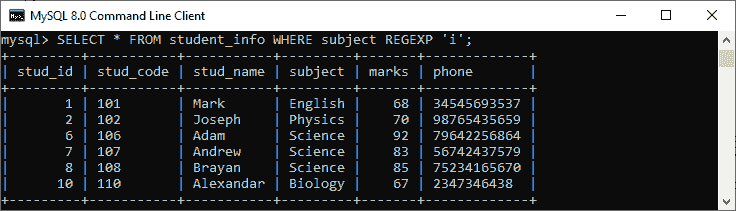
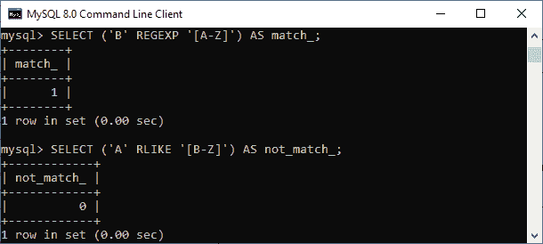
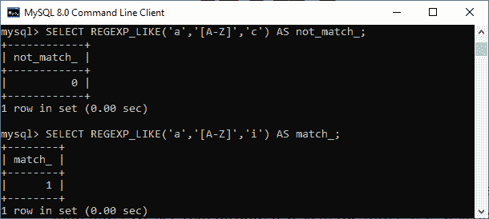
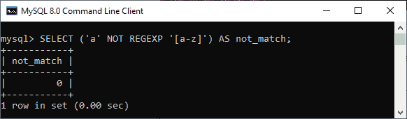
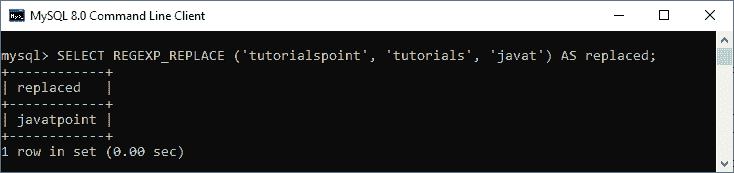
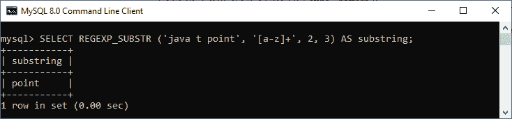

# MySQL 正则表达式

> 原文：<https://www.javatpoint.com/mysql-regular-expressions>

正则表达式是描述搜索模式的特殊字符串。这是一个强大的工具，它为基于模式识别文本字符串如字符和单词提供了一种简洁灵活的方法。它使用自己的语法，可以被[正则表达式](mysql-regular-expressions)处理器解释。从编程语言到数据库，包括 MySQL，几乎所有平台都广泛使用正则表达式。

正则表达式使用反斜杠作为转义字符**，如果使用了双反斜杠，则应该在模式匹配中考虑该字符。正则表达式不区分大小写。**在 MySQL** 中缩写为 REGEX 或 REGEXP。**

 **使用正则表达式的优势在于，我们不局限于基于 LIKE 运算符中带有百分号(%)和下划线(_)的固定模式来搜索字符串。正则表达式有更多的元字符，在执行模式匹配时允许更大的灵活性和控制。

我们之前已经了解了**通配符**，它允许我们获得与正则表达式类似的结果。所以我们可能会问**为什么我们学习正则表达式**如果我们将得到与通配符相同的结果。这是因为与通配符相比，正则表达式允许我们以更复杂的方式搜索匹配的数据。

### 句法

MySQL 采用了亨利·斯潘塞实现的正则表达式。 [MySQL](https://www.javatpoint.com/mysql-tutorial) 允许我们通过使用 REGEXP 操作符来匹配 SQL 语句中的模式。以下是说明正则表达式在 MySQL 中的使用的基本语法:

```sql

SELECT column_lists FROM table_name WHERE field_name REGEXP 'pattern';

```

在该语法中，**列列表**表示结果集中返回的列名。**表名**是将使用该模式检索数据的表的名称。 **WHERE** **字段名**代表执行正则表达式的列名。REGEXP 是正则表达式运算符，**模式**是 REGEXP 要匹配的搜索条件。我们也可以使用 **RLIKE** 运算符，它是 REGEXP 的同义词，给出与 REGEXP 相同的结果。通过使用 REGEXP 而不是 LIKE，我们可以避免将该语句与 LIKE 运算符一起使用时的混乱。

如果 WHERE 字段名称中的值与模式匹配，该语句将返回 **true** 。否则，返回**假**。如果字段名称或模式为**空**，则结果始终为空。[正则表达式运算符](mysql-regexp-operator)的否定形式不是正则表达式。

### 正则表达式元字符

下表显示了正则表达式中最常用的元字符和构造:

| 元字符 | 描述 |
| ^ | 插入符号(^)字符用于在搜索字符串的开头开始匹配。 |
| $ | 美元字符用于在搜索字符串的末尾开始匹配。 |
| 。 | 点(。)字符匹配除新行之外的任何单个字符。 |
| [abc] | 它用于匹配方括号中的任何字符。 |
| [^abc] | 它用于匹配方括号中未指定的任何字符。 |
| * | 星号(*)字符匹配前面字符串的零(0)个或更多实例。 |
| + | 加号(+)字符匹配前面字符串的一个或多个实例。 |
| {n} | 它用于匹配前面元素的 n 个实例。 |
| {m，n} | 它用于匹配前面元素的 m 到 n 个实例。 |
| p1&#124;p2 | 它用于隔离匹配任何模式 p1 或 p2 的备选方案。 |
| ？ | 问号(？)字符匹配零(0)或前面字符串的一个实例。 |
| [阿-兹] | 它用于匹配任何大写字符。 |
| [a-z] | 它用于匹配任何小写字符。 |
| [0-9] | 它用于匹配从 0 到 9 的数字。 |
| [[:<:>]T1]它匹配单词的开头。T3】 |
| [[:>:]] | 它匹配单词的结尾。 |
| [:类:] | 它用于匹配字符类，即[:alpha:]匹配字母，[:space:]匹配空格，[:pi 点:]匹配标点符号，而[:upper:]用于高级字母。 |

**用下面给出的实例让我们理解正则表达式:**

假设我们有一个名为 **student_info** 的表，其中包含以下数据。我们将基于此表数据演示各种示例。


如果我们想**搜索名字以“A 或 B”**开头的学生，我们可以使用一个正则表达式和元字符，如下所示:

```sql

mysql> SELECT * FROM student_info WHERE stud_name REGEXP '^[ab]';

```

执行该语句，我们将获得期望的结果。请参见以下输出:



如果我们想要**获得姓名以 k** 结尾的学生信息，我们可以使用‘k $’元字符来匹配字符串的结尾，如下所示:

```sql

mysql> SELECT * FROM student_info WHERE stud_name REGEXP 'k$';

```

执行该语句，我们将获得期望的结果。请参见以下输出:



如果我们想要**获得姓名正好包含六个字符**的学生信息，我们可以使用 **'^'** 和 **'$元字符**来实现。这些字符与学生姓名的**开头** **和** **结尾**匹配，并重复任意字符**的{6}次。**'介于两者之间，如下图所示:

```sql

mysql> SELECT * FROM student_info WHERE stud_name REGEXP '^.{6}$';

```

执行该语句，我们将获得期望的结果。请参见以下输出:



如果我们想**获取科目包含‘I’字符**的学生信息，我们可以使用以下查询来实现:

```sql

mysql> SELECT * FROM student_info WHERE subject REGEXP 'i';

```

执行该语句，我们将获得期望的结果。请参见以下输出:



## 正则表达式函数和运算符

以下是 MySQL 中常规函数和运算符的列表:

| 名字 | 描述 |
| [NOT_REGEXP](https://www.javatpoint.com/mysql-not-regexp-operator) | 它是 REGEXP 运算符的否定。 |
| [REGEXP](https://www.javatpoint.com/mysql-regexp-operator) | 此运算符表示字符串是否匹配正则表达式。 |
| [RLIKE](https://www.javatpoint.com/mysql-rlike-operator) | 此运算符表示字符串是否匹配正则表达式。 |
| [REGEXP_INSTR（）](https://www.javatpoint.com/mysql-regexp-instr-function) | 它是一个函数，当子串的起始索引与正则表达式匹配时给出一个结果。 |
| [REGEXP_LIKE()](https://www.javatpoint.com/mysql-regexp-like-function) | 此函数表示字符串是否匹配正则表达式。 |
| [REGEXP_REPLACE()](https://www.javatpoint.com/mysql-regexp-replace-function) | 它通过替换匹配正则表达式的子字符串来给出结果。 |
| [REGEXP_SUBSTRING()](https://www.javatpoint.com/mysql-regexp-substr-function) | 此函数返回与正则表达式匹配的子字符串。 |

让我们详细看看它们。

### REGEXP， RLIKE， & REGEXP_LIKE（）

虽然这些函数和运算符返回相同的结果，但是 **REGEXP_LIKE** ()通过可选参数给了我们更多的功能。我们可以按如下方式使用它们:

```sql

expression REGEXP pattern
expression RLIKE pattern
REGEXP(expression, pattern[, match_type])

```

这些语句输出字符串表达式是否匹配正则表达式模式。如果表达式与模式匹配，我们将得到 1。否则，它们返回 0。下面的例子解释得更清楚。

在下图中，第一条语句返回“1”，因为**“B”**在 A-Z 范围内，第二条语句将模式的范围限制为 B-Z，所以**“A”**不会匹配该范围内的任何字符，MySQL 返回 0。这里我们使用了别名 **match_ 和 not_match_** 这样返回的列会更容易理解。



### REGEXP_LIKE()参数

以下是修改功能输出的**五个可能参数**:

*   **c** :表示区分大小写的匹配。
*   **i** :表示不区分大小写的匹配。
*   **m** :表示多行模式，允许字符串内的行结束符。默认情况下，此函数匹配字符串开头和结尾的行终止符。
*   **n** :用于修改。(点)字符以匹配行终止符。
*   **u** :代表仅限 Unix 的行尾。

**例**

在这个例子中，我们添加了**‘c’和‘I’**作为可选参数，调用**区分大小写的**和**不区分大小写的**匹配。第一个查询给出输出 0，因为“A”在“a-z”范围内，但不在大写字母 A-Z 的范围内。第二个查询给出输出 1，因为不区分大小写。



### 不是正则表达式&不是 RLIKE

它们是正则表达式运算符，用于比较指定的模式并返回与模式不匹配的结果。如果没有找到匹配项，这些运算符将返回 1。否则，它们返回 0。我们可以如下使用这些函数:

```sql

SELECT (expr NOT REGEXP pat);
OR
SELECT (expr NOT RLIKE pat);

```

**例**

下面的语句返回 0，因为在给定的范围内找到了**‘a’**。

```sql

mysql> SELECT ('a' NOT REGEXP '[a-z]') AS not_match;

```

以下是输出:



### REGEXP_INSTR（）

这是一个当子串表达式的起始索引与模式匹配时给出结果的函数。如果没有找到匹配项，则返回 0。如果表达式或模式为**空**，则返回空。这里索引从 1 开始。

```sql

REGEXP_INSTR(expr, pat[, pos[, occurrence[, return_option[, match_type]]]])

```

该函数使用各种可选参数，如位置、出现、return_option、match_type 等。

**例**

假设我们想得到 expr (a b c d e f a)中子串“a”的索引位置。第一个查询返回 1，因为我们没有设置任何可选参数，这是字符串的第一个索引。第二个查询返回 13，因为我们用可选的参数出现修改了查询。

```sql

SELECT REGEXP_INSTR('a b c d e f a', 'a', 1, 1, 0) AS start_index_;
SELECT REGEXP_INSTR('a b c d e f a', 'a', 1, 2, 0) AS a_index_2;

```


### REGEXP _ REPLACE()

此函数通过匹配字符替换指定的字符串字符，然后返回结果字符串。如果没有找到任何表达式、模式或可替换字符串，它将返回空值。该功能可以如下使用:

```sql

SELECT REGEXP_REPLACE ('expression', 'character', 'replace_character');

```

替换字符使用可选参数，如位置、出现和 match_type。

**例**

**此语句将“教程”模式替换为“javat”模式**。

```sql

mysql> SELECT REGEXP_REPLACE ('tutorialspoint', 'tutorials', 'javat') AS replaced;

```

以下是输出:



### REGEXP_SUBSTRING()

此函数返回与指定模式匹配的表达式的子字符串。如果找到表达式或指定的模式，甚至找不到匹配项，它将返回空值。该功能可以如下使用:

```sql

SELECT REGEXP_SUBSTR ('expr', 'pattern');

```

该模式使用可选参数，如位置、出现和 match_type。

**例**

**该语句返回‘点’模式，这是给定范围**的第三次出现。

```sql

mysql> SELECT REGEXP_SUBSTR ('java t point', '[a-z]+', 2, 3) AS substring;

```

以下是输出:



* * ***