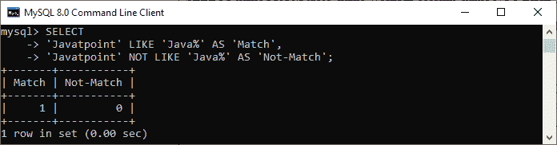
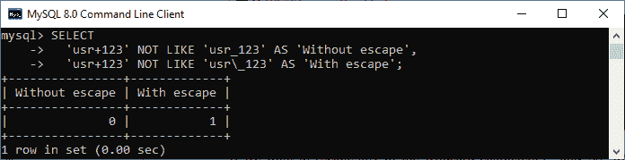
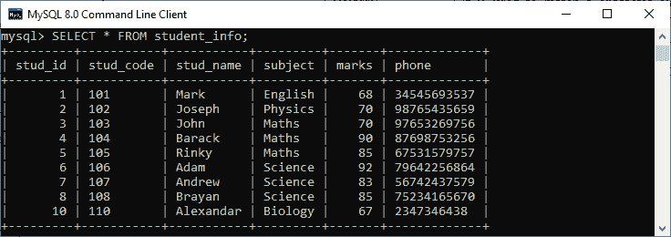
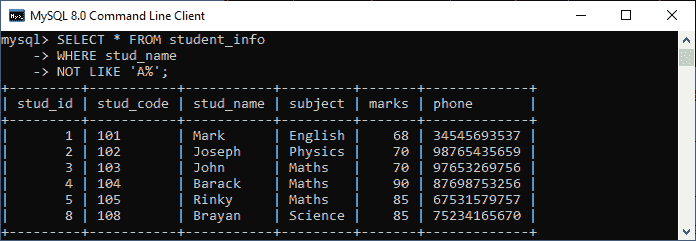
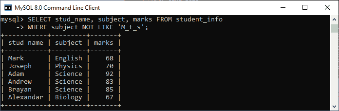
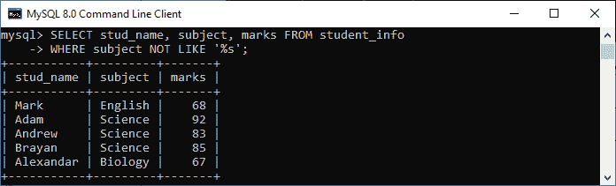
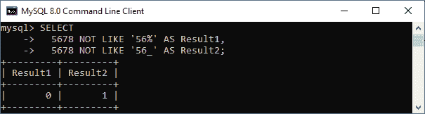

# MySQL 不像操作员

> 原文：<https://www.javatpoint.com/mysql-not-like-operator>

MySQL 提供了一种方法来查找两种类型的记录，无论是否匹配，都有一个特定的值。当我们想要在电子表格中找到需要编辑或报告的记录时，此功能非常有用。

MySQL 中的 NOT LIKE 运算符用于模式匹配。它**将该列与给定值进行比较，并返回与 NOT LIKE 子句**中的值不匹配的结果。如果语句找到匹配项，它将返回 0。否则，它将返回 1。我们可以用这个运算符来执行 LIKE 运算符的**否定**。该语句的主要优点是使用通配符搜索与模式匹配的一系列值。

### 句法

以下是在 MySQL 中使用该运算符的基本语法:

```

expression NOT LIKE pattern [ESCAPE 'escape_char']

```

在这个语法中，**表达式**是一个输入字符串，我们将对其执行搜索以匹配正则表达式。**模式**代表我们正在测试字符串的正则表达式。可选的**转义子句**用于指定转义字符。如果我们没有指定这个子句，默认情况下，它是\。

上面的运算符相当于下面的语法:

```

NOT (expression LIKE pattern [ESCAPE 'escape_char']) 

```

该语法通常与 **SELECT** 语句一起使用，如下所示:

```

SELECT name FROM table_name WHERE column_name NOT LIKE 'pattern';  

```

让我们通过例子来了解这个操作符在 [MySQL](https://www.javatpoint.com/mysql-tutorial) 中是如何工作的。

### 例子

下面的语句是“不像”运算符的最基本示例。这里我们只是**使用了一个字符串，并比较**输入字符串的任何部分是否与模式匹配来获得结果。

```

mysql> SELECT 
'Javatpoint' LIKE 'Java%' AS 'Match',
'Javatpoint' NOT LIKE 'Java%' AS 'Not-Match';

```

结果如下:



如果我们想要转义任何**通配符** (_ 和%)，我们需要使用**反斜杠**字符(\)。请参见下面的语句，其中将搜索有无转义符:

```

SELECT 
  'usr+123' NOT LIKE 'usr_123' AS 'Without escape',
  'usr+123' NOT LIKE 'usr\_123' AS 'With escape';

```

结果如下:



假设我们有一个名为 **student_info** 的表，其中包含以下数据。我们将基于此表数据演示各种示例。



如果我们想获得姓名不以字母“A”开头的**学生的详细信息，我们可以使用如下语句:**

```

mysql> SELECT * FROM student_info 
WHERE stud_name 
NOT LIKE 'A%';

```

执行该语句，我们将获得期望的结果。请参见以下输出:



下面的 MySQL 语句从 student_info 表中返回主题名为**的行，类似于用 like 运算符指定的模式:**

```

mysql> SELECT stud_name, subject, marks FROM student_info          
WHERE subject NOT LIKE 'M_t_s';

```

我们将得到下面的输出，我们可以看到语句没有返回包含上述模式的记录。



如果我们想要获取主题名称不以“s”字符结尾的**学生详细信息，我们可以使用下面的语句来实现:**

```

mysql> SELECT stud_name, subject, marks FROM student_info          
WHERE subject NOT LIKE '%s';

```

执行此语句后，我们将获得期望的结果:



下面的例子展示了**如何将 NOT LIKE 运算符与数值表达式**一起使用:

```

mysql> SELECT 
  5678 NOT LIKE '56%' AS Result1,
  5678 NOT LIKE '56_' AS Result2;

```

结果如下:



* * ***