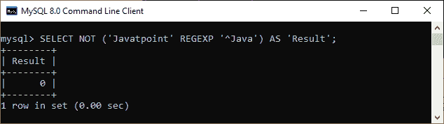
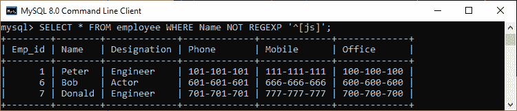

# MySQL 非正则表达式运算符

> 原文：<https://www.javatpoint.com/mysql-not-regexp-operator>

MySQL 中的 NOT REGEXP 是对用于模式匹配的 REGEXP 运算符的否定。它比较输入字符串中的给定模式，并返回与模式不匹配的结果。如果此运算符找到匹配项，则结果为 0。否则，结果为 1。

### 句法

以下是在 MySQL 中使用该运算符的基本语法:

```sql

expression NOT REGEXP pattern ;

```

在这个语法中，**表达式**是一个输入字符串，我们将对其执行搜索以匹配正则表达式。**模式**代表我们正在测试字符串的正则表达式。该语法通常用于[选择语句](https://www.javatpoint.com/mysql-select)。

**以上语法相当于下面的语句**:

```sql

NOT (expression REGEXP pattern) ;

```

让我们通过例子来了解这个操作符在 [MySQL](https://www.javatpoint.com/mysql-tutorial) 中是如何工作的。

### 例子

下面的语句是使用 NOT REGEXP 运算符的最基本的例子。这里我们刚刚使用了一个**字符串，并将其与正则表达式**进行比较，以检查输入字符串的任何部分是否与模式匹配。

```sql

mysql> SELECT
'Corner' NOT REGEXP 'Corn' AS Result1,
'Bread' NOT REGEXP 'Bro' AS Result2;

```

结果如下:


下面的语句是另一个例子，如果给定的字符串以 Java 开头，则模式匹配。由于给定的字符串与 [Java](https://www.javatpoint.com/java-tutorial) 匹配，但是由于 [REGEXP 运算符](mysql-regexp-operator)的否定，我们将得到输出 0。

```sql

mysql> SELECT NOT ('Javatpoint' REGEXP '^Java') AS 'Result';

```

结果如下:



假设我们有一个名为**员工**的表，其中包含以下数据。


如果我们想**获取姓名不以 j 或 s 开头的员工详细信息**，我们可以这样做:

```sql

mysql> SELECT * FROM employee WHERE Name NOT REGEXP '^[js]';

```

执行该语句，我们将获得期望的结果。请参见以下输出:



* * *