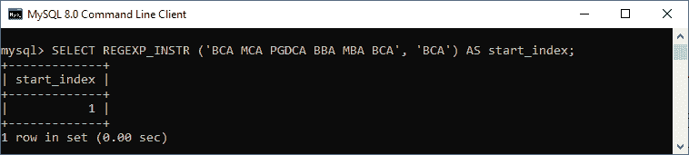
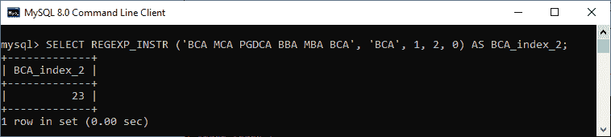
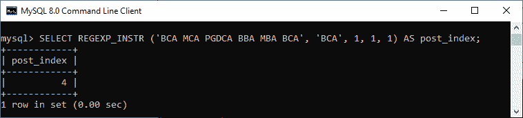

# MySQL REGEXP _ INSTR()函数

> 原文：<https://www.javatpoint.com/mysql-regexp-instr-function>

MySQL 中的 REGEXP_INSTR()函数用于模式匹配。是**通过匹配给定字符串返回子串**的索引值的函数。如果没有找到匹配项，此函数返回 0。否则，它返回 1。如果表达式或模式为空，则返回空值。这里，字符的索引从 1 开始。

### 句法

以下是在 [MySQL](https://www.javatpoint.com/mysql-tutorial) 中使用该函数的基本语法:

```

REGEXP_INSTR(expression, patterns, optional parameters);

```

### 参数说明

**REGEXP_INSTR()** 功能参数的解释为:

**表达式:**是一个字符串，我们将在上面通过正则表达式参数和函数进行搜索。

**模式:**表示用于匹配的正则表达式字符。

**REGEXP _ INSTR()函数使用下面给出的各种可选参数:**

**pos:** 用于指定搜索将开始的表达式中的位置。如果我们不指定这个参数，默认情况下，它是 1。

**出现时间:**用于指定我们要搜索匹配的哪个出现时间。如果我们不指定这个参数，默认情况下，它是 1。

**return_option:** 用于指定匹配的子串将返回哪种类型的位置。如果其值为 0，则意味着函数返回匹配子串的第一个字符的位置。如果它的值是 1，它将返回匹配的子字符串后面的位置。如果我们不指定这个参数，默认情况下，它是 1。

**match_type:** 是使用以下可能的字符进行匹配的字符串。

*   c:它表示区分大小写的匹配。
*   I:表示不区分大小写的匹配。
*   m:它表示多行模式，允许在字符串中使用行终止符。默认情况下，此函数匹配字符串开头和结尾的行终止符。
*   n:用于修改。(点)字符以匹配行终止符。
*   u:它代表了 Unix 专用的行尾。

让我们用各种例子来理解它。

### 例子

该语句返回表达式内子串“**”BCA**”的起始索引。如果我们执行该语句，它将返回 1，这是给定字符串的第一个索引。因为在这里，我们没有指定任何可选参数。

```

mysql> SELECT REGEXP_INSTR ('BCA MCA PGDCA BBA MBA BCA', 'BCA') AS start_index;

```

请参见以下输出:



在此语句中，我们通过修改带有可选参数位置和出现的查询，将模式字符串“BCA”的外观定位到第二个****时间。****

 ****```

mysql> SELECT REGEXP_INSTR ('BCA MCA PGDCA BBA MBA BCA', 'BCA', 1, 2, 0) AS BCA_index_2;

```

请参见以下输出:



在这个语句中，我们使用了 **return_option** 参数。当我们想要获取前面带有某种标识符的信息时，这个参数很有用。

```

mysql> SELECT REGEXP_INSTR ('BCA MCA PGDCA BBA MBA BCA', 'BCA', 1, 1, 1) AS post_index;

```

请参见以下输出:



* * *****