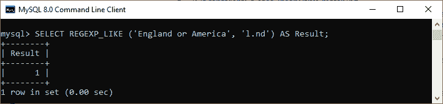
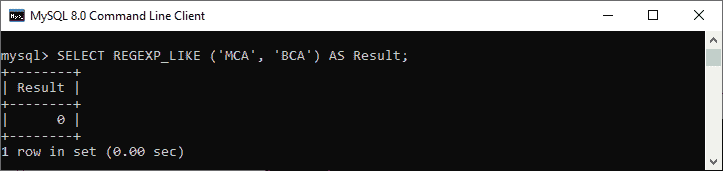
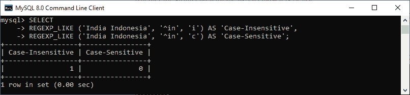

# MySQL REGEXP_LIKE()函数

> 原文：<https://www.javatpoint.com/mysql-regexp-like-function>

MySQL 中的 REGEXP _ LIKE()函数用于模式匹配。它**比较给定的字符串是否匹配正则表达式**。如果字符串与正则表达式匹配，则返回 1；如果未找到匹配，则返回 0。

### 句法

以下是在 [MySQL](https://www.javatpoint.com/mysql-tutorial) 中使用该函数的基本语法:

```sql

REGEXP_LIKE (expression, pattern [, match_type])

```

### 参数说明

REGEXP_LIKE()函数参数的解释如下:

**表达式:**是一个输入字符串，我们对其执行搜索以匹配正则表达式。

**模式:**它代表我们正在测试字符串的正则表达式。

**match_type:** 是一个字符串，可以让我们细化正则表达式。它使用以下可能的字符来执行匹配。

*   **c:** 表示区分大小写的匹配。
*   **i:** 表示不区分大小写的匹配。
*   **m:** 它代表多行模式，识别字符串中的行终止符。默认情况下，此函数匹配字符串开头和结尾的行终止符。
*   **n:** 用于修饰。(点)字符以匹配行终止符。默认情况下，它会停在一行的末尾。
*   **u:** 它代表只识别换行符的 Unix 行尾。、^和$ match 运算符。

让我们通过各种例子来理解如何在 MySQL 中使用这个函数。

### 例子

以下语句解释了 MySQL 中 REGEXP _ LIKE 函数的基本示例。

```sql

mysql> SELECT REGEXP_LIKE ('England or America', 'l.nd') AS Result;

```

在本例中，正则表达式可以指定任何字符来代替点。因此，我们将在这里得到一个匹配。所以这个函数返回 1 表示匹配。



下面的语句是输入字符串与给定正则表达式不匹配的另一个示例。

```sql

mysql> SELECT REGEXP_LIKE ('MCA', 'BCA') AS Result;

```

以下是输出:



下面的语句是另一个例子，其中指定的正则表达式搜索**字符串是否以给定的字符结束:**

```sql

mysql> SELECT REGEXP_LIKE ('England Netherland Scotland', 'and$') AS Result;

```

结果如下:


我们可以提供一个额外的参数，通过使用匹配类型参数来优化正则表达式。请参见下面的示例，其中我们指定了区分大小写的**和不区分大小写的**匹配项:****

```sql

mysql> SELECT 
REGEXP_LIKE ('India Indonesia', '^in', 'i') AS 'Case-Insensitive',
REGEXP_LIKE ('India Indonesia', '^in', 'c') AS 'Case-Sensitive';

```

结果如下:



* * ***