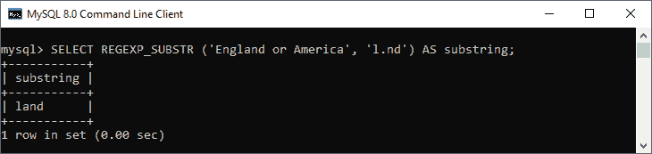
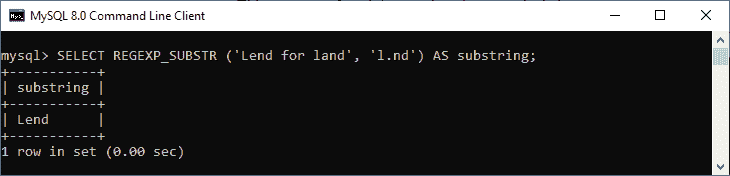
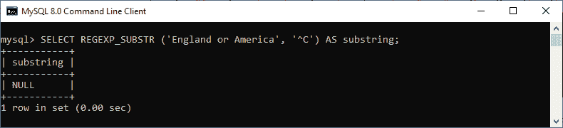
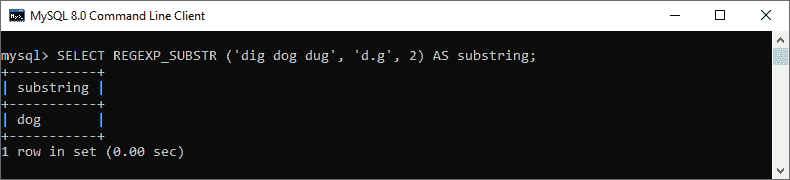
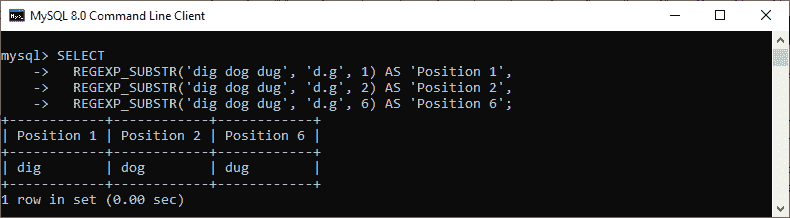
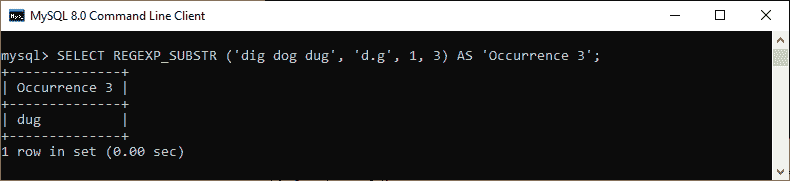
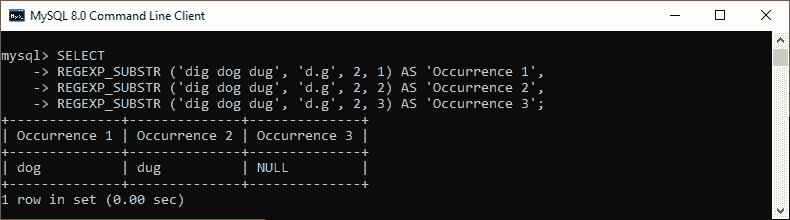
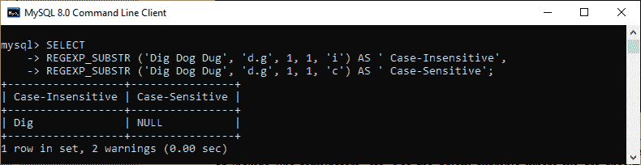

# MySQL REGEXP_SUBSTR()函数

> 原文：<https://www.javatpoint.com/mysql-regexp-substr-function>

MySQL 中的 REGEXP _ SUBSTR()函数用于模式匹配。该函数**返回输入字符串**中与给定正则表达式模式匹配的子字符串。如果没有找到匹配，它将返回空值。如果表达式或模式为空，函数将返回空值。

REGEXP _ SUBSTR()与 SUBSTRING 函数相同，但是这个函数不是只提取给定的子字符串，而是允许我们在字符串中搜索正则表达式模式。

### 句法

以下是在 [MySQL](https://www.javatpoint.com/mysql-tutorial) 中使用该函数的基本语法:

```

REGEXP_SUBSTR (expression, pattern [, position[, occurrence[, match_type]]])

```

### 参数说明

REGEXP_SUBSTR()函数参数的解释如下:

**表达式:**它是一个输入字符串，我们将通过正则表达式对其进行搜索。

**模式:**表示子串的正则表达式模式。

**REGEXP _ SUBSTR()函数使用的可选参数也在下面给出:**

**pos:** 用于指定字符串中表达式的位置，开始搜索。如果我们忽略这个参数，它从位置 1 开始。

**出现时间:**用于指定我们要搜索匹配的哪个出现时间。如果省略此参数，将使用第一个匹配项。

**match_type:** 是一个字符串，可以让我们细化正则表达式。它使用以下可能的字符来执行匹配。

*   **c:** 表示区分大小写的匹配。
*   **i:** 表示不区分大小写的匹配。
*   **E:** 用于使用子表达式提取子串。
*   **m:** 它代表多行模式，识别字符串中的行终止符。默认情况下，此函数匹配字符串开头和结尾的行终止符。
*   **n:** 用于修饰。(点)字符以匹配行终止符。默认情况下，它会停在一行的末尾。
*   **u:** 它代表只识别换行符的 Unix 行尾。、^和$ match 运算符。

让我们用各种例子来理解它。

### 例子

以下语句解释了 MySQL 中 REGEXP _ SUBSTR 函数的基本示例。

```

mysql> SELECT REGEXP_SUBSTR ('England or America', 'l.nd') AS substring;

```

该语句找到了匹配项，并返回以下输出:



假设在输入字符串中找到多个匹配项。在这种情况下，默认情况下会返回匹配子字符串的第一个匹配项。但是，如果需要，我们也可以指定另一个事件。请参见以下声明:

```

mysql> SELECT REGEXP_SUBSTR ('Lend for land', 'l.nd') AS substring;

```

此语句找到了匹配项，并返回匹配子字符串的第一个匹配项，因为我们没有指定任何特定的匹配项。请参见以下输出:



如果输入字符串和模式(子字符串)字符串不匹配，该函数返回空值。请参见下面的示例:

```

mysql> SELECT REGEXP_SUBSTR ('England or America', '^C') AS substring;

```

以下是输出:



如果我们想通过指定一个起始位置来返回子字符串，我们可以使用 REGEX _ SUBSTR 函数，如下所示:

```

mysql> SELECT REGEXP_SUBSTR ('dig dog dug', 'd.g', 2) AS substring;

```

在这个语句中，我们指定了起始位置为 2。执行这个查询，我们将得到下面的输出，在这里我们可以看到匹配的子字符串的第一个位置没有被返回。



让我们看另一个例子来更清楚地理解它:

```

mysql> SELECT 
  REGEXP_SUBSTR('dig dog dug', 'd.g', 1) AS 'Position 1',
  REGEXP_SUBSTR('dig dog dug', 'd.g', 2) AS 'Position 2',
  REGEXP_SUBSTR('dig dog dug', 'd.g', 6) AS 'Position 6';

```

以下是输出:



如果我们想要为返回匹配的子字符串指定特定的出现，我们可以如下使用这个函数:

```

mysql> SELECT REGEXP_SUBSTR ('dig dog dug', 'd.g', 1, 3) AS 'Occurrence 3';

```

在这个例子中，我们指定了匹配子串的起始位置为 1，匹配子串的出现位置为 3。因此，我们将获得以下输出:



这里是另一个例子，我们在 2 处指定了起始位置，出现次数为 1、2 和 3。

```

mysql> SELECT 
REGEXP_SUBSTR ('dig dog dug', 'd.g', 2, 1) AS 'Occurrence 1',
REGEXP_SUBSTR ('dig dog dug', 'd.g', 2, 2) AS 'Occurrence 2',
REGEXP_SUBSTR ('dig dog dug', 'd.g', 2, 3) AS 'Occurrence 3';

```

这个函数将给出下面的输出，因为起始位置在第一个事件开始之后。因此，该函数假设出现 2 为出现 1，出现 3 为出现 2。然后没有发现更多的事件，所以事件 3 的结果变成了空。



我们可以提供一个额外的参数，通过使用匹配类型参数来优化正则表达式。**例如**，我们可以用它来验证匹配是区分大小写还是包含行终止符。请参见下面的示例，其中我们指定了区分大小写和不区分大小写的匹配项:

```

mysql> SELECT 
REGEXP_SUBSTR ('Dig Dog Dug', 'd.g', 1, 1, 'i') AS ' Case-Insensitive',
REGEXP_SUBSTR ('Dig Dog Dug', 'd.g', 1, 1, 'c') AS ' Case-Sensitive';

```

以下是输出:



* * *