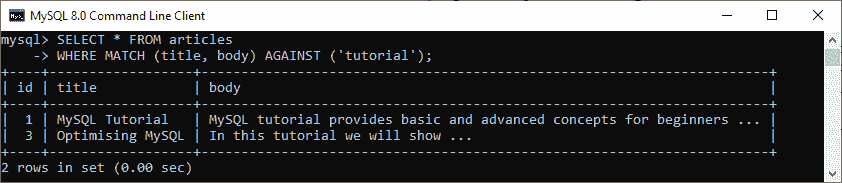
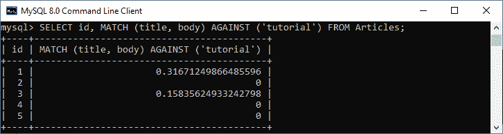

# MySQL 全文搜索(FTS)

> 原文：<https://www.javatpoint.com/mysql-fulltext-search>

全文搜索是一种搜索技术，用于**检查文档中可能不完全符合搜索标准**的所有单词。这些记录包含文本数据，如产品描述、博客文章、文章等。 [MySQL](https://www.javatpoint.com/mysql-tutorial) 从 3.23.23 版本开始支持全文索引和搜索。在这一节中，我们将学习 FULLTEXT 搜索的介绍、语法、优点、缺点、特性及其类型。

FTS 搜索技术常用于搜索引擎，如**谷歌**、 **Mozilla** 或**必应**。所有这些搜索引擎都将网站的数据收集到数据库中，并根据关键词进行搜索。它在博客、新闻、电子商务等网站上产生强大的搜索结果。

**比如**，我们已经搜索了**植物**和**树木**。FTS 检查这两个词，并可以返回分别包含搜索到的词的结果，这些词的顺序不同，要么是植物和树，要么是树和植物，或者只是植物和树。它有利于用户猜测他们想要什么，并更快地返回相关结果。

技术上，MySQL 通常通过使用 [LIKE](https://www.javatpoint.com/mysql-like) 和[正则表达式运算符](https://www.javatpoint.com/mysql-regular-expressions)来支持部分文本查找。但是，这些请求对大型数据集有一些限制，即当文本列很大或行数增加时。当用户的输入不完全匹配或者即使文档包含与该输入相关的信息也可能不会产生任何结果时，它也会表现不佳。

**关于 MySQL 全文搜索的要点:**

*   **性能** : MySQL 需要扫描整个表，根据 LIKE 或正则表达式语句中指定的模式找到精确匹配。
*   **灵活搜索** : MySQL 没有灵活的搜索查询，因为 LIKE 和正则表达式基于模式匹配来检查搜索。例如，查找描述包含自行车但不包含经典的产品。
*   **相关性排名**:它没有任何具体的方式来指定结果集中哪一行与搜索关键词更相关。
*   **存储引擎**:全文不支持所有存储引擎。它只支持 MySQL 中的 **MyISAM** 和 **InnoDB** 存储引擎。

### 句法

MySQL 使用以下语法执行全文搜索:

```

MATCH (col1, col2, col3, and so on) AGAINST (expression [search_modifier])

```

在该语法中，我们将首先指定 **MATCH** ()函数，该函数包含要搜索的列名列表，列名由逗号分隔。然后，**反对**()函数用一个字符串和一个可选修饰符进行搜索，以指示执行什么类型的搜索。**搜索修饰符**可以是自然语言模式，也可以是带有查询扩展的自然语言模式，也可以是布尔模式或带有查询扩展的自然语言模式。

## MySQL 全文搜索功能

以下是 MySQL 全文搜索的一些重要功能:

*   **原生类 SQL 接口:** MySQL 使用类 SQL 语句执行全文搜索。
*   **全动态索引**:每当列中发生数据修改时，MySQL 都会自动更新该文本列的索引。
*   **中等索引大小**:full text 索引大小比较小。
*   **速度**:基于复杂的搜索查询检查数据的全文搜索技术速度很快。

## 全文限制

*   全文只支持 InnoDB 和 MyISAM 表。
*   它也不支持分区表。
*   MATCH()函数参数必须与作为全文索引定义一部分的表中的列列表相同，除非在 MyISAM 表上 MATCH()处于布尔模式。
*   我们不能在全文搜索中使用“%”通配符。
*   在查询执行过程中，NORTH()的参数应该是一个常量字符串值。
*   全文索引对所有列使用相同的字符集和排序规则。
*   我们只能为 **CHAR、VARCHAR** 或 **TEXT** 列创建全文索引。

## 全文搜索类型

全文搜索主要分为三种类型:

### 自然语言搜索类型

这种搜索模式将搜索字符串解释为自然人类语言中的文字短语。它不支持特殊字符。如果未指定修饰符，或者指定了自然语言模式修饰符，则默认情况下启用。

### 查询扩展搜索类型

**执行两次搜索**是对自然语言搜索类型的修改。它首先执行包含一些最相关文档的自然语言搜索，然后再次搜索以返回结果。它是通过使用 WITH QUERY EXPANSION 修饰符来启用的。

### 布尔搜索类型

此搜索模式解释复杂查询的搜索字符串，这些查询可以包括布尔运算符，如小于()运算符、加号(+)和减号(-)运算符、子表达式(“(”和“)”)、双引号(“”)运算符、降低值对结果贡献的运算符(~)和通配符。它可以通过使用“布尔模式”修改器来启用。

**让我们学习一下如何定义全文索引，在 MySQL** 中执行全文搜索。

我们必须确保在对表的列执行全文搜索之前，需要对其数据进行索引。**每当列数据发生变化，MySQL 都会自动重新创建全文索引**。在 MySQL 中，全文索引总是被命名为 FULLTEXT。我们可以定义列数据类型为 CHAR、VARCHAR 和 text 的全文索引。

我们可以在使用 [**CREATE TABLE** 语句](https://www.javatpoint.com/mysql-create-table)或使用 [**ALTER TABLE**](https://www.javatpoint.com/mysql-alter-table) 或 **CREATE INDEX** 语句为现有表创建表时定义全文索引。

### 使用创建表语句创建全文索引

全文索引是在使用 CREATE TABLE 语句创建新表时定义的，如下所示:

```

CREATE TABLE table_name(
	column_name1 data type,
	column_name2 data type,
	.....,
	FULLTEXT (column1, column2,..)
);

```

这里的**表名**是新表的名称，**列名**是列的名称， **FULLTEXT** 表示包含括号中逗号分隔的列名列表的全文索引。

下面的语句创建了一个名为**文章**的新表。此表有一个全文索引，其中包括文章内容列:

```

mysql> CREATE TABLE Articles (
	id INT AUTO_INCREMENT NOT NULL PRIMARY KEY,
	title VARCHAR(220),
	body TEXT,
	FULLTEXT (title, body)
);

```

接下来，我们将记录填入该表:

```

mysql> INSERT INTO Articles VALUES
('0', 'MySQL Tutorial', 'MySQL tutorial provides basic and advanced concepts for beginners ...'),
('0', 'How To Install MySQL', 'Here we will learn how we to download and install MySQL ...'),
('0', 'Optimising MySQL', 'In this tutorial we will show ...'),
('0', 'MySQL vs. MongoDB', 'In the following database comparison ...'),
('0', 'MySQL Versions', 'This section shows all MySQL versions ...');

```

我们现在将使用 MATCH()函数执行全文搜索，该函数在 ANGER()参数中包含一个搜索字符串。它在不区分大小写的模式下执行搜索。MATCH()函数为表中的每一行返回一个相关值。如果我们在 WHERE 子句中使用 MATCH()函数，返回的行将首先以最高的相关性值自动排序。相关性是根据单词数、唯一单词数、集合中的单词总数以及包含特定单词的行数来计算的。

```

mysql> SELECT * FROM articles 
WHERE MATCH (title, body) AGAINST ('tutorial');

```

这里是我们对字符串**“教程”**执行全文搜索的输出:



让我们看另一个例子**展示了如何显式检索相关值**:

```

mysql> SELECT id, MATCH (title, body) AGAINST ('tutorial') FROM Articles;

```

以下是未对返回的行进行排序的输出:



### 使用 ALTER TABLE 语句创建全文索引

MySQL 还提供了 ALTER TABLE 语句，用于在现有的表上创建全文索引。以下语法更清楚地说明了这一点:

```

ALTER TABLE table_name  
ADD FULLTEXT (column1, column2,?)

```

在这个语法中，我们需要首先指定表名来创建索引。其次，使用 **ADD FULLTEXT 子句**定义一列或多列的全文索引。

**例如**，我们有一个名为**的表**包含列 id、标题、内容和作者。现在，我们可以为**内容**和**作者**列定义全文索引如下:

```

mysql> ALTER TABLE books ADD FULLTEXT (content, author)

```

## 使用 CREATE INDEX 语句创建全文索引

我们还可以使用 CREATE INDEX 语句为现有表创建全文索引。以下语法更清楚地说明了这一点:

```

CREATE FULLTEXT INDEX index_name
ON table_name (idx_column1, idx_column2,...)

```

**例如**，我们有一个名为 **office** 的表，其中包含列 **address_line1** 和 **address_line2** 。现在，我们可以使用以下语句为这些列创建一个 FULLTEXT 索引:

```

mysql> CREATE FULLTEXT INDEX address
ON office (address_line1, address_line2)

```

## 如何删除全文索引？

MySQL 提供了一个从表中删除全文索引的命令。我们可以通过使用如下所示的 ALTER TABLE DROP INDEX 语句来实现这一点:

```

ALTER TABLE table_name DROP INDEX index_name;

```

在这个语法中，我们首先指定了一个表的名称，然后是全文索引名称，后跟 **DROP INDEX** 子句。

**例如**，执行下面的语句将**从“**办公室”**表中永久删除地址索引**:

```

mysql> ALTER TABLE offices DROP INDEX address;

```

* * *