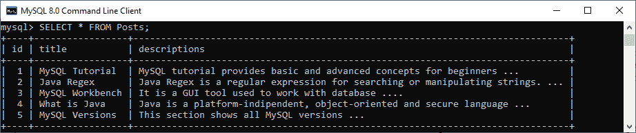
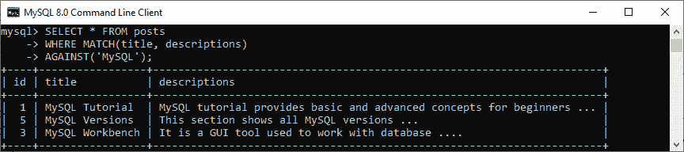
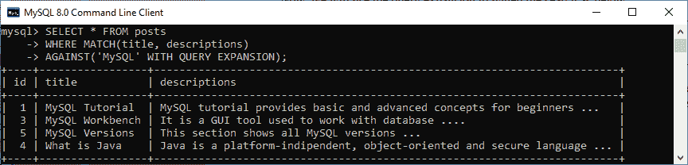

# MySQL 查询扩展全文搜索

> 原文：<https://www.javatpoint.com/mysql-query-expansion-fulltext-search>

我们知道每个用户都是基于他们的知识来搜索信息的。他们用一些关键词来搜索信息，那些关键词太短了。我们可以使用 MySQL 引入的一个新概念——查询扩展来解决这个问题，并帮助用户找到他们想要的东西。

MySQL 中的查询扩展用于**基于自动相关反馈或盲目查询扩展**来拓宽全文搜索的搜索结果。当使用查询扩展时，MySQL 全文搜索引擎执行以下步骤:

**步骤 1:** 它将首先搜索与给定搜索查询匹配的所有行。

**第二步:**它会通过检查搜索中的所有行来找到所有相关的单词。

**第三步:**最后，它会根据这些相关词而不是用户指定的原始关键词再次搜索。

在理解了查询扩展的概念之后，可能很清楚，当搜索结果太短时，我们可以使用查询扩展。我们可以再次执行搜索，但是用户会获得更多与他们使用这个概念所寻找的内容相关的信息。

如果要使用查询扩展全文搜索，需要在兑()函数中添加 **WITH QUERY EXPANSION** 搜索修饰符。换句话说，它是通过在搜索短语后添加带有查询扩展或在带有查询扩展的自然语言模式下启用的。以下是 [MySQL](https://www.javatpoint.com/mysql-tutorial) 中说明该搜索的**基本语法**:

```sql

SELECT column_lists FROM table_name
WHERE MATCH(column1, column2)
AGAINST('keyword', WITH QUERY EXPANSION);

```

让我们通过例子来理解查询扩展全文搜索在 MySQL 中是如何工作的。

### MySQL 查询扩展示例

假设我们有一个名为**的表发布了包含以下数据的**。本表有**标题**和**说明**栏作为全文索引。



以下示例显示了一篇文章信息的搜索结果，该文章的名称包含“**MySQL”**术语，但不使用查询扩展:

```sql

mysql> SELECT * FROM posts 
WHERE MATCH(title, descriptions) 
AGAINST('MySQL');

```

执行查询将返回包含“MySQL”术语的三个帖子名称:



现在，我们将使用查询扩展来扩大搜索范围，如下所示:

```sql

mysql> SELECT * FROM posts 
WHERE MATCH(title, descriptions) 
AGAINST('MySQL' WITH QUERY EXPANSION);

```

执行该语句，当使用查询扩展时，我们将在结果集中多获得一行。这里，前三行是最相关的，其他行来自从前三行派生的相关关键字。



需要注意的是，盲查询扩展通过返回不相关的输出显著增加了噪声，因此建议仅在搜索到的短语较短时使用。

* * *