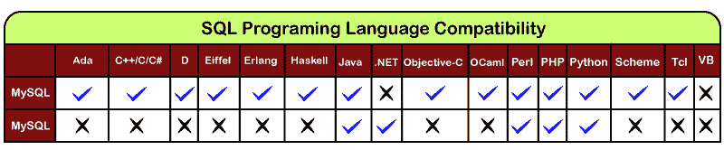
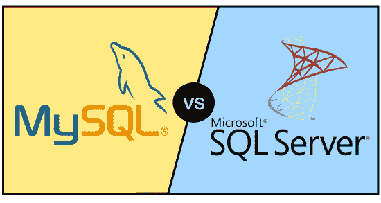

# MySQL 与 MS SQL Server 的区别

> 原文：<https://www.javatpoint.com/mysql-vs-ms-sql-server>

当程序员开发任何软件项目时，他们总是使用关系数据库管理系统。关系数据库管理系统允许用户使用创建、删除、更新和读取命令来操作后端数据。开发人员可以根据自己的具体需求在各种关系数据库管理系统中选择任何数据库软件。他们可以选择**开源**关系数据库管理系统或者**商业**数据库系统。大多数情况下，他们更喜欢提供许多高级功能以及最新安全和加密技术的商业数据库。

MySQL 和 MS SQL 是许多大小企业广泛使用的关系数据库管理系统软件。根据开发人员的需求和预算，这两个数据库都有几个版本。在本节中，我们将从开发人员的角度理解 MySQL 和 MS SQL Server 之间的主要区别。

### 什么是微软 SQL Server？

MS SQL Server 是 RDBMS 数据库软件，由**微软公司**开发销售。该软件的主要目标是存储、检索和访问开发人员从同一系统或使用远程位置请求的数据。它是为了与 MySQL 和 Oracle 数据库软件竞争而推出的。与其他关系数据库管理系统类似，它也使用 SQL 查询与数据库进行交互。然而，微软 SQL 自带查询语言 **T-SQL(Transact-SQL)** ，它提供了一组额外的编程结构来声明变量、存储过程、异常处理等。它使用支持 32 位和 64 位环境的 SQL Server Management Studio(SSMS)接口工具。

### 什么是 MySQL？

MySQL 是用于管理关系数据库的流行数据库管理系统。是开源数据库软件，**Oracle 公司**支持。与微软的 SQL Server 和 Oracle 数据库相比，它是一个快速、可扩展、易于使用的数据库管理系统。它通常与 PHP 脚本一起用于创建强大且动态的服务器端或基于 web 的企业应用程序。它使用 **MySQL 工作台**作为与数据库架构师合作的界面工具。

它由瑞典公司 **MySQL AB** 开发、营销和支持，用 C 和 C++编程语言编写。很多大小公司都用 MySQL。MySQL 支持很多操作系统，比如 Windows、Linux、MacOS 等。使用 C、C++和 Java 语言。

### MySQL 与微软 SQL Server 的比较

以下是两者之间的基本比较:

**环境:** MySQL 由 Oracle 公司管理和支持，可以与大多数流行的操作系统配合使用。它还可以与其他语言一起工作，如 TCL、Scheme、Perl 和 Haskel。另一方面，MS SQL 由主要运行在 Windows 操作系统上的微软公司管理和支持。然而，微软最近宣布，这个数据库也可以支持 Linux 和 Mac OS X 操作系统。

**版本:** MySQL 数据库有三个版本，分别是 MySQL 社区版、MySQL 企业版和 MySQL 标准版。相比之下，微软 SQL 数据库有多种版本，如标准版、企业版、网络版、工作组版或快速版。

**成本:** MySQL 是开源数据库软件，属于通用公共许可证(GNU)，所以我们可以免费使用。另一方面，MS SQL 是微软公司开发支持的，不能免费使用。如果我们想使用这个数据库，我们必须购买商业许可证。

**IDE 工具:** MySQL 和 MS SQL 总是使用不同的 IDE 工具进行开发。微软 SQL 使用 SQL Server 管理工作室(SSMS)界面工具。而 MySQL 使用企业管理器，允许我们与服务器连接，并为架构、表设计和安全性提供数据库管理。

**语言兼容性:**在 MySQL 数据库系统中，我们可以使用 C、C++、Ada、Perl、Java 等多种编程语言。而在微软的 SQL 中，我们可以使用。Net、PHP、Ruby、Visual Basic、Java、VB 和 Python 编程语言。下图更清楚地解释了这一点:

**安全性:** MySQL 使用符合 EC2 的服务来安全地存储数据。而微软 SQL Server 具有 EC2 兼容以及最先进的安全功能，并且微软公司自己也拥有这一功能。

**查询取消:**在 MySQL 中，我们不能在查询进行过程中取消查询。另一方面，MS SQL 允许我们在查询进行到一半时停止查询。在使用事务引擎确保状态一致性的过程中，MS SQL 也比 MySQL 更好。

**过滤:** MySQL 过滤掉用户、表、行等。在许多方面，但它一次只能使用一个数据库。另一方面，MS SQL 可以同时使用多个数据库。MS SQL 允许开发人员筛选出用户、表、行等。并且可以将过滤后的数据存储在不同的数据库中。

### MySQL 与微软 SQL Server

让我们将上述差异总结成表格形式，如下所示:

| 比较基础 | 关系型数据库 | 微软 |
| 定义 | MySQL 是用于管理关系数据库的流行数据库管理系统。与微软的 SQL Server 相比，它是一个快速、可扩展、易于使用的数据库系统。 | 它是一种关系数据库管理系统(RDBMS)数据库软件，主要是为 Windows 系统存储、检索和访问开发者请求的数据而开发的。 |
| 开发者 | 它由 Oracle 公司开发。 | 它由微软公司开发。 |
| 初始版本 | 它于 1995 年 5 月 23 日首次推出。 | 它于 1989 年 4 月 24 日首次推出。 |
| 最新版本 | 8 . 0 . 19 2020 年 1 月 | 2019 年 11 月的 SQL Server 2019 |
| 许可证 | 开源的 | 商业 |
| 工具语言 | C，C++ | C++ |
| 操作系统支持 | FreeBSD
Linux
OS x
Solaris
windows | Linux
Windows
MacOS |
| 数据备份 | 在数据备份期间，它会阻塞数据库。 | 在数据备份过程中，它不会阻塞数据库。 |
| 应用编程接口和其他访问方法 | ADO.NET
JDBC
ODBC
专有本地 API | ADO.NET
JDBC
ODBC
OLE DB
表格数据流(TDS) |
| 查询取消 | 它不允许我们在查询过程中取消查询。 | 这个数据库系统允许我们在过程的中途停止查询。 |
| 数据库操作 | 我们无法在运行时操作数据库文件。 | 我们可以在运行时操作数据库文件。 |
| 版本 | MySQL 社区版
MySQL 企业版
MySQL 标准版 | SQL Server 标准版
SQL Server 企业版
SQL Server Web
SQL Server 工作组
SQL Server 快速版 |
| 储存空间 | 它占用更少的操作存储空间。 | 它需要很大的操作存储空间。 |
| 费用 | 它属于通用公共许可证，可以免费使用。 | 它需要购买许可证才能访问其高级功能。 |
| 社区支持 | 它有非常丰富的社区支持，因为它是免费使用的。 | 它没有太多的社区支持，因为它是一项付费服务。 |
| 用户界面 | MySQL 工作台 | SQL Server 管理工作室(SSMS)。 |
| 公司使用 | 亚马逊
【Netflix】
【Uber technologies】
【Dropbox】
【pinteres】
Airbnb | Microsoft
栈交换
忒
MIT
全页
子文件 |

* * *