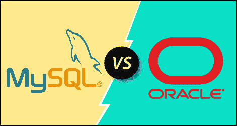

# MySQL 和 Oracle 的区别

> 原文：<https://www.javatpoint.com/mysql-vs-oracle>

MySQL 和 Oracle 是小公司和大公司使用的两个著名的关系数据库。虽然甲骨文公司支持这两种数据库，但它们也有很多不同之处。与 MySQL 相比，甲骨文是更强大的软件。在本节中，我们将基于各种参数来比较 MySQL 和 Oracle 数据库系统之间的差异。

### 什么是 MySQL？

[MySQL](https://www.javatpoint.com/mysql-tutorial) 是目前流行的用于管理关系数据库的数据库管理系统。它是开源数据库软件，由甲骨文公司支持。与微软 [SQL Server](https://www.javatpoint.com/sql-server-tutorial) 和甲骨文数据库相比，它是一个快速、可扩展、易于使用的数据库管理系统。它通常与 PHP 脚本一起用于创建强大且动态的服务器端或基于 web 的企业应用程序。

由瑞典公司 **MySQL AB** 开发支持，用 C 和 [C++编程语言](https://www.javatpoint.com/cpp-tutorial)编写。很多大小公司都用 MySQL。MySQL 支持很多操作系统，像 Windows、 [Linux](https://www.javatpoint.com/linux-tutorial) 、MacOS 等。用 [C](https://www.javatpoint.com/c-programming-language-tutorial) 、C++、 [Java 语言](https://www.javatpoint.com/java-tutorial)。

**MySQL 数据库的特性**

MySQL 数据库的基本特性如下:

*   MySQL 是一个关系数据库管理系统，使用方便。我们可以只使用几条简单的 SQL 语句来构建 MySQL 并与之交互。
*   它是安全的，因为密码在 MySQL 中是加密的。
*   它遵循客户机/服务器架构。
*   它是免费和开源的。
*   它是可扩展的。
*   它允许事务回滚、提交和崩溃恢复。
*   它提供高性能、高灵活性和高生产率。

### 什么是甲骨文？

[Oracle](https://www.javatpoint.com/oracle-tutorial) 是一个关系数据库系统，提供自驱动、自保护、自修复，旨在消除容易出错的手动数据库管理。Oracle 是一个跨平台的数据库系统，可以在各种操作系统上运行。它允许快速安全地存储和检索数据。学生可以免费获得，但不能用于商业目的。它是第一个为商业目的开发的使用查询语言操作数据的数据库软件。Oracle 于 1980 年发布，具有基本的 SQL 功能。该软件是可扩展的、可移植的、分布式的和可编程的。

**甲骨文数据库的特点**

Oracle 数据库的基本特性如下:

*   Oracle 数据库是跨平台的，因为它可以在 Windows、Linux、Mac 等各种操作系统上运行。
*   它支持逻辑数据库结构，允许在不知道数据物理存储的情况下与数据库交互。
*   它是可扩展的、可移植的、分布式的和可编程的。
*   它可以快速处理大量数据。
*   它支持 ACID 属性，允许我们维护您数据的完整性和可靠性。
*   oracle 拥有网络堆栈，使我们能够使用 Oracle 数据库在不同平台之间顺畅地进行应用程序通信。
*   它有一个恢复管理器工具，提供冷、热和增量数据库备份和恢复。

### MySQL 诉 Oracle

让我们以下面给出的表格形式总结一下 MySQL 和 Oracle 之间的常见差异:

| 比较基础 | 关系型数据库 | 神谕 |
| 介绍 | 它是一个开源的、跨平台的关系数据库管理系统，由瑞典 MYSQL AB 公司构建，目前由 Oracle 提供支持。 | Oracle 是一个实现面向对象特性的关系数据库系统(RDBMS)。它允许快速安全地存储和检索数据。它可以处理大量数据。 |
| 释放；排放；发布 | 它于 1995 年发行。 | 它于 1980 年发行。 |
| 费用 | 它是免费和开源的。它在 GNU 下获得许可。 | 它被许可用于商业目的，但它免费提供快速版。快速版只推荐给学生。 |
| 可量测性 | MySQL 数据库用于小型和大型企业。 | Oracle 数据库用于非常大规模的部署。 |
| 数据分区 | 它不支持数据分区。 | 它支持数据分区。 |
| 安全 | 它需要用户名、密码和主机来访问数据库。 | 访问数据库需要用户名、密码和配置文件验证。 |
| 系统类型 | 它只适用于静态系统。 | 它可以与静态和动态系统一起工作。 |
| 空值 | MySQL 支持空值。 | Oracle 不支持空值。 |
| 性格；角色；字母 | MySQL 只支持两个字符，即 CHAR 和 VARCHAR。 | Oracle 支持四种不同的字符，即 CHAR、VARCHAR2、NCHAR 和 NVARCHAR2。 |
| 备份机制 | 它只提供了两种备份机制，即 mysqlhotcopy 和 mysqldump。 | 它提供了许多备份机制，包括备份、热备份、导入、导出等。 |
| XML 支持 | 它不支持 XML。 | 它支持 XML。 |
| 存储功能 | 它只包含一些存储功能，如表空间、同义词、包和许多其他功能。 | 它支持许多存储功能，如表空间、同义词、包等。 |
| 锁定设备 | MySQL 只有一个表锁定功能。 | Oracle 有表锁定和行锁定功能。 |
| 语言支持 | MySQL 只支持 SQL 语言。 | Oracle 同时支持 SQL 和 PL/SQL 语言。 |
| 操作系统支持 | 它支持以下操作系统:

 | 它支持以下操作系统:

 |

* * *