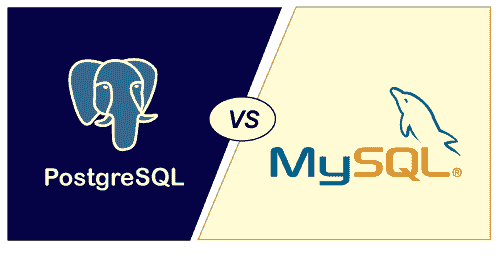

# PostgreSQL 和 MySQL 的区别

> 原文：<https://www.javatpoint.com/postgresql-vs-mysql>

当我们选择哪个数据库软件对我们的项目有用和最好时，在数据库之间进行比较是很重要的。PostgreSQL 和 MySQL 都是作为开源社区出现的两种最流行、使用最广泛的数据库软件。两种数据库都有各自的好处，所以组织更好的选择取决于具体的需求和目标。在进行比较之前，我们将简要讨论这些数据库。

## 什么是 PostgreSQL？

PostgreSQL 是一个开源的、跨平台的、**对象关系数据库管理系统(ORDBMS)** ，正式用 [C 编程语言](https://www.javatpoint.com/c-programming-language-tutorial)编写。最初是在加州大学 计算机科学系**引进的。它提供了非常简单的设置和安装。它支持 [SQL](https://www.javatpoint.com/sql-tutorial) 和 NoSQL 查询语言。它提供安全存储的数据，并可以在处理请求时恢复。它符合 ACID 标准，高度并发，还支持函数、存储过程&触发器。它有 **MVCC(多版本并发控制)**，允许几个用户同时在系统上工作。**

## 什么是 MySQL？

[MySQL](https://www.javatpoint.com/mysql-tutorial) 是一个开源且流行的数据库管理系统，用于管理**关系数据库**。Oracle 提供访问和管理该数据库的支持。与其他数据库相比，它速度快、可扩展、易于使用。它通常与 PHP 脚本一起用于创建强大且动态的服务器端或基于 web 的企业应用程序。

它作为**客户端-服务器架构**工作，客户端通过图形用户界面(GUI)发出请求，只要指令匹配，服务器就会给出想要的输出。

由**瑞典公司 MySQL AB** 开发支持，用 C 和 [C++编程语言](https://www.javatpoint.com/cpp-tutorial) s 编写，很多大小公司都用 MySQL。MySQL 支持很多操作系统，比如 [Windows](https://www.javatpoint.com/windows) 、 [Linux](https://www.javatpoint.com/linux-tutorial) 、MacOS 等。用 C、C++、 [Java 语言](https://www.javatpoint.com/java-tutorial)。

## PostgreSQL vs MySQL

让我们通过表格的形式来比较这两个数据库。虽然 [PostgreSQL](https://www.javatpoint.com/postgresql-tutorial) 和 MySQL 都是顶级的[关系数据库管理系统](https://www.javatpoint.com/what-is-rdbms) (RDBMS)，但是它们之间有着根本的区别。

| 参数 | 一种数据库系统 | 关系型数据库 |
| 定义 | PostgreSQL 是一个开源的、跨平台的、对象关系数据库管理系统(ORDBMS)，建立在加州大学计算机科学系。 | 它是一个开源的、跨平台的关系数据库管理系统，由瑞典 MYSQL AB 公司构建，目前由 Oracle 提供支持。 |
| 称为 | PostgreSQL 是一个功能更加密集的数据库系统。它被描述为世界上最先进的 Oracle 开源数据库版本。 | MySQL 以速度快而闻名，但它的功能不如 PostgreSQL。这是该组织中最受欢迎的数据库。 |
| 释放；排放；发布 | 它于 1995 年 5 月作为 Postgre95 发行。 | 它于 1995 年发行。 |
| 批准 | 这是麻省理工风格的执照。 | 它是 GNU(通用公共许可证)下的许可证。 |
| 发音 | 它被发音为后队列。 | 它被发音为我的 ess 队列。 |
| Programming Languages 履行 | 是用 c 写的。 | 它是用 C/C++编写的。 |
| 流行 | PostgreSQL 在来自 Oracle 或 SQL Server 背景的开发人员中很受欢迎。 | MySQL 因其速度快、使用方便而受到开发人员的欢迎。 |
| 图形用户界面工具 | 它提供了 PgAdmin 图形用户界面。 | 它提供了 MySQL 工作台 GUI。 |
| 存储引擎 | PostgreSQL 是一个统一的数据库服务器，只有一个存储引擎。 | MySQL 有一个多层结构，有一组存储引擎。比如 InnoDB，MyISAM。 |
| 耐酸性 | 它完全支持符合 ACID。 | 只有部分版本符合 ACID 标准。 |
| 主要焦点 | PostgreSQL 的开发重点是特性和标准。 | MySQL 的开发注重速度。 |
| 二手的 | PostgreSQL 通常用于大型和复杂的操作。对他们来说更可靠。 | MySQL 一般用于简单的操作。 |
| 安全 | 它支持本机 SSL。 | 它有 TLS 支持。 |
| 提供 | PostgreSQL 提供了可靠性、数据完整性和开发人员友好的特性。 | MySQL 通常与 PHP 一起使用，用于处理网页和优化简单查询。 |
| 工作单元表 | 它在 DROP TABLE 语句中没有 TEMP 或 TEMPLATE 关键字。 | 它在 DROP TABLE 语句中有一个 TEMP 或 TEMPLATE 关键字来移除临时表。 |
| 表继承 | 它支持。 | 它不支持。 |
| 分身术 | 异步、级联和同步。 | 异步、同步和半同步。 |
| 任务调度程序 | 它有一个 pgAgent 任务计划程序。 | 它有一个预定事件。 |
| 连接可伸缩性 | 在这里，每次创建连接，都是一个操作系统过程。 | 这里，每次创建连接时，它都是一个操作系统线程。 |
| 社区支持 | 它得到了开发人员强大而积极的社区支持，他们通过访问免费资源不断改进现有功能。 | 它拥有开发人员的广泛社区支持，他们总是用新功能维护现有功能。 |
| 公司用途 | 苹果、Etsy、IMDB、Macworld、Debian、红帽、太阳微系统、思科、Skype。 | GitHub、美国海军、NASA、特斯拉、网飞、脸书、推特、Zappos、YouTube、Spotify。 |

## PostgreSQL 相对于 MySQL 的优势

以下几点让 PostgreSQL 比 MySQL 更有优势:

*   PostgreSQL 是一个非常安全、独立且功能丰富的开源数据库。
*   PostgreSQL 支持许多高级数据类型，如多维数组、用户定义的类型等。
*   PostgreSQL 很好地遵循了 SQL 标准，并支持“高级”的 SQL，如窗口函数或通用表表达式。
*   它提供了 Oracle 和 SQL Server 支持的所有性能优化。
*   像亚马逊、红移、Instagram 等公司都在使用 PostgreSQL。

## MySQL 相对于 PostgreSQL 的优势

以下几点使 MySQL 比 PostgreSQL 更受欢迎:

*   就数据库排名而言，MySQL 比 PostgreSQL 更受欢迎。
*   在 MySQL 中获得社区支持和搜索答案比 PostgreSQL 更容易。
*   复制在 MySQL 而不是 PostgreSQL 中实现得很好。
*   脸书、推特、Pinterest 等公司都在使用 MySQL。

* * *