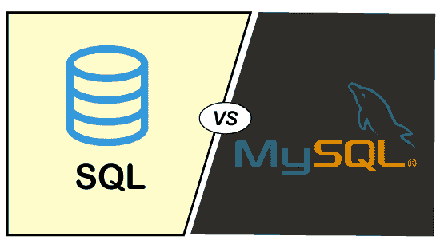

# MySQL 和 SQL 的区别

> 原文：<https://www.javatpoint.com/mysql-vs-sql>

SQL 扩展为结构化查询语言。SQL 是一种标准语言，使用户能够设计和管理数据库。另一方面，MySQL 是一个关系数据库管理系统，允许用户存储和检索数据库中的数据。MySQL 使用 SQL 对数据库执行特定的操作。MySQL 和 SQL 都提供了两种流行且与众不同的服务器:用于数据库管理的 MySQL Server 和 SQL Server。

让我们来了解一下 [MySQL](https://www.javatpoint.com/mysql-tutorial) 和 [SQL](https://www.javatpoint.com/sql-tutorial) 服务器的区别。

### 1)开发人员

SQL 由微软公司开发，命名为微软 SQL Server (MS SQL)。另一方面，MySQL 是由 Oracle 公司开发的。它的名字是“我的(联合创始人女儿名下)和结构化查询语言(SQL)”的组合包。

### 2)可用性

MySQL 是开源软件，所有人都可以免费使用。相比之下，SQL 不是开源软件，因此不能免费获得。

### 3)平台支持

SQL 最初是为 [Windows 操作系统](https://www.javatpoint.com/windows)开发的。目前由 [Linux](https://www.javatpoint.com/linux-tutorial) 和 macOS(通过 Docker)支持，缺少 Windows 平台支持的某些功能。而 MySQL 在 Windows、macOS、Linux、Solaris 平台上运行良好。

### 4)编程语言支持

MS SQL 本身是编程语言，但 SQL Server 支持 [C++](https://www.javatpoint.com/cpp-tutorial) 、 [Go](https://www.javatpoint.com/go-tutorial) 、 [R](https://www.javatpoint.com/r-tutorial) 、 [PHP](https://www.javatpoint.com/php-tutorial) 、 [Python](https://www.javatpoint.com/python-tutorial) 、 [Ruby](https://www.javatpoint.com/ruby-tutorial) 、Visual Basic 等基础编程语言。除了基本的编程语言，MySQL 还支持 Perl、Haskel、Tcl 等。

### 5)存储引擎

MySQL 不需要大量的存储空间来执行不同的操作。它支持多个存储引擎。MySQL 还支持插件存储引擎。另一方面，MS SQL 只支持单个存储引擎。因此，程序员需要用更好的引擎进行更新。

### 6)提供的安全性

MySQL 是一个不太安全的服务器，因为它只允许其他处理器或它自己的二进制文件在执行时操作数据库文件。

但是，微软 SQL 提供了一个高度安全的工作。它不允许在执行时通过其他处理器或自己的二进制文件访问或操作数据库文件。

### 7)备份

在 MySQL 中，对于数据备份，开发人员需要将其提取为 SQL 语句。在备份数据时，服务器会阻止数据库，这减少了从一个版本的 MySQL 切换到另一个版本时数据损坏的可能性。

在 MS SQL 中，服务器不会在备份时阻止数据库。这意味着在数据备份时，开发人员可以对数据库执行其他操作。

### 8)数据恢复的时间消耗

MySQL 因为同时执行多条 SQL 语句而消耗大量的数据恢复时间，而 MS SQL 还原海量数据的工作量和时间更少。

### 9)取消查询执行

MySQL 不提供在执行时停止或取消查询的功能。为此，用户需要取消整个过程。与 MySQL 不同，MS SQL Server 提供了在执行时截断查询的功能，而不会干扰或取消整个过程。

### 10)软件堆栈组件

企业可以根据用户对项目的需求，选择各种版本的 MS SQL。另一方面，许多网络应用程序开发人员使用 MySQL 作为 LAMP 堆栈的一个组件。

### 11)版本

MySQL 有两个版本。用户可以使用 MySQL 社区服务器或 MySQL 企业服务器。然而，微软的 SQL 有各种专门的版本。用户可以从网络、企业、标准或快速版本的 SQL 中进行选择。

### 12)多语言

MySQL 只有英语版本。相比之下，SQL 有许多不同的语言版本。

### 13)语法

SQL 语法易于使用和实现。另一方面，MySQL 语法的使用和实现有点典型。

例如，

如果我们想要实现长度函数，将使用以下查询:

```sql

MS SQL: SELECT LEN(req_string) FROM <Table_name>

MySQL: SELECT CHARACTER_LENGTH(req_string) FROM <Table_name>

```

## MySQL vs. SQL

通过下面的对比图，让我们了解一下 MySQL 和 SQL 之间的一些巨大差异:



| 塞内加尔 | 参数 | 关系型数据库 | 结构化查询语言 |
| 1. | 定义 | MySQL 是市场上流行的开源数据库，由瑞典公司 MySQL AB 开发。 | SQL(结构化查询语言)是一种编程语言，对于管理我们的关系数据库非常有用。 |
| 2. | 目的 | MySQL 用于以表格形式处理、存储、删除和更新数据。 | 它用于查询和操作数据库。 |
| 3. | 更新 | MySQL 是软件，所以经常更新。目前稳定的版本是 v8.0.20，它提供了比以前版本快两倍的速度。 | SQL 是一种编程语言；这就是为什么它没有得到任何更新。它的命令或语句总是固定不变的。 |
| 4. | 类型 | 它是使用 SQL 语言和数据库进行交互的数据库软件。 | 它是一种用于管理数据库的查询语言。 |
| 5. | 复杂性 | 通过简单的下载和安装就可以轻松使用。 | 它需要学习语言来有效地使用它。 |
| 6. | 使用 | MySQL 被用作管理关系数据库的 RDBMS。 | SQL 命令或语句用于各种数据库管理系统和关系数据库管理系统。MySQL 本身使用 SQL 命令。 |
| 7. | 连接器支持 | 它提供了设计和开发数据库的 MySQL 工作台工具。 | SQL 中没有可用的连接器。 |
| 8. | 使用多种语言的 | 它只有英语版本。 | 它有许多不同的语言版本。 |
| 9. | 灵活性 | 它不支持 XMAL 和用户定义的函数。 | 它包括对 XMAL 和用户定义函数的支持。 |
| 10. | 社区支持 | MySQL 是免费使用的，因此它拥有非常丰富的社区支持。 | 它没有优秀的社区支持。如果我们发现任何问题，我们需要去微软的 SQL Server 支持。 |
| 11. | 优势 | 开源的。
数据安全。
高性能。
数据安全。
完成工作流程控制。 | 不需要编码。
高速。
便携性。
多视角的数据。
互动语言。 |

### 类似

MySQL 和 SQL 有一些共同的功能，解释如下:

*   两者都与管理关系数据库有关。
*   两者都有数据类型。
*   两者都为数据库用户提供了别名功能。
*   两者都在表中使用连接操作(内部、左侧、右侧、自身、交叉)。
*   两者都能够执行算术(+、-、*、/、%)和比较(>、 =、< =)以及逻辑(与、或、非)运算。
*   两者都可以使用聚合函数，如求和、计数、平均等。
*   两者都有存储过程、索引、视图和触发器。

* * *