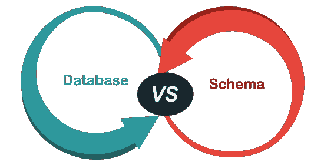
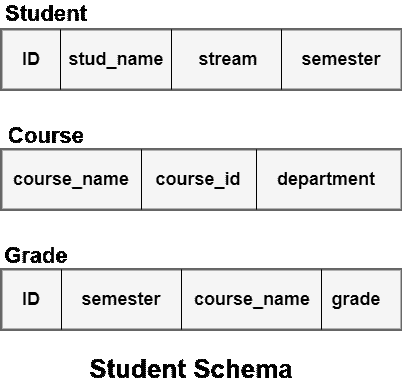
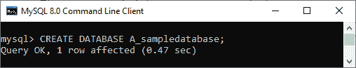
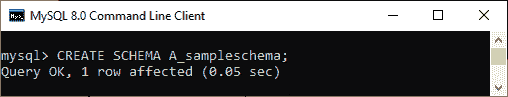
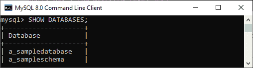

# 数据库和模式的区别

> 原文：<https://www.javatpoint.com/database-vs-schema>

数据库是当今生活中的常用术语。许多组织、公司、企业和研究所都需要一个系统来将它们的数据存储在一个格式良好的结构中，以便在需要时可以很容易地获得有价值的信息。每个数据库都由包含数据和元数据的物理文件组成。因此，我们可以说数据库是存储信息的内存组件。每个数据库都是模式的集合，这意味着在设计数据库时，我们需要为它们的结构视图指定模式。

数据库和模式术语的区别是面试问题中最常见的部分。**它们之间的主要区别在于数据库是相互关联的数据的集合，而 schema 是数据库的结构视图**。本文解释了 DATABASE 和 SCHEMA 的完整概述以及它们的区别，它们主要是可以互换使用的，但完全不同。



## 什么是数据库？

数据库是一个存储有组织的和相互关联的数据集合的应用程序。每个数据库都有自己的结构、数据类型和数据约束、它们与另一个约束的关系以及关于对象的数据或信息。**存储在数据库中的数据会定期更新**。因此它经常变化。我们可以使用 **DML(数据操作语言)命令**修改或更改存储在数据库中的数据。数据库中特定时刻的数据称为数据库实例。

数据库可以人工或计算机生成和操作。基于用户需求的数据库大小。在今天的生活中，数据库一般都是数字化使用的。

## 什么是模式？

模式是描述整个数据库的结构定义或描述的数据库的逻辑表示。通常，它只不过是拥有数据库对象(如表、视图等)的用户。在设计数据库的过程中，我们必须指定模式。一旦我们定义了数据库模式，我们就不应该频繁地更改它，因为它会扰乱数据库中的数据组织。

我们可以以称为**模式图**的图表形式显示数据库模式。该图显示了表中包含的数据、变量以及它们之间的关联方式。请注意，模式图没有显示数据库的每个方面，例如数据库实例、属性类型等。

我们可以使用 **DDL(数据定义语言)语句**来指定模式。DDL 语句设置表名、属性及其类型、约束及其与数据库中其他表的关系。当我们想要修改模式时，也可以使用这个语句。

**例如**，下图显示了包含学生信息的数据库模式。这里我们可以看到所有表的名称和它们的变量。



## 数据库和模式的主要区别

以下几点解释了数据库和模式之间的主要区别:

*   它们之间的根本区别在于，数据库是关于所考虑对象的相关数据或信息的有组织的集合。相反，模式是整个数据库的逻辑表示或描述。
*   一旦我们声明了一个数据库模式，我们就不能经常更改它，因为它会扰乱存储在数据库中的数据的组织。相比之下，我们可以定期更新数据库。
*   数据库是表的模式、记录和约束的集合。另一方面，模式包含表的结构、属性、它们的类型、约束以及它们与其他表的关系。
*   DDL 语句用于生成和修改模式。另一方面，DML 语句用于创建和修改数据库内部的数据。
*   每个数据库**使用内存**存储数据，而模式**可以使用逻辑结构**存储数据。

## 数据库与模式比较图

下面的对比图快速解释了它们的主要区别:

| 比较基础 | 数据库ˌ资料库 | 计划 |
| **定义** | 数据库是一个存储有组织的相关数据集合的应用程序。 | 模式是数据库的逻辑表示。 |
| **声明** | DML 用于生成和修改数据库中的记录。 | DDL 语句定义了数据库的模式。 |
| **修改** | 数据库定期更新数据，以便可以频繁更改。 | 一旦模式被声明，我们就不应该经常改变它。 |
| **包括** | 数据库是表的模式、记录和约束的集合。 | 模式总是包括表的名称、列的名称、它们的类型和约束。 |
| **记忆** | 它使用内存来存储数据。 | 它不使用内存来存储数据。 |

## MySQL 中的数据库与模式

[MySQL](https://www.javatpoint.com/mysql-tutorial) 没有提供数据库和模式之间的任何真正区别。它们可以互换使用，这意味着**模式与数据库**同义。当我们编写用于创建数据库的查询时，我们可以使用类似的查询来创建模式。

**我们可以通过创建一个数据库和一个模式来阐明这个概念，使用的步骤如下**:

首先，我们可以使用以下语法创建一个数据库:

```sql

CREATE DATABASE database_name;

```

我们可以在如下输出的查询中使用该语法:



其次，我们可以使用下面的语法创建一个数据库:

```sql

CREATE SCHEMA schema_name;

```

我们可以在如下输出的查询中使用该语法:



现在，数据库和模式都已成功创建。我们可以使用 **SHOW** 命令来显示数据库和模式。对上图的查询如下:

```sql

mysql> SHOW DATABASES;

```

我们将看到上面查询的以下输出:



### 结论

在本文中，我们对数据库和模式进行了比较。在这里，我们的结论是，MySQL 在模式和数据库之间没有实际的区别。它们可互换使用，意味着两者都是同义词。另一方面，在其他一些语言中，它们之间有明显的区别。简单地说，数据库是模式的集合，而模式是表的集合。

* * *