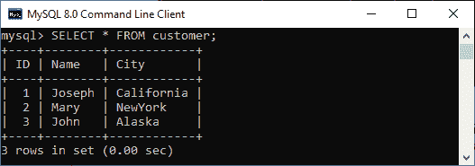
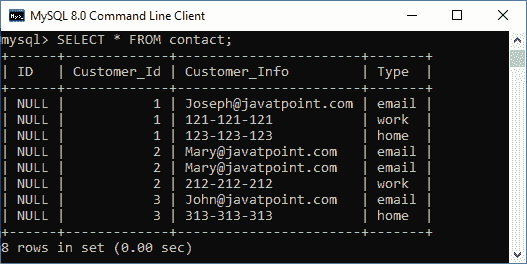

# 主键和外键的区别

> 原文：<https://www.javatpoint.com/primary-key-vs-foreign-key>

MySQL 中的键是构建两个表之间关系的基本元素。它们在维护关系数据库结构时非常有用。**它们的主要区别在于主键标识表中的每条记录，而外键用于将两个表链接在一起**。在本文中，我们将介绍基于各种参数的主键和外键之间的本质区别。在进行比较之前，我们将简要讨论这些关键。


## 什么是主键？

[主键](https://www.javatpoint.com/mysql-primary-key)是一个**唯一或非空键**，它唯一标识表或关系中的每条记录。每个数据库都需要表中每一行的唯一标识符，主键在唯一标识表中的行方面起着至关重要的作用。主键列不能存储**重复值**。也叫**极小超键**；因此，我们不能在任何关系中指定多个主键。

**例如**，我们有一个名为**客户**的表，表中有身份证、姓名、城市等属性。只有**标识栏**不能包含重复值和空值，因为每个客户都有唯一的标识号。该功能有助于唯一地识别数据库中的每条记录。因此，我们可以将标识属性作为主键。



## 什么是外键？

[外键](https://www.javatpoint.com/mysql-foreign-key)是数据库中的一组一列或多列，用于唯一标识其他表中的另一个数据库记录，以保持引用完整性。它也被称为**引用键，在数据库中两个不同的表之间建立关系**。外键总是与另一个表中的主键列相匹配。这意味着一个表中的外键列引用另一个表的主键列。外键在关系数据库规范化中是有益的，尤其是当我们需要访问其他表中的记录时。

外键与父表保存初始列值，子表引用父列值的表创建**父子关系**。只有在子表上找到外键约束时，我们才能实现这种关系。

**例如**，我们有一个名为**联系人**的表，该表具有诸如 ID、Customer_Id、Customer_Info 和 Type 等属性。在这里我们可以将**客户标识栏**设为外键。



如果我们想删除从两个表中删除记录的引用数据，我们可以在 contact 表中定义外键，如下所示:

```sql

FOREIGN KEY (Customer_Id) REFERENCES customer(ID)   
ON DELETE CASCADE   
ON UPDATE CASCADE

```

当我们从客户表中删除任何记录时，联系表中的相关行也会被删除，两个表都会自动更新。

## 主键和外键之间的关键区别

以下几点解释了主键和外键之间的区别:

*   关系数据库中的主键约束充当表中每一行的唯一标识符。相比之下，外键约束在两个不同的表之间建立关系，以唯一标识同一表或另一表的一行。
*   主键列不存储空值，而外键可以接受多个空值。
*   关系数据库中的每个表不能定义一个以上的主键，而我们可以在一个表中指定多个外键。
*   我们无法移除父表的主键值，该值被子表中的外键列引用。相反，我们可以删除子表的外键值，即使它们引用父表的主键。
*   主键是唯一的非空约束，因此主键属性不能有两个相同的值，而外键字段可以存储重复的值。
*   我们可以无限制地将值插入主键列。相反，在外键表中插入值时，我们需要确保该值出现在主键列中。
*   我们可以在临时表上隐式定义主键约束，而不能在临时表上强制执行外键约束。

## 主键与外键对比图

下面的对比图快速解释了它们的主要区别:

| 比较基础 | 主关键字 | 外键 |
| **基础** | 它用于唯一地标识数据库表中的每条记录。 | 它用于将两个表链接在一起。这意味着一个表中的外键引用另一个表的主键。 |
| **空** | 主键列值不能为空。 | 外键列可以接受空值。 |
| **计数** | 一个表只能有一个主键。 | 一个表可以有多个外键。 |
| **复制** | 主键是唯一的属性；因此，它不能存储关系中的重复值。 | 我们可以在外键列中存储重复的值。 |
| **索引** | 默认情况下，主键是聚集索引，这意味着它是自动索引的。 | 默认情况下，外键不是聚集索引。我们可以手动创建聚集索引。 |
| **删除** | 无法从表中删除主键值。如果要删除它，请确保引用的外键不包含它的值。 | 可以从表中移除外键值，而不必担心它引用另一个表的主键。 |
| 插入 | 我们可以无限制地将值插入主键列，无论它是否存在于外键中。 | 主键列中不存在的值不能插入引用外键。 |
| **临时表** | 主键约束可以在临时表上定义。 | 不能在临时表上定义外键约束。 |
| **关系** | 它不能在表中创建父子关系。 | 它可以在表中建立父子关系。 |

## 结论

在本文中，我们对主键和外键约束进行了比较。这里我们已经得出结论，这两个键在关系数据库模式中起着重要的作用，因为它们在多个表之间建立关系。主键列始终存储表中每条记录的唯一值，而外键值可以重复。这两种约束结构是相同的，但是它们的功能不同，因为主键唯一地标识表或关系中的记录。外键将两个表链接在一起。

* * *