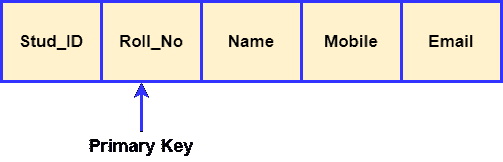
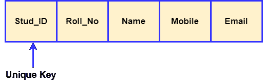

# 主键和唯一键的区别

> 原文：<https://www.javatpoint.com/primary-key-vs-unique-key>

MySQL 中的键是用于构建一个或两个以上表之间关系的一列或一组列。它们也用于从表中访问记录。两个键都为表或关系中的一列或一组列提供了保证的唯一性。**它们之间的主要区别在于主键标识表中的每条记录，唯一键防止一列中除空值**之外的重复条目。在本文中，我们将基于各种参数来比较主键和唯一键之间的本质区别。在进行比较之前，我们将简要讨论这些关键。


## 什么是主键？

[主键](https://www.javatpoint.com/mysql-primary-key)是一个**唯一或非空**键，唯一标识该表或关系中的每条记录。主键列不能存储重复值，这意味着主键列值总是唯一的。它也被称为一把**最小超级钥匙**；因此，我们不能在任何关系中指定多个主键。一个表的主键列可以被另一个表的外键列引用。

**例如**，我们有一个名为**学生**的表，表中有 Stud_ID、Roll_No、Name、Mobile、Email 等属性。



这里只有 **Roll_No** 列不能包含相同的空值。我们知道每个学生都有唯一的学号。因此，两个学生永远不可能有相同的卷号。该功能有助于唯一地识别数据库中的每条记录。因此，我们可以将 Roll_No 属性设为主键。

### 主键的特征

以下是基本的主要特征:

*   主键列不能包含重复值。
*   主键实现了表的实体完整性。
*   一个表不能有多个主键列。
*   我们可以从一个或多个表字段中创建主键。
*   主键列应具有非空约束。

## 什么是唯一键？

[唯一键](https://www.javatpoint.com/mysql-unique-key)是表中唯一标识数据库记录的一列或多列组合。唯一键**防止**在列中存储**重复值**。与主键列不同，表可以包含多个唯一键列。该键类似于主键，只是在唯一键列中可以存储一个空值。唯一键也称为**唯一约束**，可以被另一个表的外键引用。

**以**为例，我们来考虑名为**学生**的同一个表，该表具有诸如 Stud_ID、Roll_No、Name、Mobile 和 Email 等属性。



这里 **Stud_ID** 可以指定为唯一的约束，因为每个学生都必须有唯一的识别号。如果一个学生换了学校，那么他或她就没有学生证了。在这种情况下，条目可能包含一个**空值**值，因为唯一的键约束允许存储空值，但它应该只有一个。

### 唯一键的特征

以下是重要的独特关键功能:

*   我们可以从一个或多个表字段中构造唯一键。
*   一个表可以定义多个唯一键列。
*   默认情况下，唯一键位于非聚集唯一索引中。
*   唯一约束列可以存储空值，但每列只允许一个空值。
*   外键可以引用唯一约束来保持表的唯一性。

## 主键和唯一键之间的关键区别

以下几点解释了主键和候选键之间的主要区别:

*   主键可以构成表的一个或多个字段，以唯一地标识表中的记录。另一方面，唯一键防止两行在一列中有重复的条目。
*   在关系数据库中，一个表不能有多个主键，而每个表可以有多个唯一键。
*   主键列不能包含空值，而唯一键可以有空值，但一个表中只允许有一个空值。
*   主键应该是唯一的，但唯一键不一定是主键。
*   默认情况下，主键是聚集索引，其中数据在物理上组织在顺序索引中。相反，唯一键是唯一的非聚集索引。
*   主键实现实体完整性，而唯一键实施唯一数据。

## 主键与唯一键对比图

下面的对比图快速解释了它们的主要区别:

| 比较基础 | 主关键字 | 唯一密钥 |
| **基础** | 主键用作表中每个记录的唯一标识符。 | 当主键不在表中时，唯一键也是记录的唯一标识符。 |
| **空** | 我们不能在主键列中存储空值。 | 我们可以在唯一键列中存储空值，但只允许一个空值。 |
| **目的** | 它加强了实体的完整性。 | 它强制执行唯一数据。 |
| **指数** | 默认情况下，主键创建聚集索引。 | 默认情况下，唯一键创建非聚集索引。 |
| **键号** | 每个表只支持一个主键。 | 一个表可以有多个唯一键。 |
| **值修改** | 我们不能更改或删除主键值。 | 我们可以修改唯一键列值。 |
| **用途** | 它用于标识表中的每条记录。 | 它防止在列中存储重复的条目，除了空值。 |
| **语法** | 我们可以使用以下语法在表中创建一个主键列:

```sql
CREATE TABLE Employee
(
Id INT PRIMARY KEY, 
name VARCHAR(150), 
address VARCHAR(250)
)
```

 | 我们可以使用以下语法在表中创建一个唯一的键列:

```sql
CREATE TABLE Person
(
Id INT UNIQUE, 
name VARCHAR(150), 
address VARCHAR(250)
)
```

 |

### 结论

在本文中，我们对主键和唯一键约束进行了比较。这里我们得出结论，当我们希望列不包含重复值时，唯一键是有用的。当我们不想在表中保留空值时，主键很有用。当我们在另一个表中有一个外键来创建表之间的关系时，这也是理想的。

* * *