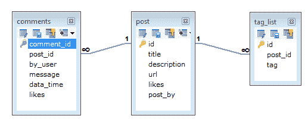

# 蒙古数据库中的数据建模

> 原文：<https://www.javatpoint.com/mongodb-data-modeling>

在 MongoDB 中，数据有一个灵活的模式。它与 SQL 数据库完全不同，在 SQL 数据库中，您必须在插入数据之前确定并声明表的模式。MongoDB 集合不强制文档结构。

数据建模的主要挑战是平衡应用程序的需求、数据库引擎的性能特征和数据检索模式。

## 在 MongoDB 中设计模式时，请考虑以下事项

*   总是根据用户需求设计模式。
*   不要在读操作中加入写操作。
*   要一起使用的对象应该合并到一个文档中。否则，它们应该被分开(确保不需要连接)。
*   针对更频繁的用例优化您的模式。
*   在模式中进行复杂的聚合。
*   您应该复制数据，但要有限度，因为磁盘空间比计算时间更便宜。

**例如:**

让我们举一个客户的例子，他的网站需要数据库设计。他的网站有以下要求:

每篇文章都是独特的(包含唯一的标题，描述和网址)。

每个帖子可以有一个或多个标签。

每篇文章都有它的出版商的名字和喜欢的总数。

每个帖子可以有零个或更多的评论，评论必须包含用户名，消息，数据时间和喜欢。

对于上述要求，关系数据库管理系统中至少需要三个表。



但是在 MongoDB 中，模式设计将有一个收集帖子，并具有以下结构:

```
{
_id: POST_ID
title: TITLE_OF_POST,
description: POST_DESCRIPTION,
by: POST_BY,
url: URL_OF_POST,
tags: [TAG1, TAG2, TAG3],
likes: TOTAL_LIKES,
comments: [
{
user: 'COMMENT_BY',
message: TEXT,
datecreated: DATE_TIME,
like: LIKES
},
{
user: 'COMMENT_BY',
message: TEST,
dateCreated: DATE_TIME,
like: LIKES
}}}

```

* * *