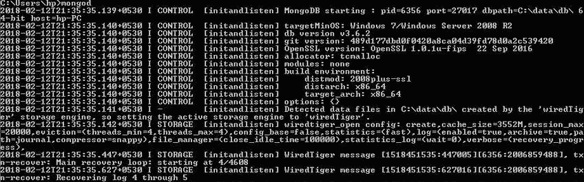
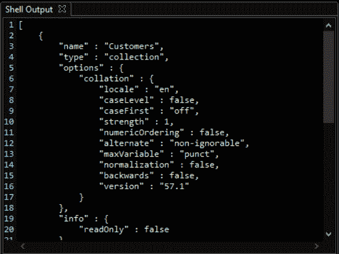
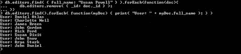

# MongoDB 游标方法

> 原文：<https://www.javatpoint.com/mongodb-cursor-methods>

MongoDB 游标方法修改了执行指定查询的方式。以下是带有描述、语法和示例的游标方法列表。

### #1 cursor.addOption 标志

该方法添加了“OP_QUERY”有线协议标志。添加它是为了改变查询的行为，如可定制标志。

**例**

```js

var t = db.myCappedCollection;
var cursor = t.find().
addOption(DBQuery.Option.tailable)
.addOption(DBQuery.Option.awaitData)

```

上面的示例添加了可调整标志和 awaitData 标志，以确保查询返回一个可调整的光标。使用此方法将生成一个游标，该游标在返回完整结果集后会等待几秒钟。以便在查询过程中可以获取并返回额外的数据。

### 第二个。游标. batchSize

来自 [MongoDB](https://www.javatpoint.com/mongodb-tutorial) 对象的批处理结果返回使用批处理大小方法指定的文档数量。在许多情况下，如果我们修改批处理大小，它将不会影响用户或应用程序。

**例**

```js

db.inventory.find().batchSize(10)

```



### #3.cursor.close()

用于根据方法的指令关闭游标并释放关联的服务器资源的方法。游标将被剩余结果为零的服务器自动关闭，或者它已经空闲了指定的一段时间。

**例**

```js

db.collection.find(<query>).close()

```

### #4.光标.排序规则(<collation document="">)</collation>

MongoDB 排序规则()方法为 db.collection.find()返回的游标指定排序规则。

关闭方法接受的排序规则文档:

```js

{
   locale: <string>,
   caseLevel: <boolean>,
   caseFirst: <string>,
   strength: <int>,
   numericOrdering: <boolean>,
   alternate: <string>,
   maxVariable: <string>,
   backwards: <boolean>
}

```

**示例:**

```js

db.javaTpoint.find( { x: "a" } ).collation( { locale: "en_US", strength: 1 } )

```

**输出:**



### #5.cursor.forEach(函数)

JavaScript 函数将通过使用 forEach 方法由光标应用于所有文档。

**语法:**

```js

db.collection.find().forEach(<function>)

```

**示例:**

在 find()方法返回的游标上调用的 forEach()方法显示集合中所有用户的名称:

```js

db.users.find().forEach( function(javaTpoint) { print( "user: " + editors.name ); } );

```

**输出:**



### #6.cursor.hint(索引)

在查询过程中调用该方法，以覆盖 MongoDB 对索引和查询优化过程的默认选择。

**示例:**

将使用下面的查询返回用户集合中使用年龄字段索引的所有文档。

```js

db.users.find().hint( { age: 1 } )

```

### #7.cursor.limit()

此方法用于指定光标返回的最大文档数。它将在游标中使用，类似于 SQL 数据库中的 LIMIT 语句。

**示例:**

```js

db.collection.find(<query>).limit(<number>)

```

### #8.cursor.map(函数)

游标访问的文档使用 map 方法，并将最近的应用程序的返回值收集到一个数组中。

**示例:**

```js

db.users.find().map( function(u) { return u.name; } );

```

### #9\. cursor.max()

max 方法用于限制 find()的结果。max()方法。MongoDB 指定特定索引的独占上限，这提供了一种指定复合键索引上限的方法。

例子

为集合创建以下索引:

```js

db.products.createIndexes( [
   { "item" : 1, "type" : 1 },
   { "item" : 1, "type" : -1 },
   { "price" : 1 }])

```

如果您使用的是{ item: 1，type: 1 }索引的顺序，则 max()会限制查询低于 item 等于 Mango 和 type 等于的界限的文档

```js

db.products.find().max( { item: 'Mango', type: 'Alfonso' } ).hint( { item: 1, type: 1 } )

```

### #10.cursor.min（）

约束 find()的结果。min() MongoDB 按顺序指定特定索引的下限。此方法提供了一种定义复合键索引下限的方法。

**语法:**

```js

{ field1: <min value>, field2: <min value2>, fieldN:<min valueN> }

```

**示例:**

首先，创建一个名为 superstore 的示例集合，其中包含以下文档:

```js

db.products.insertMany([
{ "_id" : 1, "item" : "Java", "type" : "book", "price" : NumberDecimal("1.09") },
{ "_id" : 2, "item" : "MongoDB", "type" : "book", "price" : NumberDecimal("1.9") },
{ "_id" : 3, "item" : "Homefoil","type" : "Utensil", "price" : NumberDecimal("1.2") },
{ "_id" : 4, "item" : "Handwash", "type": "Utensil", "price" : NumberDecimal("1.29") },
{ "_id" : 5, "item" : "Rice", "type" : "Grocery", "price" : NumberDecimal("1.59") },
{ "_id" : 6, "item" : "Mango", "type" : "Fruit", "price" : NumberDecimal("1.29") },
{ "_id" : 7, "item" : "Orange", "type" : "Fruit", "price" : NumberDecimal("2.99") },
{ "_id" : 9, "item" : "Apple", "type" : "Fruit", "price" : NumberDecimal("1.99") },
{ "_id" : 8, "item" : "Potato", "type" : "vegetable", "price" : NumberDecimal("0.99") },
{ "_id" : 10, "item" : "Onion", "type" : "vegetable", "price" : NumberDecimal("1.39") }
])

```

现在，为集合创建索引:


min()方法使用{ item: 1，type: 1 }索引的顺序将查询限制到文档。

```js

db.products.find().min( { item: 'Java', type: 'book' } ).hint( { item: 1, type: 1 } )

```

### #11.cursor.tailable()

可调整方法将光标标记为可调整。它作为一个扫描仪在一个有盖的收藏。即使在到达集合的最后一个节点后，它仍然保持打开状态。方法的应用程序将随着新数据插入集合中而持续运行。

**语法:**

```js

cursor.tailable( { awaitData : <boolean> } )

```

如果 awaitdata 标志设置为 true，则当游标到达上限集合的末尾等待新数据到达时，MongoDB 会阻塞查询线程一段时间。当新数据被插入到封顶集合中时，被阻塞的线程被通知唤醒，并将下一批返回给客户端。

### #12 . cursor . toarray()

该方法返回一个数组，该数组包含光标所属的所有文档。它将所有文档加载到内存中，并通过完全迭代光标来耗尽光标。

**示例:**

```js

var allProductsArray = db.products.find().toArray();
if (allProductsArray.length > 0) { printjson (allProductsArray[0]); }

```

* * *