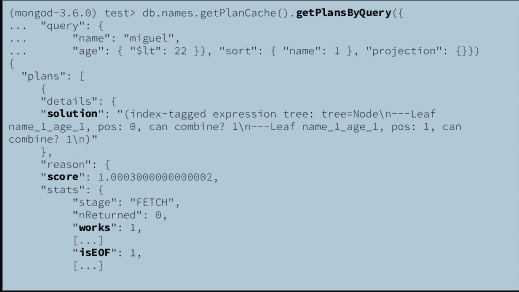
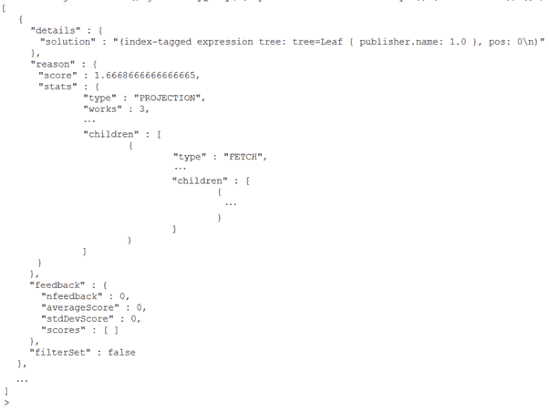
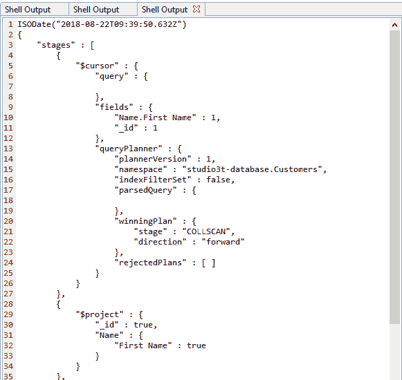

# MongoDB 查询计划缓存方法

> 原文：<https://www.javatpoint.com/mongodb-query-plan-cache-methods>

### 第一个。db . collection . getplancache()

使用集合的计划缓存对象允许您访问此方法。我们需要使用 db.collection.getPlanCache()方法来检索计划缓存对象。方法返回一个已用于收集以访问查询计划缓存的接口，并提供一个查看和清除查询计划缓存的方法。

具有多个可实现计划的查询优化器可以缓存查询形状。

**通过界面可以使用以下方法:**

**planache . help:**此方法可通过指定集合的计划缓存对象访问，并显示可用于指定集合的查询计划缓存的方法，*即 db . collection . getplanache()。帮助()。*

**planache . listqueryshapes()**:此方法可通过指定集合的计划缓存对象访问，并显示存在缓存查询计划的查询形状，*即 db . collection . getplanache()。listQueryShapes()。*

**plancache . getplansbyquery()**:此方法可通过指定集合的计划缓存对象访问，并显示参数化查询形状的缓存查询计划。，*即 db . collection . getplanache()。getPlansByQuery()。*

**Planche . ClearPlansByquery()**:此方法可通过特定集合的计划缓存对象访问，并为参数化查询形状清除缓存的查询计划。，*即 db . collection . getplanache()。clearPlansByQuery()*

**PlanCache.clear()** :此方法可通过特定集合的计划缓存对象访问，并清除集合的所有缓存查询计划。，*即 db . collection . getplanache()。clear()*



### #2.PlanCache.clear()

clear 方法只能从计划缓存的对象中使用，以删除指定集合的所有缓存查询计划。

**例如-** 清除学生集合的缓存。

```

db.student.getPlanCache().clear()

```



### #3.PlanCache.clearPlansByQuery()

此方法清除指定查询形状的缓存查询计划，这些计划可从特定集合的计划缓存对象中获得；*即*

```

db.collection.getPlanCache().clearPlansByQuery( <query>, <projection>, <sort> )

```

PlanCache.clearPlansByQuery()方法接受以下参数:

**查询单据:**该参数是查询形状的查询谓词。谓词的结构和字段名对形状很重要，查询谓词中的值不重要。

**投影文档:**可选参数，指定排序参数时必选。它可以用于与查询形状关联的投影。

**例**

如果收集订单具有以下查询形状:

```

{
  "query" : { "qty" : { "$gt" : 10 } },
  "sort" : { "ord_date" : 1 },
  "projection" : { },
  "queryHash" : "9AAD95BE" // Available starting in MongoDB 4.2
}

```

以下操作删除为形状缓存的查询计划:

```

db.orders.getPlanCache().clearPlansByQuery(
   { "qty" : { "$gt" : 10 } },
   { },
   { "ord_date" : 1 }
)

```

**输出:**



### #4.PlanCache.help()

显示可用于查看和修改集合的查询计划缓存的方法。该方法仅在特定集合的计划缓存对象中可用；即

```

db.collection.getPlanCache().help()

```

### 5 号。PlanCache.listQueryShapes()

4.2 版不推荐使用该方法，该方法用于显示存在缓存查询计划的查询形状。如果您使用的是旧版本的 MongoDB，则可以使用此方法。所有查询形状都与查询散列相关联，以帮助识别具有相同查询形状的慢查询。

**语法:**

```

db.collection.getPlanCache().listQueryShapes()

```

**示例:**

```

db.orders.getPlanCache().listQueryShapes()

```

订单集合具有与查询形状关联的已兑现计划。方法将返回当前在缓存中的查询形状的数组。

```

[
  {
    "query" : { "qty" : { "$gt" : 10 } },
    "sort" : { "ord_date" : 1 },
    "projection" : { },
    "queryHash" : "9AAD95BE" 
  {
    "query" : { "$or" :
       [
         { "qty" : { "$gt" : 15 }, "item" : "xyz123" },
         { "status" : "A" }
       ]
    },
    "sort" : { },
    "projection" : { },
    "queryHash" : "0A087AD0"  
  },
  {
    "query" : { "$or" : [ { "qty" : { "$gt" : 15 } }, { "status" : "A" } ] },
    "sort" : { },
    "projection" : { },
    "queryHash" : "DA43B020"
  }
]

```

* * *