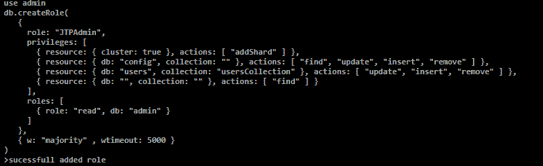
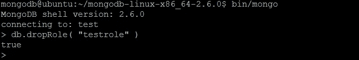
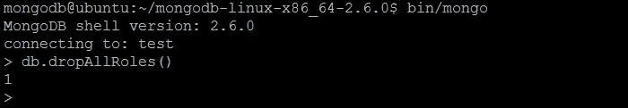
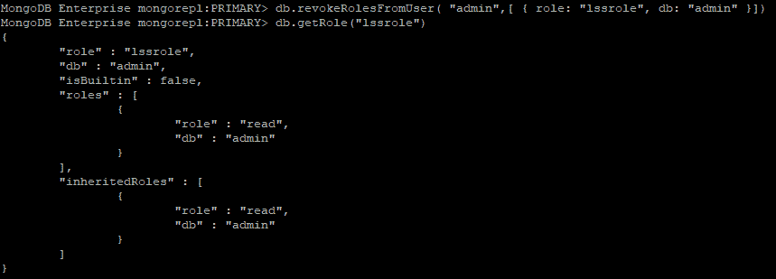
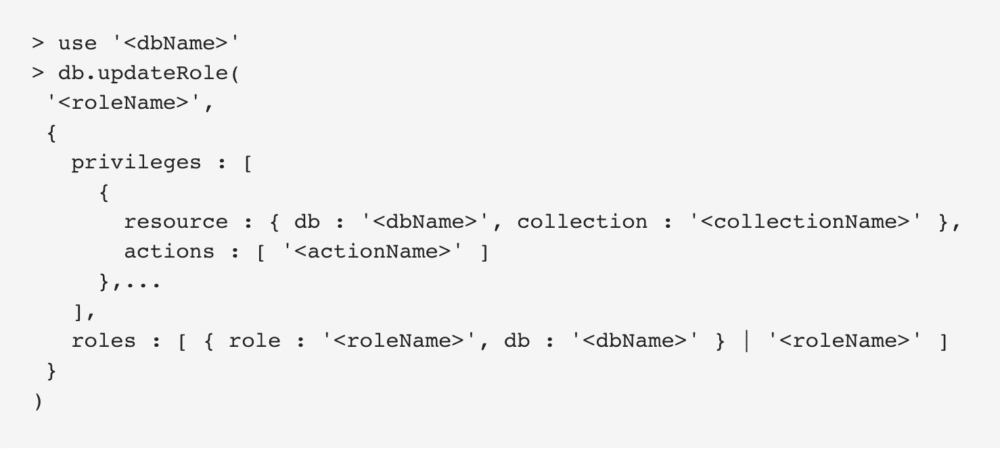

# 角色管理方法

> 原文：<https://www.javatpoint.com/mongodb-role-management-methods>

角色管理命令用于管理用户的角色。以下是用于不同目的的方法。

### #1.db.createRole(角色，写关注)

createRole 方法用于在数据库下分配角色。使用此方法，我们可以通过显式列出权限来指定角色的权限。您也可以通过让角色从一些不同的角色或两者继承权限来执行它。该角色始终适用于运行该方法的数据库。

**语法:**

```

{
  role: "<role_name>",
  privileges: [
     { resource: { <resource> }, actions: [ "<action>", ... ] },
     ...
  ],
  roles: [
     { role: "<role_name>", db: "<database_name>" } | "<role>",
  ],
  authenticationRestrictions: [
    {
      clientSource: ["<IP>" | "<CIDR range>", ...],
      serverAddress: ["<IP>" | "<CIDR range>", ...]
    }, ]}

```

**示例:**

管理数据库上的 JTPAdmin 角色将使用 cerate 角色方法创建:

```

use admin
db.createRole(
   {
     role: "JTPAdmin",
     privileges: [
       { resource: { cluster: true }, actions: [ "addShard" ] },
       { resource: { db: "config", collection: "" }, actions: [ "find", "update", "insert", "remove" ] },
       { resource: { db: "users", collection: "usersCollection" }, actions: [ "update", "insert", "remove" ] },
       { resource: { db: "", collection: "" }, actions: [ "find" ] }
     ],
     roles: [
       { role: "read", db: "admin" }
     ]
   },
   { w: "majority" , wtimeout: 5000 }
)

```

**输出:**



### #2.db.dropRole(rolename，writeConcern)

drop role 方法用于从运行该方法的数据库中删除指定的用户定义角色。

**例**

以下示例从教程数据库中删除 readsubject 角色:

```

use test
db.dropRole( "testrole", { w: "majority" } )

```

**输出:**



### #3.db.dropAllRoles(写关注)

drop all 角色方法用于从运行该方法的数据库中删除所有指定的用户定义角色。

**例**

以下示例使用多数写操作，并从教程数据库中删除所有用户定义的角色。

```

use tutorials
db.dropAllRoles( { w: "majority" } )

```

**输出:**



### 4 号房。db . getrle(role name args)

在 [MongoDB](https://www.javatpoint.com/mongodb-tutorial) 中，一个角色继承了某个其他角色的实例。此方法用于获取该角色从中继承权限的父角色。此外，可以使用此方法返回角色的所有权限。

当我们从包含用户定义角色和内置角色的数据库中运行 db.getRole()方法时，指定的命令可以检索信息。

**示例:**

```

use tutorials
db.getRole( "Admin" )

```

对于角色，教程数据库中定义的 Admin 返回角色继承信息和权限。

```

use tutorials
db.getRole( "Admin", { showPrivileges: true } )

```

### #5.db.getRoles（）

返回运行该命令的数据库中所有角色的信息。不管有没有参数，我们都可以使用这个方法。如果我们在没有参数的情况下运行此方法，该方法将返回数据库的用户定义角色的继承信息。

**例**

以下查询将返回教程数据库中所有现有角色的文档，还包括角色权限和内置角色:

```

db.getRoles(
    {
      rolesInfo: 1,
      showPrivileges:true,
      showBuiltinRoles: true
    }
)

```

**输出:**



### 6 号。db .更新角色(<rolename>、<update>、</update></rolename>

更新角色方法用于更新用户定义的角色。要更新用户定义的角色，它必须在指定角色的数据库上运行。当我们更新一个字段时，它将完全替换旧字段的值。

在这种情况下，我们需要在不替换每个值的情况下添加或删除角色/权限，我们必须使用一个或多个列出的方法:

*   *格兰特罗勒斯托罗尔（）*
*   *【grantprivilegestorole()*
*   撤销煤油的作用()
*   *撤销特权角色()*

**例**

下面的示例将替换教程数据库中存在的管理员角色的权限和角色。该方法在包含管理员的数据库上运行:

```

use tutorial
db.updateRole(
    "librarian",
    {
      privileges:
          [
            {
              resource: { db:"tutorials", collection:"books" },
              actions: [ "update", "createCollection", "createIndex"]
            }
          ],
      roles:
          [
            {
              role: "read",
              db: "products"
            }
          ]
    },
    { w:"majority" }
)

```

**外壳输出和示例:**



* * *