# MongoDB 史迪奇

> 原文：<https://www.javatpoint.com/mongodb-stitch>

MongoDB 提供了一个无服务器平台，无需设置服务器基础设施即可快速构建应用程序。MongoDB Stitch 被设计为 MongoDB Atlas 的升级版本。它会自动将连接整合到我们的数据库中。Stitch 阐明了开发和实施过程。它是通过忽略构建和部署后端的需求来实现的。MongoDB stitch 可用作后端服务，允许我们轻松配置数据身份验证、数据访问规则和服务。

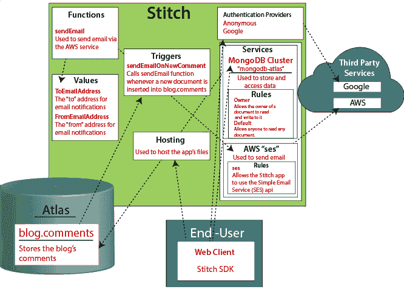

MongoDB stitch 提供了一个可升级的基础设施设计来处理请求。它还协调服务和数据库交互。也就是说，我们不需要在诸如配置我们的服务器等任务上花费时间和资源。

例如——我们可以使用 MongoDB Stitch 生成一个管道，允许我们通过 HTTP 服务使用 Stripe 接受付款，更新购买日期，并使用 Mailgun 服务发送确认电子邮件。

## 使用缝合用户界面创建缝合应用程序

**第一步:**进入[https://www.mongodb.com/cloud/atlas](https://www.mongodb.com/cloud/atlas)页面，登录你的 Atlas 账号。

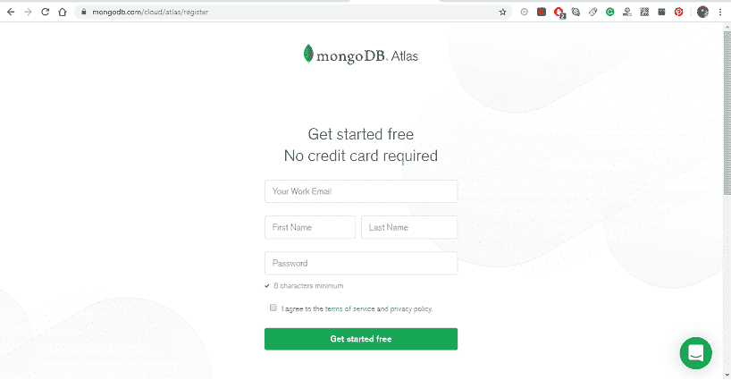

**步骤 2:** 现在，您必须创建一个集群来与您的 MongoDB Stitch 应用程序一起使用，请按照以下步骤操作:

*   点击左侧导航窗口的 ***集群*** 按钮，然后点击 ***新建集群*** 按钮。
    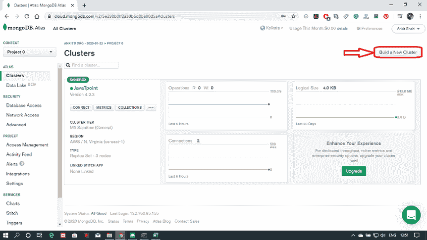
*   选择您首选的服务提供商、地区、层级和其他所需设置。
    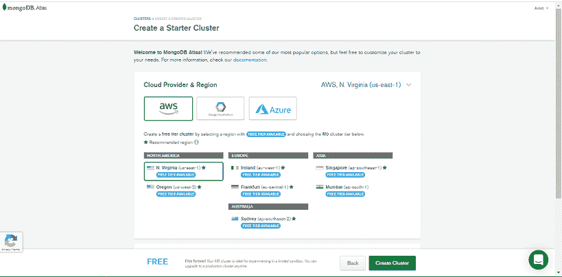
*   集群的名称默认为 ***【集群 0】***。如果要更改群集的名称，必须在这一步进行，因为一旦配置，群集名称就不能更改。
    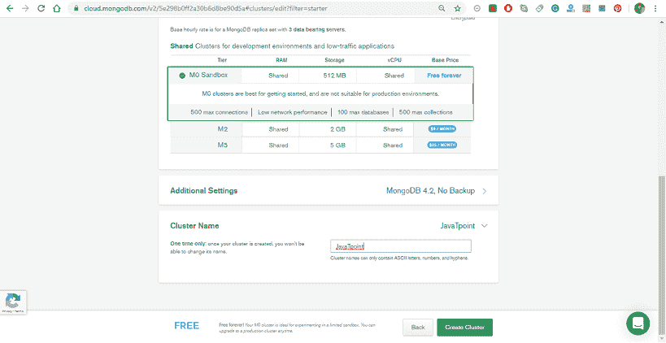
*   最后，单击创建集群按钮保存您所做的更改。

**第三步:**在[MongoDB 图册](https://www.javatpoint.com/mongodb-atlas)内，从左侧导航窗口点击 ***缝合应用*** 。

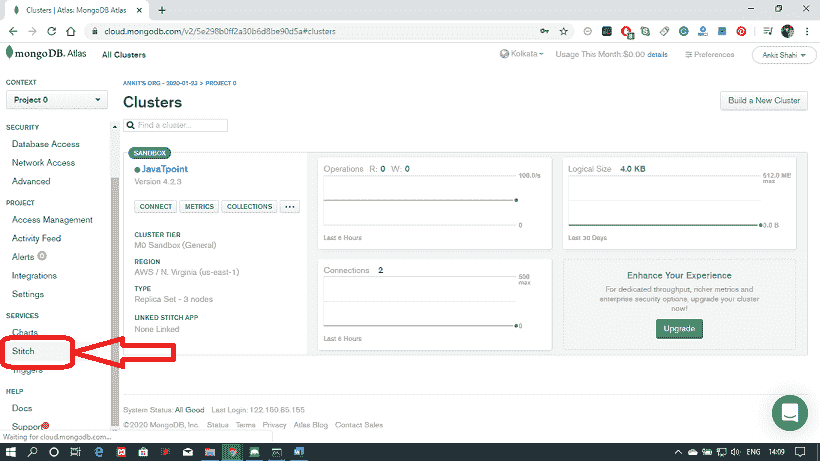

**第 4 步:**之后，点击 ***新建应用*** 按钮。

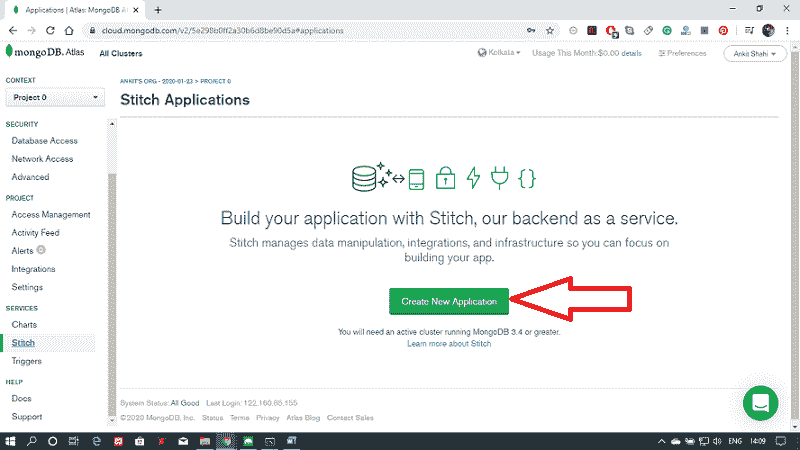

**步骤 5:** 在“创建新应用程序”弹出窗口中，输入您的 Stitch 应用程序的名称。

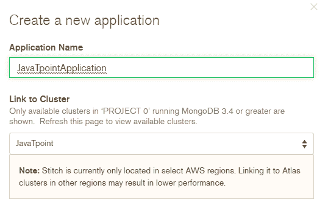

**第 6 步:**从 ***链接到*** 下拉对话框中选择项目中的集群。MongoDB Stitch 会自动创建一个链接到您的集群的 [MongoDB](https://www.javatpoint.com/mongodb-tutorial) 服务。

**步骤 7:** 在 ***针法服务名称*** 字段中填写针法将要创建的服务的名称。

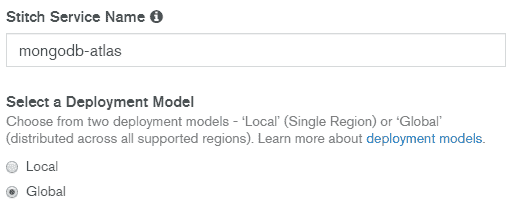

**步骤 8:** 为您的应用程序选择部署模型和部署区域。然后点击 ***创建*** 按钮。

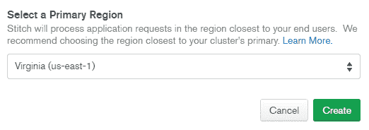

成功部署后，将出现以下窗口。

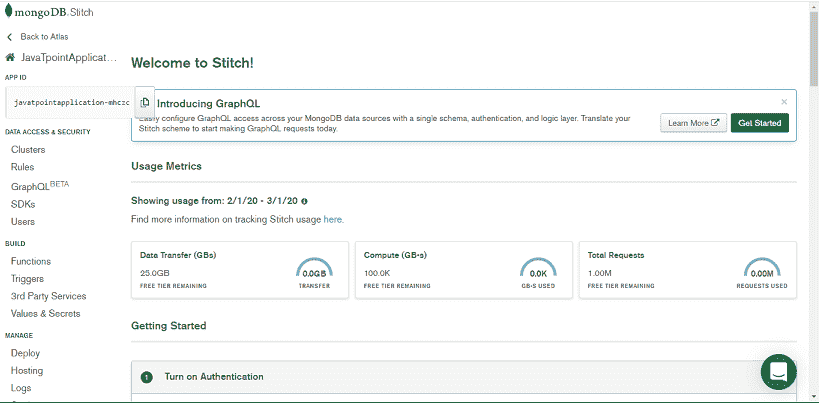

## 使用缝合命令行界面创建缝合应用程序

**步骤 1:** 首先，为你的应用程序创建一个新的目录，并在目录的根级别添加一个 stitch.json 文件。文件必须包含一个空的 [JSON 对象](https://www.javatpoint.com/json-object)。

**步骤 2:** 使用[应用编程接口](https://www.javatpoint.com/api-full-form)密钥向阿特拉斯认证 MongoDB Stitch 应用程序。

```

stitch-cli login --api-key=my-api-key --private-api-key=my-private-api-key

```

**步骤 3:** 现在，使用“stick-CLI 导入”命令导入 Stitch CLI 库。

**步骤 4:** 您应该验证您的应用程序是否已创建。

## 使用缝合在任何地方查询

使用 MongoDB 查询语言，我们可以直接从客户端应用程序代码中查询 MongoDB 中存储的数据。MongoDB 集合的 Stitch 服务器允许我们根据登录用户或每个文档的内容，使用指定的数据访问规则安全地过滤结果。

学生集合包含描述示例拼贴画中每个学生的文档。每个文档包括学生的姓名、电子邮件、地址、费用和学生流的信息。在下面给出的例子中，我们比较了学生收集的所有文档，并将格式化的结果作为表格返回。

**HTML 文件:**

```

<!-- Base Stitch Browser SDK --> <script src="https://s3.amazonaws.com/stitch                      sdks/js/bundles/4.0.13/stitch.js"></script>

<div class="results-bar">
  <p>Count of Results:</p>
  <span id="num-results" class="results-bar__count"></span>
</div>
<table class="table table-striped">
  <thead class="thead">
    <tr>
      <th>Name</th>
      <th>Email</th>
      <th>Class</th>
      <th>Batch</th>
      <th>Fees</th>
    </tr>
  </thead>
  <tbody id='students'></tbody>
</table>

```

**Java 脚本文件:**

```

const {
  Stitch,
  RemoteMongoClient,
  UserPasswordCredential
} = stitch;

const stitchClient = Stitch.initializeDefaultAppClient("stitch-quickstarts-zhpox");

login("javatpoint@example.com", "password123").then(() => {
  // Initialize a MongoDB Service Client
  const mongodb = stitchClient.getServiceClient( RemoteMongoClient.factory,
    "mongodb-atlas");
  // Get a hook to the student collection
  const students = mongodb.db("Admin").collection("students");

  return students.find({}, {
    // limit: 2,
    // sort: { "fees": -1 }
  })
    .asArray();
})
  .then(displayStudents)

function login(email, password) {
  const credential = new UserPasswordCredential(email, password);
  return stitchClient.auth.loginWithCredential(credential);
}

// Renders the the students' information in the table
function displayStudents(students) {
  const employeesTableBody = document.getElementById("students");
  const numResultsEl = document.getElementById("num-results");
  const tableRows = students.map(student => {
    return '
      <tr>
        <td>${student.name.last}, ${student.name.first}</td>
        <td>${student.email}</td>
        <td>${student.role}</td>
        <td>${student.manager.name.first}${student.manager.name.last} (${student.admin.id || "no manager"})</td>
        <td>${student.fees}</td>
      </tr>
    ';
  });
  studentTableBody.innerHTML = tableRows.join("");
  numResultsEl.innerHTML = student.length;
}

```

**用规则保护数据**

如果我们不想让每个学生都能看到其他学生的数据，我们可以使用收集规则。我们可以使用它来控制所有用户都可以访问的数据，而不改变查询的模式。

## 创建博客应用程序

在这里，我们正在创建一个博客和评论系统使用史迪奇。我们使用 MongoDB Stitch[JavaScript](https://www.javatpoint.com/javascript-tutorial)SDK 和 MongoDB 服务直接从客户端代码添加和查询注释。

**博客应用的架构**

博客应用程序架构需要以下功能:

*   登录能力。
*   博文存储能力。
*   博文评论能力。

当我们使用 MongoDB 阿特拉斯集群时，我们可以存储注释和身份验证详细信息，允许用户使用临时帐户发布注释。

博客架构的三个主要组成部分是:

*   一种网络前端，
*   缝合应用，
*   MongoDB 地图集数据库。

博客应用程序架构的前端处理显示和用户交互。Stitch 管理来自前端的所有请求，并且只允许已验证的请求进入数据库，这为我们的用户保存了注释。

## 为博客应用程序创建后端

博客应用程序的后端用于存储评论和其他细节，如认证和授权用户，查找博客文章的现有评论等。我们将注释存储在 MongoDB 应用程序的示例中。在这里，我们将通过授权限制用户创建、编辑和删除仅与其用户标识相关联的注释的权限。我们还需要确保一个用户不能作为另一个用户登录；我们可以通过使用 MongoDB stitch 中内置的用户管理系统来实现这一点。

**要求:**

*   MongoDB 阿特拉斯账户。
*   和一个托管在阿特拉斯上的 MongoDB 集群。我们建议您创建一个免费的 M0 地图集集群，并有利于学习。

**步骤 1:** 按照上面的指示创建缝合应用。

**第 2 步:**在您创建的缝合应用程序中打开匿名身份验证。

**第三步:**最后，配置***blog . comments***MongoDB 收藏

*   从缝合界面的左侧导航中，单击 MongoDB 地图集下的规则。
*   然后，单击添加收藏。
*   现在，为数据库名称输入博客，并为集合名称输入注释。
*   选择“无模板”选项，然后单击添加收藏。

**第 4 步:**启用对评论的读写。

**第五步:**最后，点击**查看&部署变更**在[图形用户界面](https://www.javatpoint.com/gui-full-form)顶部的弹出窗口中发布您的申请。

## 为博客应用程序创建网络客户端

**步骤 1:** 创建一个 [HTML](https://www.javatpoint.com/html-tutorial) 页面如下。

```

<html>
  <head>
  </head>
  <body>
    <h3>This is the first blog post of JavaTpoint</h3>
    <div id="content">
      Learn technology from javaTpoint to keep yourself industry ready.
    </div>
    <hr>
    <div id="comments"></div>
  </body>
</html>

```

**第二步:**现在，附上下面的 JavaScript SDK。附加 MongoDB 缝合软件开发工具包。将下面给出的脚本标签添加到 html 文件的头部。

```

<script src="https://s3.amazonaws.com/stitch-sdks/js/bundles/4/stitch.js"></script>

```

**步骤 3:** 初始化应用客户端和一个 MongoDB Service 客户端，将评论存储在 MongoDB 中。将应用程序 id 替换为您的“缝合”<应用程序 id >。您可以在缝合界面的客户端页面找到您的应用程序标识。

```

<script>
  // it initializing the App Client
  const client = stitch.Stitch.initializeDefaultAppClient("<give-your-app-id-here>");
  // Now, it will get a MongoDB Service Client
  const mongodb = client.getServiceClient(
    stitch.RemoteMongoClient.factory,
    "mongodb-atlas"
  );
  // Getting a reference to the blog database
  const db = mongodb.db("blog");
</script>

```

**第 4 步:**现在，添加下面给出的脚本，在页面加载时查询并显示评论。

```

function displayComments() {
  db.collection("comments")
    .find({}, {limit: 1000})
    .toArray()
    .then(docs => {
      const html = docs.map(doc => '<div>${doc.comment}</div>');
      document.getElementById("comments").innerHTML = html;
    });
}

```

**第五步:**你必须创建一个文件，允许用户在加载期间登录并显示评论。

```

function displayCommentsOnLoad() {
  client.auth

    .loginWithCredential(new stitch.AnonymousCredential())

    .then(displayComments)
    .catch(console.error);
}

```

**第 6 步:**现在，创建一个表单来提交评论。

```

function addComment() {
  const newComment = document.getElementById("new_comment");
  console.log("add comment", client.auth.user.id)
  db.collection("firstcomment")
    .insertOne({ owner_id : client.auth.user.id, comment: newComment.value })
    .then(displayComments);
  newComment.value = "";
}

```

* * *