# MongoDB 商业智能连接器

> 原文：<https://www.javatpoint.com/mongodb-bi-connector>

MongoDB 商业智能连接器允许我们用 SQL 创建查询。使用现有的关系 BI 工具，如 Tableau、MicroStrategy 和 Qlik，我们可以可视化和报告我们的 MongoDB 企业数据。在 mongod 或 mongos 报告工具和实例之间，BI 连接器充当用于翻译查询和数据的层。它不存储任何 SQL 数据，并用于将我们的 MongoDB 集群与商业智能工具连接起来。

### 商业智能系统的组成部分

*   *MongoDB 数据库:*用于存储数据
*   *BI 连接器:*它翻译 SQL 查询，并在我们的 BI 工具和 MongoDB 之间提供关系模式。
*   *ODBC 数据源名称(DSN):* 保存连接和授权配置数据。
*   *BI 工具:*该工具用于数据的可视化和分析。

以下是描述商业智能系统可能配置的几个要点。

*   ***托管数据库和 BI 连接器:*** 我们可以用 Atlas 提供的连接信息建立我们的 DSN，因为它运行在 Atlas 上。
    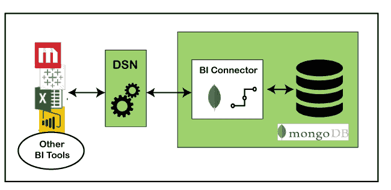
*   ***托管数据库和内部 BI 连接器:*** 如果我们的 MongoDB 实例没有托管在 Atlas 上，我们可以在本地运行 BI 连接器，并用 mongo-uri 指定远程数据库地址。或者比 M10 小的部署，那么当我们开始 BI Connector 的 mongosqld 过程时。
    
*   ***内部数据库和 BI 连接器:*** 如果我们同时安装了 MongoDB 和 BI 连接器，我们可以将 DSN 设置为指向 BI 连接器地址。
    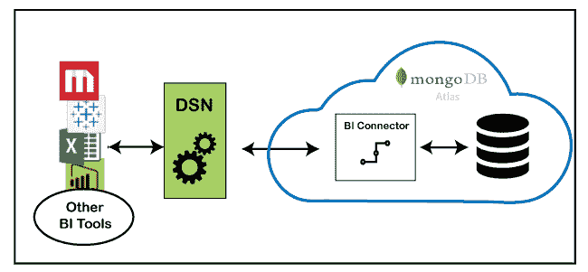
*   ***【本地数据库和 BI 连接器:*** 我们可以用它进行测试和一次实验。我们可以在桌面上运行 MongoDB 和 BI Connector。这是使用 BI Connector 快速查看数据可视化可能性的最简单方法。

## 安装商务智能连接器

我们可以在 [MongoDB 图集](https://www.javatpoint.com/mongodb-atlas)中安装并托管 MongoDB BI 连接器。

### 在 Windows 上安装

**第一步:**首先要从[https://www.mongodb.com/download-center/bi-connector](https://www.mongodb.com/download-center/bi-connector)下载 BI 的 MongoDB 连接器

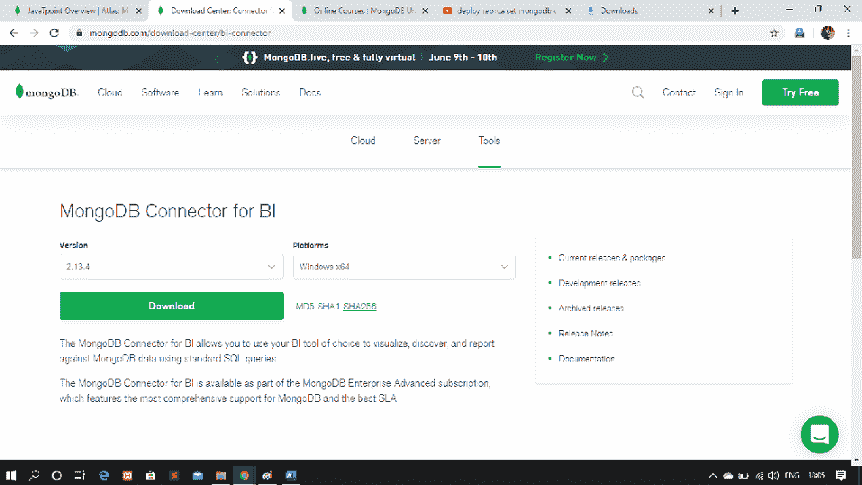

**步骤 2:** 现在，运行下载的。MongoDB BI 连接器的 msi 文件。

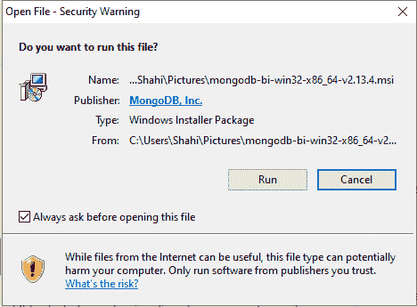

**第三步:**按照安装提示安装文件。

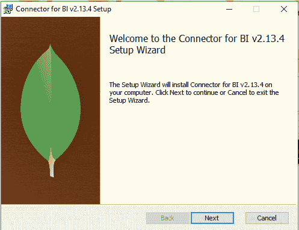

*现在可以运行 BI 连接器了。*

我们将使用 mongosqld 程序，该程序用于将我们的 BI 工具与 MongoDB 实例连接起来。它需要一个映射我们的 MongoDB 集合和数据库的数据模式。它生成一个数据模式并保存在内存中

您必须使用 MongoDB Atlas/命令行/或系统服务将 mongosqld 作为托管服务运行。

安装并运行商业智能连接器后，您可以开始使用首选的商业智能工具

### 创建系统数字用户线

系统 DSN 是一个已保存的配置，它定义了一个由 ODBC 驱动程序使用的数据库连接。您必须按照下面给出的步骤为 BI 连接器的 mongosqld 进程设置 DSN。当您创建 DSN 以使用 DSN 并从 [MongoDB](https://www.javatpoint.com/mongodb-tutorial) 导入数据时，您可以配置广泛的 [SQL](https://www.javatpoint.com/sql-tutorial) 客户端和商业智能工具。

**步骤 1:** 安装 BI 连接器，并将其配置为与您的副本集建立连接。

**第二步:**现在，下载并安装 Visual [C++](https://www.javatpoint.com/cpp-tutorial)

**第三步:**你要下载安装 BI 连接器的 MongoDB ODBC 驱动。

**步骤 4:** 安装成功后，启动 Microsoft ODBC 数据源程序。

**步骤 5:** 现在，在 ODBC 数据源程序中选择系统 DSN 选项卡。

**第六步:**之后，点击当前窗口的添加按钮。

**第 7 步:**从可用驱动列表中，选择一个 MongoDB ODBC 驱动。

**第八步:**现在，它会要求你填写一些细节，然后填写表单字段的所有必要信息。

**第九步:**如果已经启用认证，那么在下一个窗口填写认证表。

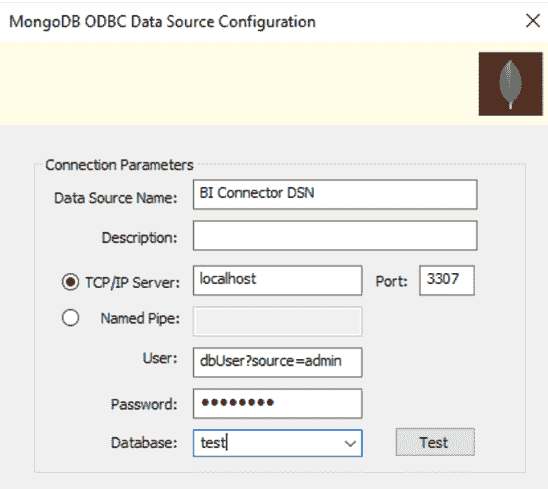

**步骤 10:** 如果您启用了 TLS/SSL，那么您必须填写 TLS/SSL 表单字段。

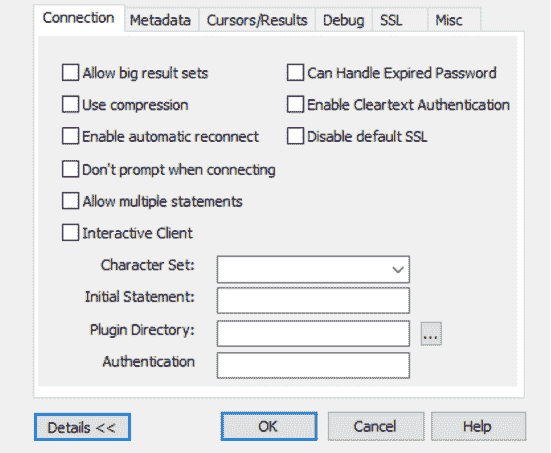

**第 11 步:**最后点击测试按钮，测试 ODBC 连接。

### 用连接器连接商务智能工具

我们现在将学习将一些商业智能工具与商业智能连接器连接起来。我们可以使用下面给出的任何商业智能工具进行连接。

### 微策略

**步骤 1:** 首先，您必须创建一个 64 位系统数据源名称

**步骤 2:** 安装 window/mac 的 MongoDB ODBC 驱动程序

**第三步:**从[https://www.microstrategy.com/us/get-started/desktop](https://www.microstrategy.com/us/get-started/desktop)下载安装 Microstrategy 桌面应用

**步骤 4:** 安装成功后，双击图标运行 Microstrategy Desktop 应用程序。

**步骤 5:** 现在，在 Microstrategy 应用程序的主页窗口上，从文件菜单中选择新建档案以创建新档案。

**步骤 6:** 现在，您必须通过单击数据集面板中的新建数据按钮来添加数据

**第 7 步:**之后，要添加数据库，单击数据源窗口中的数据库图标。

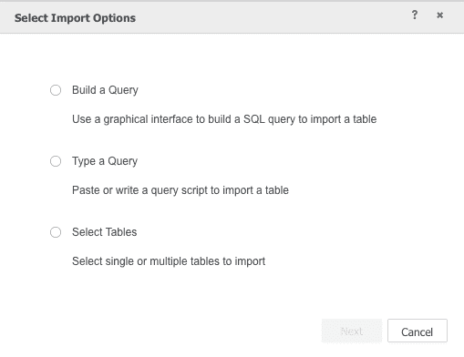

**步骤 8:** 然后，从弹出窗口中，单击选择表格，然后单击下一步按钮。

**第九步:**现在，你可以通过点击窗口左上角的加号图标来添加数据源。

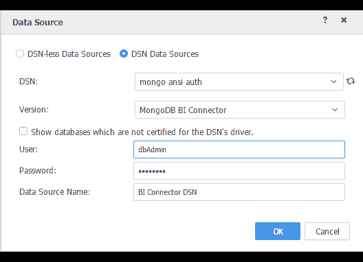

**第 10 步:**单击 DSN 数据源单选按钮，然后从 DSN 下拉菜单中选择您的 DSN。

**步骤 11:** 现在，从版本下拉菜单中，选择 MongoDB BI 连接器。

**第 12 步:**之后，你需要输入你的 mongosqld 用户名&密码，并给数据源一个名称，然后点击确定。

**步骤 13:** 现在，您可以在数据源面板中看到您新创建的数据源。现在，您可以选择要使用的数据库。

**第 14 步:**您可以在右侧面板上拖动想要处理的收藏，然后单击“完成”按钮。

**步骤 15:** 现在可以构建适合自己需求的可视化，并选择数据访问模式。

### 连接到桌面

**步骤 1:** 下载后安装 Tableau 桌面版 10.3 或更高版本。

**步骤 2:** 现在，在启用身份验证的情况下运行 Atlas 部署和 mongosqld 实例。

**第 3 步:**之后，在为 BI Connector 和下载 MongoDB ODBC 驱动程序后，运行 [Windows](https://www.javatpoint.com/windows) 安装程序包。

**步骤 4:** 现在，您需要一个配置为将 Tableau 安全连接到 BI 连接器的 DSN。

**第 5 步:**启动微软 ODBC 数据源程序

**步骤 6:** 选择系统 DSN 选项卡

**第 7 步:**点击添加按钮

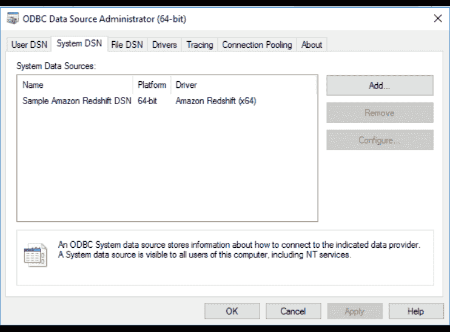

**步骤 8:** 现在，从可用驱动程序列表中选择 MongoDB ODBC 驱动程序，并填写必要的表单字段。

**第 9 步:**之后，需要填写认证表单字段。

**第十步:**现在点击测试按钮，测试 ODBC 的连接。

**步骤 11:** 运行 Tableau 桌面应用程序。

**步骤 12:** 现在使用 Tableau 连接，在左侧导航中的“更多”下，单击“ODBC”

**步骤 13:** 在 ODBC 对话框中，从下拉列表中选择您的 DSN，然后单击连接。

**步骤 14:** 现在，一旦连接测试完成，就登录它。

### 连接到 PowerBI 桌面

Power BI 是应用程序、服务和连接器的集合，它们协同工作，将我们的独立数据源转化为交互式见解。它将是云/内部混合数据仓库或电子表格的 Excel 集合。您可以使用 Power BI 轻松连接到您的数据源。

**第一步:**前往[https://powerbi.microsoft.com/en-us/get-started/](https://powerbi.microsoft.com/en-us/get-started/)报名 Power BI。然后下载 Power BI 的桌面应用。

**第二步:**Power BI 桌面安装成功后，启动。

**第三步:**现在，在主页上，你会发现工具栏上的获取数据选项。点击它。

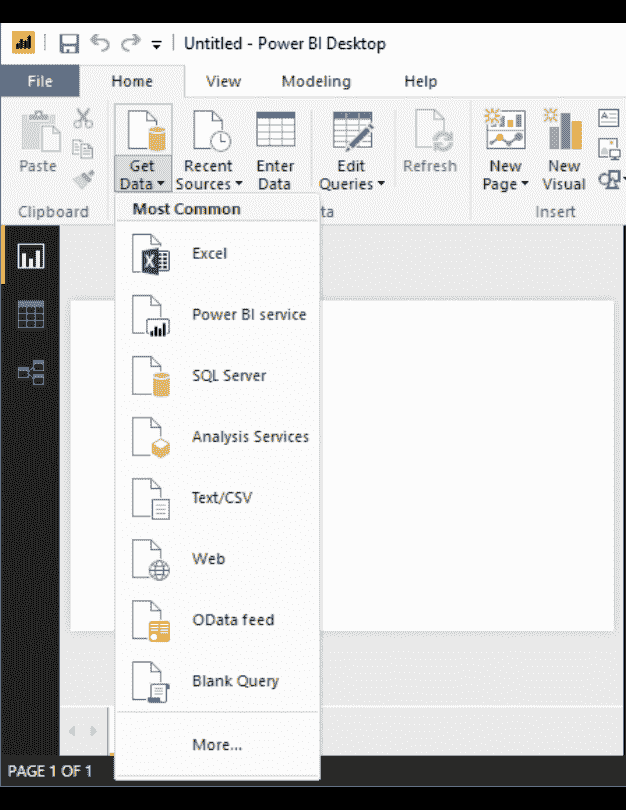

**第 4 步:**然后点击更多选项。

**第五步:**之后会出现一个列表，可以从数据源列表中选择 ODBC，点击连接。

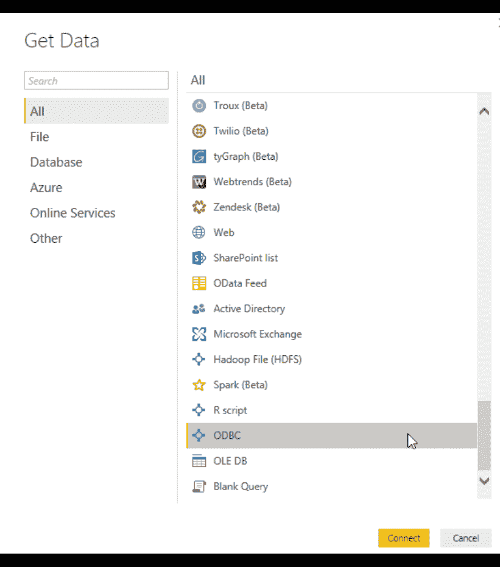

**第 6 步:**现在，您必须从列表中选择 ODBC 数据源名称，然后单击确定按钮。

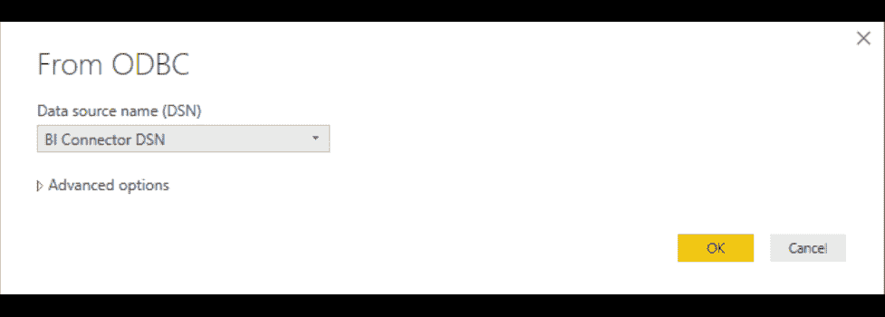

**第 7 步:**现在您在 Power BI 导航器上有了数据库列表。选择要使用的集合和数据库。

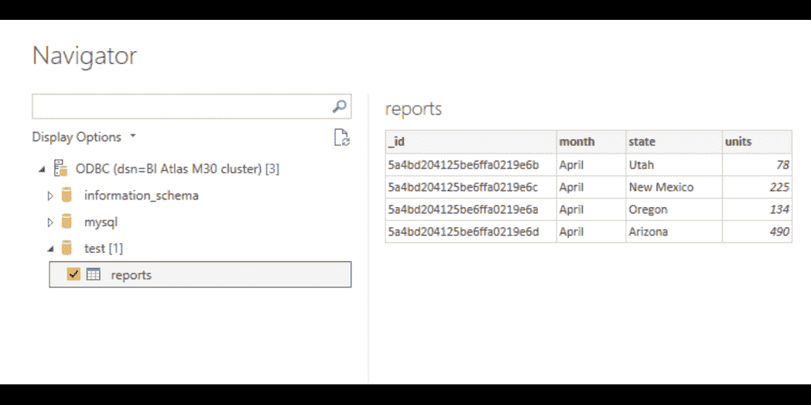

**第 8 步:**最后，选择完成后点击加载。

**第九步:**现在，可以开始使用 [Power BI](https://www.javatpoint.com/power-bi) 了。

### 连接到 Qlik Sense

Qlik sense 是一个复杂的人工智能、可扩展的多云架构和分析引擎，用于支持任何组织中的每个人每天做出更好的决策，并创建一个真正的数据驱动型企业。

**第一步:**从 https://www.qlik.com/us/trial/download-qlik-sense-desktop.下载并安装 Qlik sense 桌面版

**步骤 2:** 安装成功后，启动应用程序。

**第三步:**点击新建应用按钮。

**第 4 步:**为您的应用程序填写一个名称并打开它。

**第五步:**点击添加数据按钮。

**步骤 6:** 现在，从数据源列表中选择 ODBC。

**步骤 7:** 在“创建新连接”窗口中，选择您在步骤 3 中创建的 ODBC 数据源。

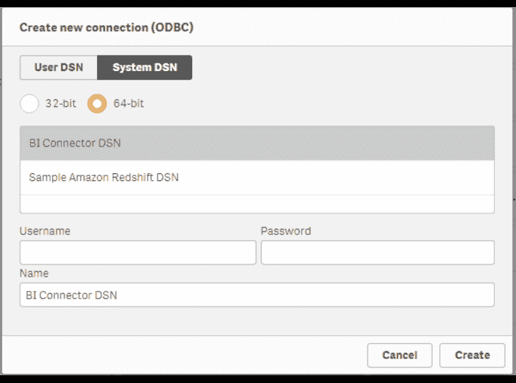

**步骤 8:** 模式文件中列出的所有数据库和表都应该出现在应用程序的概述中。

### 连接到微软 Excel

**步骤 1:** 确保您有正在运行的 mongosqld 实例。

**第二步:**启动[微软 Excel](https://www.javatpoint.com/excel-tutorial) 如果你的 PC 里已经有了，或者你可以从微软下载。

**步骤 3:** 现在，选择数据选项卡打开数据工具栏。

**第四步:**在工具栏左侧，点击获取外部数据。

**第五步:**现在，点击其他来源。

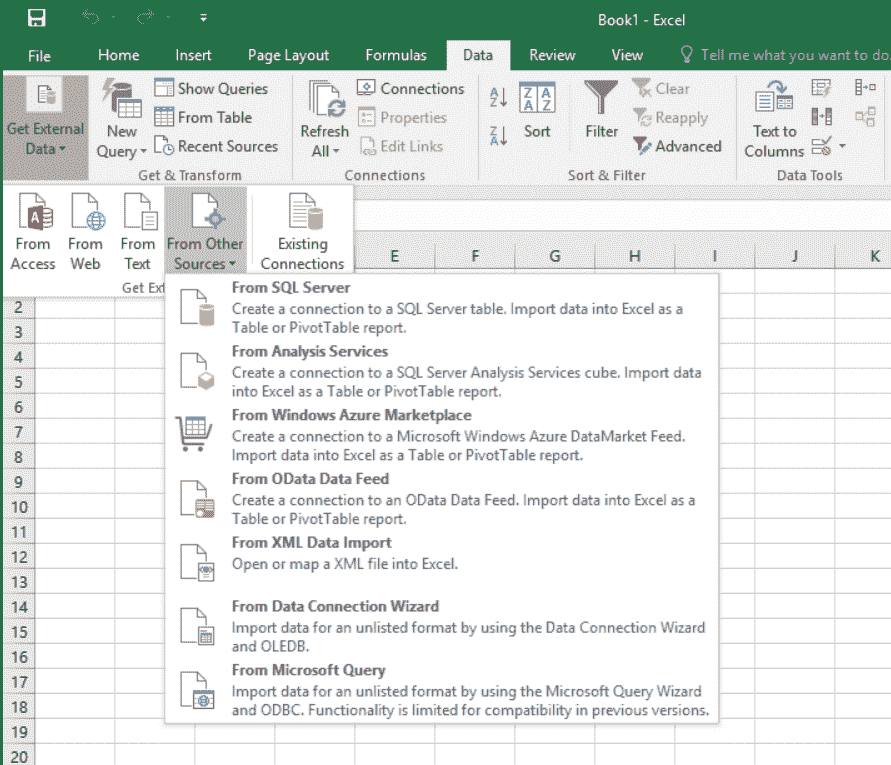

**第 6 步:**之后，选择从数据连接向导选项。

**步骤 7:** 现在，从数据源选项列表中选择 ODBC DSN，然后单击下一步。

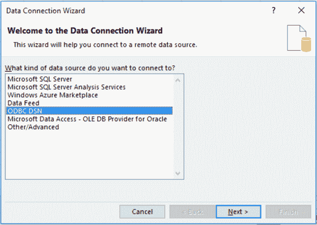

**步骤 8:** 选择用于连接到您的 BI 连接器实例的 DSN，然后单击下一步。

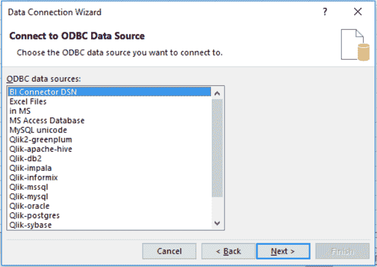

**第九步:**点击下一步，会出现下拉菜单，然后从列表中选择一个数据库和收藏。完成后点击下一步

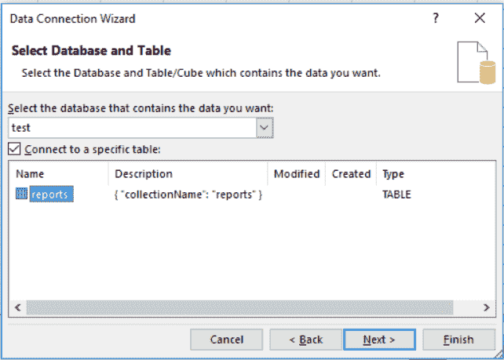

**步骤 10:** 现在，选择数据连接文件后点击完成。

**第 11 步:**最后在最后一个对话窗口中单击确定，您可以在其中指定工作表的格式

* * *