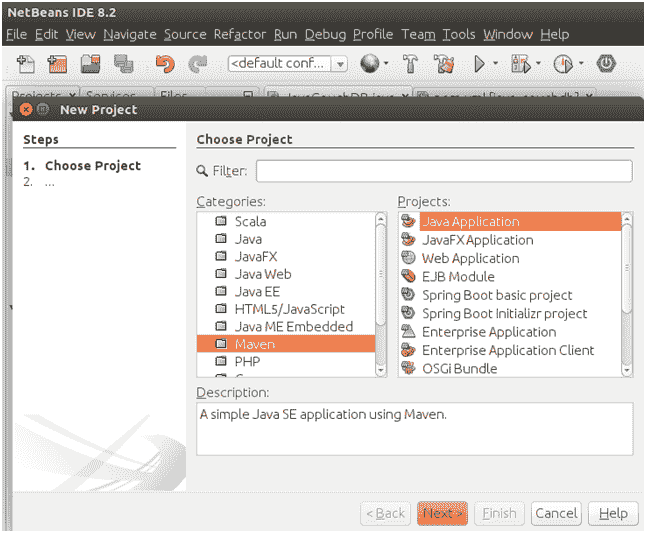
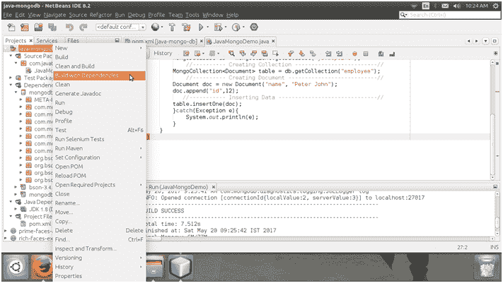
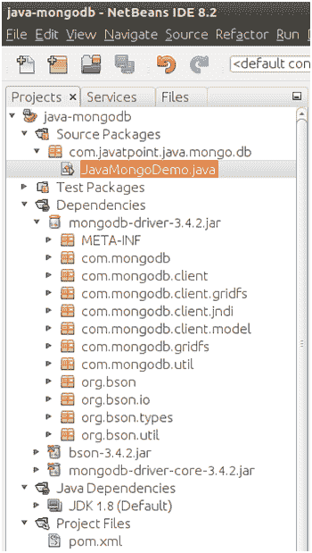
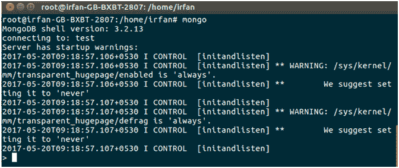
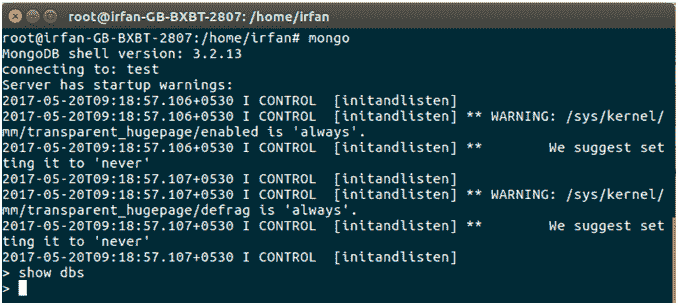
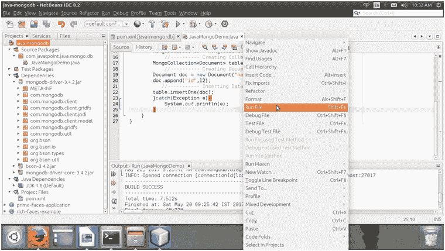
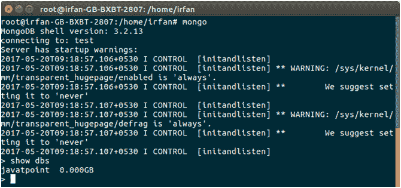
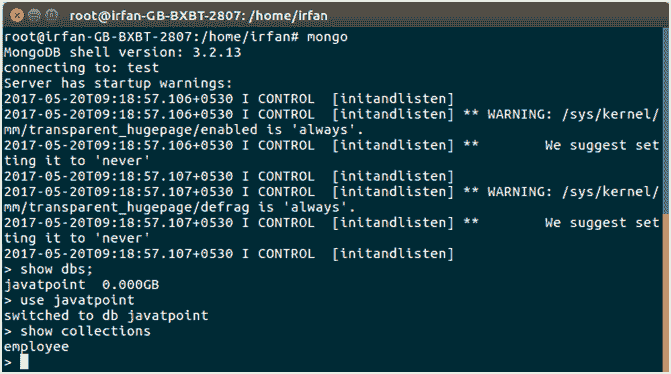
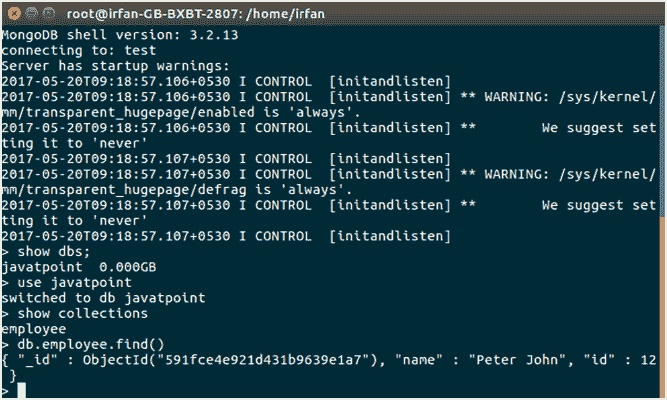

# Java MongoDB 连接性

> 哎哎哎:# t0]https://www . javatppoint . com/Java-mong odb

为了连接 MongoDB 数据库，Java 项目包括以下步骤。在这里，我们创建了一个 maven 项目，并为 mongodb 驱动程序提供了依赖性。

## 遵循以下步骤:

### 1)创建一个微型项目



### 2)将相关性添加到 POM 文件

//POM . XML

```
<?xml version="1.0" encoding="UTF-8"?>
<project  xmlns:xsi="http://www.w3.org/2001/XMLSchema-instance" xsi:schemaLocation="http://maven.apache.org/POM/4.0.0 http://maven.apache.org/xsd/maven-4.0.0.xsd">
<modelVersion>4.0.0</modelVersion>
<groupId>com.javatpoint</groupId>
<artifactId>java-mongo-db</artifactId>
<version>1.0-SNAPSHOT</version>
<packaging>jar</packaging>
<properties>
<project.build.sourceEncoding>UTF-8</project.build.sourceEncoding>
<maven.compiler.source>1.8</maven.compiler.source>
<maven.compiler.target>1.8</maven.compiler.target>
</properties>
<name>java-mongodb</name>
<dependencies>
<dependency>
<groupId>org.mongodb</groupId>
<artifactId>mongodb-driver</artifactId>
<version>3.4.2</version>
</dependency>
</dependencies>
</project>

```

### 3)创建 Java 文件

创建一个 Java 文件并编写代码来创建连接。

**//JavaMongoDemo.java**

```
package com.javatpoint.java.mongo.db;
import com.mongodb.MongoClient;
import com.mongodb.client.MongoCollection;
import com.mongodb.client.MongoDatabase;
import org.bson.Document;
public class JavaMongoDemo {
public static void main(String[] args){
try{
//---------- Connecting DataBase -------------------------//
MongoClient mongoClient = new MongoClient( "localhost" , 27017 );
//---------- Creating DataBase ---------------------------//
MongoDatabase db = mongoClient.getDatabase("javatpoint");
//---------- Creating Collection -------------------------//
MongoCollection<Document> table = db.getCollection("employee");
//---------- Creating Document ---------------------------//  
Document doc = new Document("name", "Peter John");
doc.append("id",12);
//----------- Inserting Data ------------------------------//
table.insertOne(doc);
}catch(Exception e){
System.out.println(e);
}
}
}

```

### 4)构建依赖关系来加载 JAR



**项目结构**

最后，我们的项目结构是这样的。



### 5)进入蒙古外壳

确保我们安装了 mongoDB。安装后，通过键入以下命令进入 mongo shell。

```
$ mongo

```



**数据库**

我们可以使用以下命令查看可用的数据库。

```
> show dbs

```



我们可以看到没有可用的数据库。让我们创建一个数据库。

**运行 Java 文件**

运行此文件以创建数据库。



**数据库**

再次检查 MongoDB 以查看可用的数据库。



看，创建了一个数据库 **javatpoint** 。

**集合**

参见，创建的集合**员工。**



**记录**

查看插入的记录。



我们可以看到，Java 程序执行得很好，我们也可以执行其他数据库操作。