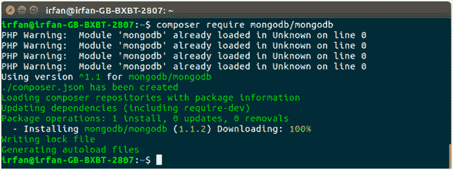
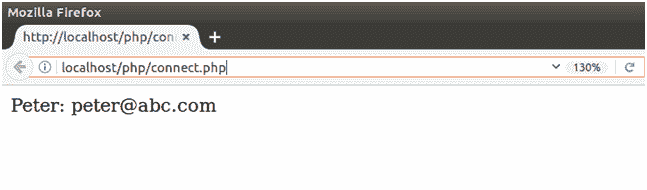
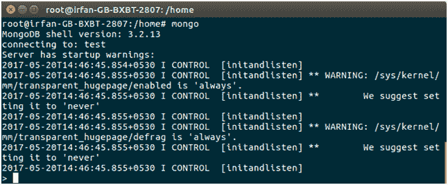
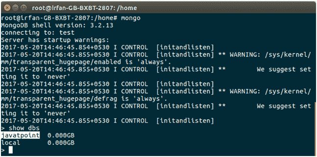
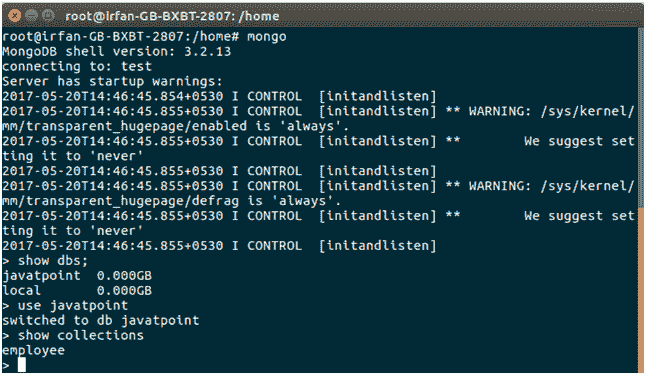
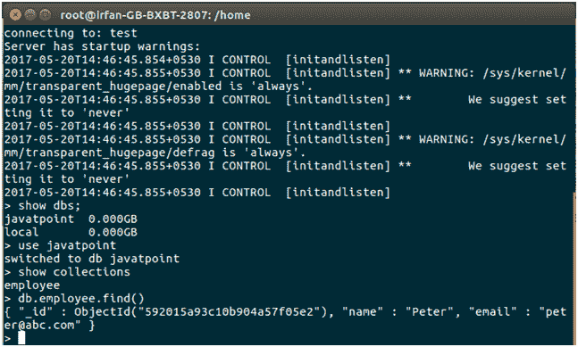

# Php MongoDB 连接性

> 哎哎哎:# t0]https://www . javatppoint . com/PHP-mong odb

Php 提供 **mongodb** 驱动与 mongodb 数据库连接。安装后，我们可以使用 php 执行数据库操作。这里，我们用 Ubuntu 16.04 创建一个例子。该示例包括以下步骤。

### 1)安装驱动程序

```
$ pecl install mongodb

```


### 2）编辑 php.ini 文件

存储在 apache 服务器目录/**etc/PHP/7.0/Apache 2/PHP . ini**中

```
$ extension = mongodb.so

```


### 3)安装 mongo-php 库

以下是使用 Composer 安装此库的首选方式。

```
$ composer require mongodb/mongodb

```



### 4)创建 Php 脚本

**//connect.php**

```
<?php
require 'vendor/autoload.php';
// Creating Connection
$con = new MongoDB\Client("mongodb://localhost:27017");
// Creating Database
$db = $con->javatpoint;
// Creating Document
$collection = $db->employee;
// Insering Record
$collection->insertOne( [ 'name' =>'Peter', 'email' =>'peter@abc.com' ] );
// Fetching Record
$record = $collection->find( [ 'name' =>'Peter'] );
foreach ($record as $employe) {
echo $employe['name'], ': ', $employe['email']."<br>";
}
?>

```

### 5)执行 Php 脚本

在本地主机服务器上执行此脚本。它将创建数据库并将数据存储到 mongodb 中。

```
localhost/php/connect.php

```



### 6)进入 MongoDB 外壳

执行 php 脚本后，我们可以在 mongodb 中看到创建的数据库。

```
$ mongo

```



**6.1。显示数据库**

以下命令用于显示数据库。

```
> show dbs

```



**6.2。展示收藏**

以下命令用于显示集合。

```
> show collections

```



**6.3。访问记录**

```
> db.employee.find()

```



一切就绪，一切正常。我们还可以执行其他数据库操作。