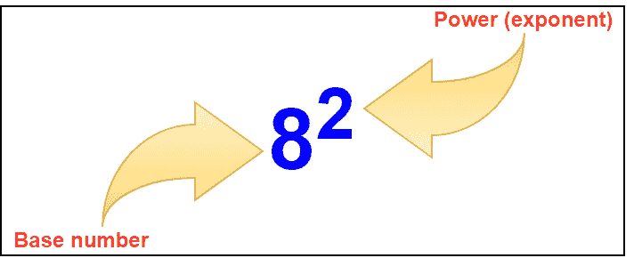

# MongoDB $ pow 运算符

> 原文：<https://www.javatpoint.com/mongodb-pow-operator>

## MongoDB 中的$ pow 运算符是什么？

MongoDB 提供了多种算术表达式运算符。$ pow 运营商就是其中之一。此运算符用于聚合管道阶段。这个运算符用来求一个数的指数(幂)。

### 一个数的指数是多少？

指数(幂)是一个数与自身相乘的结果。通常情况下，指数用如下图表表示。



### $pow 运算符的语法:

```js

{ $pow: [ < number >, < exponent > ] }

```

**<数>和<指数>可以是任何有效的表达式，直到它解析为一个数。**

**重点:**

1.  如果数字为空，则$pow 运算符返回空值。
2.  如果数字指的是缺失的字段，则$pow 运算符返回 null。
3.  如果数字是 NaN，$pow 运算符返回 NaN。

| S.No | 例子 | 输出 |
| 1. | { $pow: [ 4，0 ] } | one |
| 2. | { $pow: [ 4，2 ] } | Sixteen |
| 3. | { $pow: [ 4，-2 ] } | 0.0625 |
| 4. | { $pow: [ -4，0.5 ] } | 圆盘烤饼 |

### 示例:

在以下示例中，我们正在使用:

```js

Database: javaTpoint
Collection: shapes
Document: Six documents that contain the details of the shapes

```

```js
>db.shapes.find().pretty()
{
        {
         "_id" : 1, 
         "name" : "rectangle",
         "area" : 16
        }
        {
         "_id" : 2, 
         "name" : "square",
         "area" : 10
        }
        {
         "_id" : 3, 
         "name" : "circle",
         "perimeter" : 15,
         "area" : 10,
         "details" : { 
                           "radius" : 3,
                           "diameter" : 6
                          }
        }
        {
         "_id" : 4, 
         "name" : "rectangle",
         "area" : 0
        }
        {
         "_id" : 5, 
         "name" : "oval",
         "area" : 20
        }
        {
         "_id" : 6, 
         "name" : "triangle",
         "area" : 5
        }
        {
         "_id" : 7, 
         "name" : "rectangle",
         "area" : null
        }
}

```

**示例 1:使用$ pow 运算符**

在这个例子中，我们使用$pow 操作符将矩形中的“面积”字段提升一个指定的指数。

```js

db.shapes.aggregate(
 [
   {$match: { name : "rectangle"}},
      {
          $project: 
              {
                name : 1,
                area : 1,
                result : {$pow: ["$area", 3]}
               }
      }
 ]
)

```

**输出:**

```js
{
         "_id" : 1, 
         "name" : "rectangle",
         "area" : 16,
         "result" : 4096
}
{
         "_id" : 4, 
         "name" : "rectangle",
         "area" : 0,
         "result" : 0
}
{
         "_id" : 7, 
         "name" : "rectangle",
         "area" : null,
         "result" : null
}

```

在这个例子中，我们使用面积字段作为基数，使用 3 作为指数。因此，矩形的每个“面积”字段都增加了 3 的幂。

**例 2:负指数**

如果基数为零(0)且指数为负，则不能提升该数。在这种情况下，它会返回错误消息。

```js

db.shapes.aggregate(
  [
    { $match: { _id : 4 } },
      { 
          $project: 
           { 
                name : 1,
                area : 1,
                result: { $pow: [ "$area", -3 ] }
            }
       }
  ]
)

```

**输出:**

```js
uncaught exception : Error : command failed : {
	"ok" : 0,
	"errmsg" : "$pow cannot take a base of 0.and a negative exponent",
	"code" : 28764,
	"codeName" : "Location28764"4' [ ln;' lj; h
Lh;klh[pjlkh[pkoh[khp[o
} : aggregate failed:
[email protected]/mongo/shell/utils.js:25:13
[email protected]/mongo/shell/assert.js:18:14
[email protected]/mongo/shell/assert.js:618:17
[email protected]/mongo/shell/assert.js:708:16
[email protected]/mongo/shell/db.js:266:5
[email protected]/mongo/shell/collection.js:1046 : 12
@(shell) : 1 : 1

```

错误明确指出。“$pow 不能取 0 的基数和负指数”。

```js

db.shapes.aggregate(
  [
    { $match: { _id: 5  } },
      { 
          $project: 
           { 
                name : 1,
                area : 1,
                result: { $pow: [ "$area", -3 ] }
            }
       }
  ]
)

```

**输出:**

```js
{
         "_id" : 5, 
         "name" : "oval",
         "area" : 20,
         "result" : 0.000125  
}

```

**例 3:零指数**

我们已经在“示例 1”中看到，如果基数为空，结果也会变为空。

如果指数的值为空，它仍将返回空值。

```js

db.shapes.aggregate(
  [
    { $match: { _id: 6  } },
      { 
          $project: 
           { 
                name : 1,
                area : 1,
                result: { $pow: [ "$area", null ] }
            }
       }
  ]
)

```

**输出:**

```js
{
         "_id" : 6, 
         "name" : "triangle",
         "area" : 5,
         "result" : null  
}

```

**示例 4:不存在的字段**

如果对程序中不存在的字段应用$pow 运算符，则返回 null。

```js

db.shapes.aggregate(
  [
    { $match: { _id: 2  } },
      { 
          $project: 
           { 
                name : 1,
                area : 1,
                result: { $pow: [ "$perimeter", null ] }
            }
       }
  ]
)

```

**输出:**

```js
{
         "_id" : 2, 
         "name" : "square",
         "area" : 10,
         "result" : null  
}

```

* * *