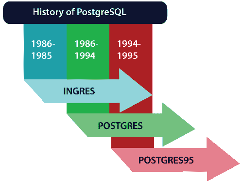

# PostgreSQL 教程

> 原文：<https://www.javatpoint.com/postgresql-tutorial>

PostgreSQL 是一个流行的**关系数据库管理系统(RDBMS)** 。我们的 PostgreSQL 教程提供了 PostgreSQL 的基本和高级概念。在本教程中，我们将学习 PostgreSQL 语言的所有主题，如**创建数据库、删除数据库、选择数据库、选择表、更新记录、创建表、删除记录、删除表、触发器、函数、插入记录、过程、游标、**等。

我们还将提供 PostgreSQL 面试问题和测验，以帮助您更好地理解 PostgreSQL 语言。本教程将帮助我们理解 PostgreSQL 的所有主要特性，还提供了如何使用 PostgreSQL 的知识。

## 什么是 PostgreSQL？

PostgreSQL 是一个 **ORDBMS** [ **开源对象关系数据库管理系统** ]。用于安全存储数据；支持最佳实践，并允许在处理请求时恢复它们。

*   PostgreSQL 最初于 1996 年 7 月 8 日在加州大学 T2 分校推出。
*   它是第一个执行 **MVCC** [ **多版本并发控制**功能的数据库管理系统，甚至在 Oracle 之前。多版本并发控制属性在 Oracle 中被称为**快照**隔离。
*   是用 **C** 编程语言写的。
*   PostgreSQL 是**跨平台**，运行在各种操作系统上，如**微软** **Windows、UNIX、FreeBSD、Mac OS X、Solaris、HP-UX、LINUX** 等等。
*   PostgreSQL 是 macOS 服务器的现有数据库。
*   PostgreSQL 也发音为**Post-gress-Q-L**，由 **PostgreSQL 全球发展集团**(一个全球志愿者团队)开发，任何组织或其他私人实体都不控制它。
*   PostgreSQL 将为我们提供借助各种编程语言(如 **Java、C 和 C++、**等)添加自定义函数的功能。
*   在这里，我们可以描述我们的**函数语言、索引类型和数据类型**，我们还可以创建一个**自定义插件**来增加我们需求的可靠性。
*   其源代码可在 **PostgreSQL 许可下访问；**因此，我们可以自由使用它，以任何形式更改和分配 PostgreSQL。
*   PostgreSQL 遵循**事务**以及 **ACID(原子性、一致性、隔离性和持久性)**属性。
*   PostgreSQL 的主要目标是处理各种作业，从单一技术到 web 服务或具有多个并行用户的数据仓库。

## PostgreSQL 的历史

PostgreSQL 是由 PostgreSQL 全球开发小组开发的，该小组由加州大学伯克利分校(UCB)的计算机科学教授 T2·迈克尔·斯通布雷克领导。教授的石破天惊始于 **1986** 作为后续项目和后 Ingres 项目，以克服现有数据库系统的问题。

最初，它被称为 **Postgres，**但**在 1996 年**时，该项目被更名为 **PostgreSQL** 。话说回来，2007 年**他们做了一些分析，开发团队决定保留名称为 **PostgreSQL** 。现在，它是市场上最具创新性的开源数据库。**

**

| 年 | 描述 |
| **1977-1985** :在这些特殊的年份，开发了 **INGRES** 项目。 | 

*   **Anger Company** was developed in 1980 and 1994: acquired by Computer United Company.
*   Ingres project is the proof of concept of relational database.

 |
| **1986-1994: POSTGRES** | 在 INGRES 中，升级特性对于面向对象和查询语言 **Quel** 至关重要。*   INGRES' code base is not used as the basis of POSTGRES.*   After that, it was commercialized as a diagram and acquired by **Informix and IBM** . |
| **1994-1995: Postgres95** | 

*   In 1994, the support for SQL was increased.
*   In 1995, they published **postgres 95** .
*   In 1996, they re-released it as **PostgreSQL 6.0** .
*   **Establishment of PostgreSQL global development team**

 |

#### 注意:1997 年，第一个 PostgreSQL 发布了他们设计的 6.0 版本。稍后，世界各地的开发人员将作为 PostgreSQL 全球开发小组继续开发该软件。开发将继续创建开放源代码软件和 PostgreSQL 许可证都可以访问的版本。

* * *

## PostgreSQL 索引

* * *

**PostgreSQL 教程**

*   [SQL 入门](postgresql-tutorial)
*   [PostgreSQL 历史记录](postgresql-history)
*   [PostgreSQL 功能](postgresql-features)
*   [PostgreSQL 语法](postgresql-syntax)
*   [PostgreSQL 数据类型](postgresql-datatypes)
*   [安装 PostgreSQL](install-postgresql)

**PostgreSQL 数据库**

*   [PostgreSQL 创建数据库](postgresql-create-database)
*   [PostgreSQL Drop DB](postgresql-drop-database)

**PostgreSQL 表**

*   [PostgreSQL 创建表](postgresql-create-table)
*   [PostgreSQL 删除表](postgresql-drop-table)

**PostgreSQL 模式**

*   [PostgreSQL 模式](postgresql-schema)

**PostgreSQL 查询**

*   [PostgreSQL 插入](postgresql-insert)
*   [后置 SQL 选择](postgresql-select)
*   [PostgreSQL 更新](postgresql-update)
*   [PostgreSQL 删除](postgresql-delete)

**PostgreSQL 子句**

*   [PostgreSQL 其中](postgresql-where-clause)
*   [邮政编码订单依据](postgresql-order-by-clause)
*   [后置 SQL 分组依据](postgresql-group-by-clause)
*   [后置 SQL 具有](postgresql-having-clause)

**后置条件**

*   [后置条件](postgresql-condition)
*   [PostgreSQL 和](postgresql-and-condition)
*   [PostgreSQL Or](postgresql-or-condition)
*   [PostgreSQL 和&或](postgresql-and-or-condition)
*   [PostgreSQL 非](postgresql-not-condition)
*   [PostgreSQL Like](postgresql-like-condition)
*   [PostgreSQL In](postgresql-in-condition)
*   [后置 SQL 不在](postgresql-not-in-condition)
*   [后置 SQL 之间](postgresql-between-condition)

**PostgreSQL 视图**

*   [PostgreSQL 视图](postgresql-view)

**PostgreSQL 连接**

*   [PostgreSQL 内部连接](postgresql-join)
*   [PostgreSQL 左连接](postgresql-left-join)
*   [PostgreSQL 右连接](postgresql-right-join)
*   [PostgreSQL 完全连接](postgresql-full-join)
*   [PostgreSQL 交叉连接](postgresql-cross-join)

**后置 SQL 高级**

*   [PostgreSQL 函数](postgresql-functions)
*   [PostgreSQL 触发器](postgresql-trigger)
*   [PostgreSQL 别名](postgresql-alias)
*   [PostgreSQL 索引](postgresql-indexes)
*   [邮政编码日期&时间](postgresql-date-time)

**面试问题**

*   [SQL 面试](sql-interview-questions)
*   [PL/SQL 面试](pl-sql-interview-questions)

**测验**

*   [SQL 小测验](sql-quiz)

* * *

## 先决条件

学习 PostgreSQL 的要求是数据库方面的知识，主要是 RDBMS 和 MySQL。它是具有不同设置和程序的数据库软件。

## 观众

PostgreSQL 教程提供了 SQL 的基本和高级思想。我们的 PostgreSQL 教程是为初学者和专业人士设计的。

## 问题

我们向您保证，在学习 PostgreSQL 教程时，您不会发现任何困难。但是如果本教程有任何错误，请将问题或错误张贴在联系表中，以便我们改进。

* * ***