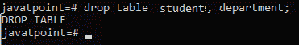
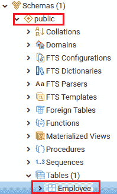
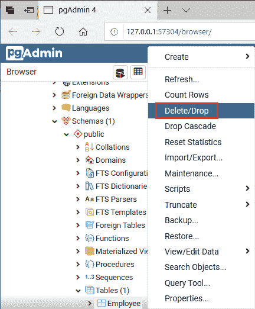
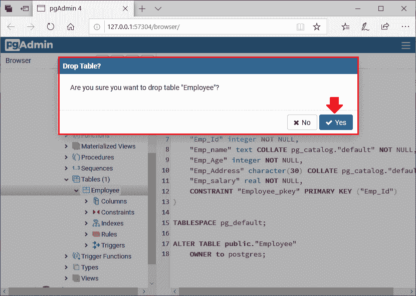
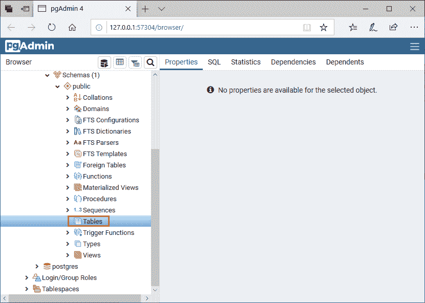

# PostgreSQL 删除表

> 原文：<https://www.javatpoint.com/postgresql-drop-table>

在 PostgreSQL 中，我们可以使用 Drop table 命令删除现有表或不再需要的表。此命令从数据库中永久删除表的完整数据以及整个结构或定义。

因此，在删除表时，我们必须非常警惕，因为删除表后，我们无法恢复丢失的数据。

在这一节中，我们将学习**如何在 PostgreSQL 中删除**一个表。

## 删除表的语法

```sql

DROP TABLE table_name;

```

这里**表名**参数用于定义表名，我们将从数据库中删除。而**掉表**是用来掉表的关键词。

在 [PostgreSQL](https://www.javatpoint.com/postgresql-tutorial) 中，我们可以通过两种方式来删除表:

*   **从 psql 中删除表格**
*   **将表格放入 pgAdmin**

### 从 psql 中删除表

要在 psql 中删除或移除，我们将遵循以下步骤:

**第一步**

在本教程的前一部分，我们已经创建了表格**学生和系**。首先，我们将借助下面的命令来确认这些表:

```sql

Javatpoint=# \d

```

使用上述命令后，将出现以下输出:


**第二步**

这意味着**学生和部门**表在所选数据库中可用。因此，我们将在下面命令的帮助下让它们掉落:

```sql

javatpoint=# drop table student, department;

```



**第三步**

如果我们再次查看关系列表:

```sql

javatpoint=# \d
relations found.
javatpoint=# 

```

上面的消息指定 drop 命令成功执行。

### 将表格放入 pgAdmin

如果我们想从 **pgAdmin** 中删除一个表，我们需要遵循以下过程:

**第一步**

打开您的 pgAdmin，然后转到**对象树**，我们将转到数据库，然后转到**模式**下的**公共**部分，然后选择我们要**删除或删除的**员工**表。**



**第二步**

然后我们将右键单击选中的(**员工**)表，并从给定的下拉列表中单击**删除/删除**选项，如下图所示:



**第三步**

屏幕上会出现**降表**弹出窗口，点击**是**按钮降**员工**表。



**第四步**

一旦我们点击“是”按钮，表格将被自动删除，正如我们在下面的截图中看到的那样，**表格**部分没有表格可用。



* * *