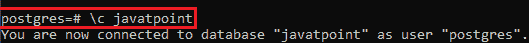
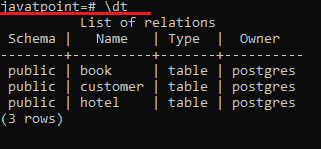
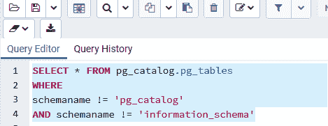
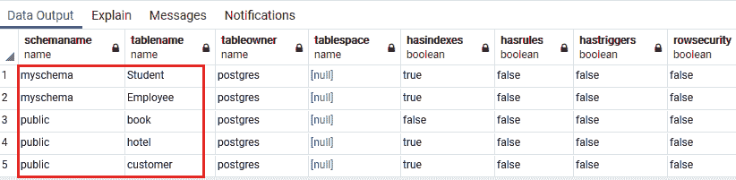
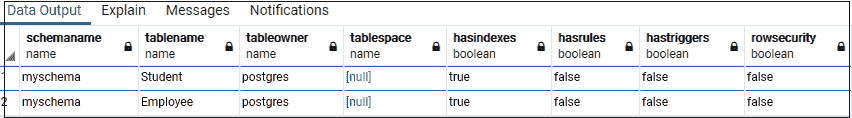
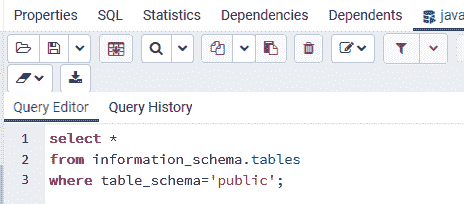
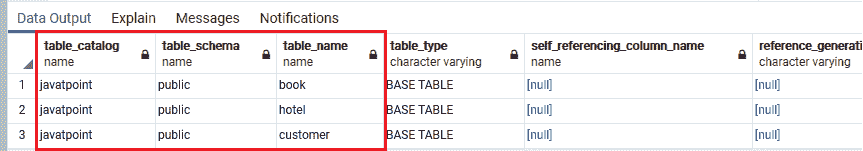

# PostgreSQL 显示表

> 原文：<https://www.javatpoint.com/postgresql-show-table>

在本节中，我们将学习如何在 PostgreSQL 中**显示表格。当我们有许多数据库，其中有几个表时，列表或显示表是很重要的。**

有时各种数据库中的表名是相同的；在这种情况下，show table 命令非常有用。

在 PostgreSQL 中，我们可以通过以下两种不同的方式来显示这些表:

*   **PostgreSQL 使用 psql** 显示表格
*   **PostgreSQL 使用 pgadmin4** 显示表格

#### 注意:在 PostgreSQL 中，我们不能直接使用 SHOW TABLES 命令，因为我们可以直接在 MySQL 中使用。

## PostgreSQL 使用 psql 显示表

在 psql 中，我们可以借助下面的命令获得数据库的表信息数量，并显示当前数据库中的表:

```

\dt

```

要获得表的列表，我们将遵循以下步骤:

**第一步**

*   打开**出现的**SQL shell(psql)**必要的细节**。之后，我们将使用在 PostgreSQL 安装过程中创建的**密码**登录**到 Postgres 数据库服务器。**
***   我们连接到 **Postgres 服务器**，如下图所示:**

**

**第二步**

*   现在，我们将连接到我们之前创建的特定数据库服务器，即 **javatpoint** ，并借助以下命令:

```

\c javatpoint 

```



**第三步**

*   最后，我们将执行 SHOW TABLES 命令来查看**javat oin**t 数据库包含许多表。

```

Javatpoint=# \dt

```

#### 注意:dt 命令用于列出当前数据库中的所有表。

**输出**

下面的截图解释得更清楚了:



## PostgreSQL 显示使用 pgAdmin4 的表

在 [PostgreSQL](https://www.javatpoint.com/postgresql-tutorial) 中，这是**借助 **pgAdmin4** 展示表格**的另一种方式。

在这里，我们将使用**选择命令**从 PostgreSQL 目录中请求数据。

```

SELECT * FROM pg_catalog.pg_tables
WHERE
schemaname != 'pg_catalog'
AND schemaname != 'information_schema';

```

#### 注意:为了获得数据库中每个表的所有有用信息，我们将使用 pg_tables。

### pgadmin4 中的 SQL 查询

我们可以在 [SQL](https://www.javatpoint.com/sql-tutorial) 查询工具中看到上面的查询:



### 表格结构

上述查询将生成下表结构:



#### 注意:我们可以修改 WHERE 子句中的条件来过滤系统表。
如果忽略 WHERE 子句，我们可能会得到很多表，这些表可能是对我们没有用的系统表。

假设我们将上面查询中的**模式名称修改为 myschema** :

```

SELECT * FROM pg_catalog.pg_tables
WHERE
schemaname = 'myschema'
AND schemaname != 'information_schema'

```

### pgAdmin4 中的 SQL 查询

一旦我们更改了查询，点击**执行按钮**，如下图所示:


**输出**

我们可以看到我们在 **myschema** 中创建的表格，如下图所示:



**或**

我们可以使用另一个查询**来显示数据库中的表**:

```

select * 
from information_schema.tables 
where table_schema='public';

```

#### 注意:在这里，信息模式本身是一个自动出现在所有数据库中的模式，称为 information_schema。

### pgAdmin4 中的 SQL 查询



**输出**

在这里，我们可以看到上面查询的输出:



* * ***