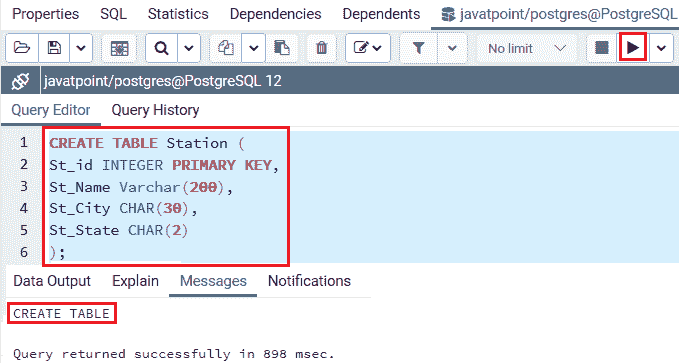
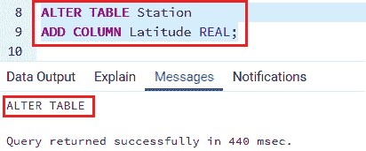
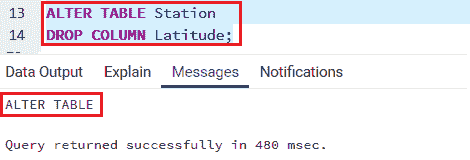
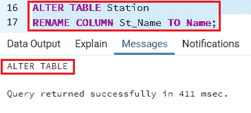
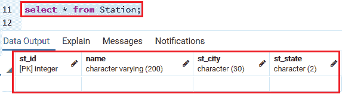
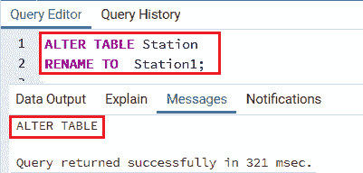
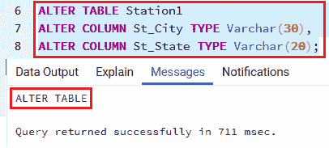
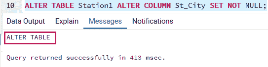
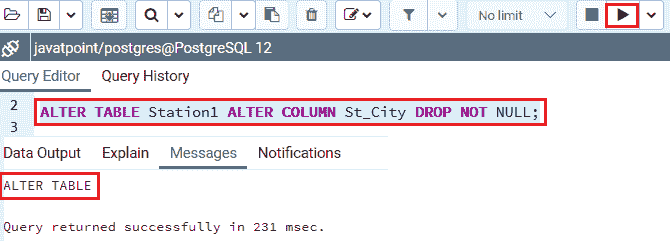
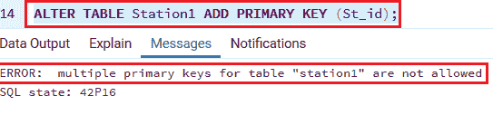

# PostgreSQL ALTER 表

> 原文：<https://www.javatpoint.com/postgresql-alter-table>

在这一节中，我们将学习 **PostgreSQL ALTER TABLE** 的各种命令来改变表的结构。

## PostgreSQL ALTER TABLE 命令

我们使用 [PostgreSQL](https://www.javatpoint.com/postgresql-tutorial) alter table 命令来改变当前的表结构。

**涂改表**的**语法**如下:

```sql

ALTER TABLE table_name action;

```

下表将显示以下 ALTER TABLE 命令修改:

| 描述 | 命令 |
| 我们将使用**更改表格添加列**来**向表格**添加新列。 | ALTER TABLE TABLE _ name ADD COLUMN new _ COLUMN _ name TYPE； |
| 我们将使用**更改表格删除列**命令**删除现有的**列。 | ALTER TABLE TABLE _ name DROP COLUMN _ NAmE； |
| 要修改列的默认值，我们可以使用**改变表格改变列设置默认值或删除默认值**命令。 | ALTER TABLE 表名 ALTER COLUMN 列名[设置默认值&#124;删除默认值]； |
| 我们将使用**改变表格添加约束**命令**来添加约束**。 | **更改表格**表格 _ 名称**添加约束**约束 _ 名称约束 _ 定义； |
| 我们将使用**将表重命名列更改为**命令来为剩余的列重命名**。** | ALTER TABLE TABLE _ name RENAME COLUMN _ name TO new _ COLUMN _ name； |
| 对于**重命名表**，我们将使用**将表重命名为**命令。 | **更改表**表名**更名为**新表名； |
| 对于**添加检查约束**，我们将使用**改变表格，添加检查**命令。 | **更改表格**表格 _ 名称**添加检查**表达式； |
| 要更改**非空约束**，我们将使用**更改表格更改列**命令。 | 更改表名更改列名[设置不为空&#124;删除不为空]； |

在 PostgreSQL 中，我们可以在 **alter table 命令**中执行各种活动，如下所示:

*   [添加列](postgresql-add-columns)
*   [重命名一列](postgresql-rename-column)
*   [降一柱](postgresql-drop-column)
*   向列添加 CHECK 约束
*   [修改列的数据类型](postgresql-change-column-type)
*   为列设置默认值
*   重命名表格

## PostgreSQL ALTER TABLE 示例

为了更好地理解 **ALTER TABLE** 命令，我们将借助 Create table 命令创建一个名为 **Station** 的新表:

```sql

CREATE TABLE Station (
St_id INTEGER PRIMARY KEY,
St_Name Varchar(200),
St_City CHAR(30),
St_State CHAR(2)
);

```

**输出**

执行上述命令后，我们将看到下面的消息窗口:



创建完**工作站**表格后，我们将对该特定表格执行以下操作:

### 添加列

之后，我们将借助以下命令添加一个名为**纬度**的新列:

```sql

ALTER TABLE Station
ADD COLUMN Latitude REAL;

```

**输出**

执行上述命令后，我们将看到下面的消息窗口:



### 放下一列

要从站表中删除纬度列，我们将使用以下命令:

```sql

ALTER TABLE Station
DROP COLUMN Latitude;

```

**输出**

执行上述语句后，我们将收到以下消息:



### 重命名列

要将 **St_Name** 列重命名为 **Name** ，我们使用以下命令:

```sql

ALTER TABLE Station
RENAME COLUMN St_Name TO Name;

```

**输出**

一旦我们执行了上面的命令，我们将得到下面的消息:



我们使用 SELECT 命令来检查上面所有的变更操作:

```sql

Select * from Station;

```

**输出**

运行上面的命令后，我们将得到下面的输出:



### 重命名表格

要将 Station 表重命名为 Station1，我们将使用以下命令:

```sql

ALTER TABLE Station
RENAME TO  Station1;

```

**输出**

执行上述命令后，我们将获得以下消息:



### 更改列类型

以下命令用于在 **Station1** 表中将 **St_City 和 St_State** 列的类型从 **Char** 修改为 **Varchar** :

```sql

ALTER TABLE Station1
ALTER COLUMN St_City TYPE Varchar(30),
ALTER COLUMN St_State TYPE Varchar(20);

```

**输出**

执行上述命令后，我们将获得以下消息:



### 添加非空约束

如果我们想在**站 1** 表的 **St_City** 列中添加 NOT NULL 约束，我们将使用以下命令:

```sql

ALTER TABLE Station1 ALTER COLUMN St_City SET NOT NULL;

```

**输出**

一旦我们执行了上面的命令，我们将得到下面的消息:



### 删除非空约束

如果我们想从**站 1** 表的 **St_City** 列中删除 NOT NULL 约束，我们将运行以下命令:

```sql

ALTER TABLE Station1 
ALTER COLUMN 
St_City DROP NOT NULL;

```

**输出**

执行上述命令后，我们将获得以下消息:



### 添加主键约束 9

如果我们想在 **Station1** 表中添加一个主键约束，我们将使用下面的命令。

```sql

ALTER TABLE Station1 ADD PRIMARY KEY (St_id);

```

**输出**

在下面的消息窗口中，**一个表**只允许有一个主键。因此，我们将假设表中没有预先设置的主键。



### 摘要

*   在 alter 命令的帮助下，我们可以**删除列**。如果索引或任何表约束被链接，那么相关的列将被自动删除。或者，对于另一个表，如果引用了该表，我们可以使用级联。
*   通过使用 alter table 命令，我们可以在特定表格中添加**列**以及**约束**。
*   我们也可以在 alter 命令的帮助下删除**列的默认值**。
*   我们可以修改**列的数据类型，**，连接的索引和约束将自动修改为新的列类型

* * *