# PostgreSQL 临时表

> 原文：<https://www.javatpoint.com/postgresql-temporary-table>

在本节中，我们将了解 **PostgreSQL 临时表**的工作以及如何创建和删除它。

### 如何创建 PostgreSQL 临时表

临时表是一个简短的表；它的名字意思是；它在数据库会话时出现。PostgreSQL 会在操作或会话结束时自动删除临时表。

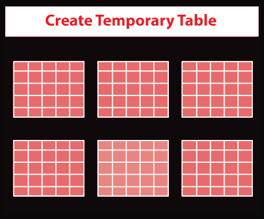

这里，我们将使用**创建临时表**命令来创建临时表。

**语法**

以下语法用于在 [PostgreSQL](https://www.javatpoint.com/postgresql-tutorial) 中创建临时表:

```

CREATE TEMPORARY TABLE temp_table_name(...);

```

**或**

我们也可以使用 **TEMP** 关键字，而不是使用上面语法中的**临时**关键字。

```

Create Temp Table temp_table_Name(...);

```

### PostgreSQL 临时表示例

让我们看一些例子来实时理解临时表的工作。

这里，我们在 **[SQL](https://www.javatpoint.com/sql-tutorial) shell (psql)** 中创建一个**临时表**。因此，为此，我们将遵循以下流程:

首先，使用 **psql** 登录 PostgreSQL 数据库服务器，在以下命令的帮助下，创建一个新的数据库为 ***Jtp*** :

```

CREATE DATABASE jtp;

```

**输出**

执行完上面的命令，我们会得到下面的输出，表示***【jtp】***数据库已经创建成功。

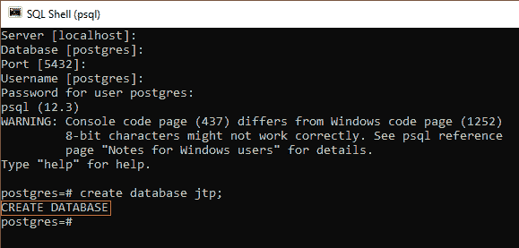

要查看之前创建的所有数据库的列表，我们将输入以下命令:

```

\l  

```

**输出**

执行上述命令后，我们得到以下结果:

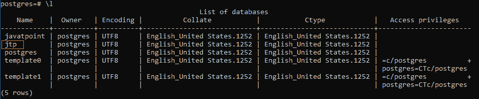

要连接到数据库，我们将输入以下命令:

```

\c jtp

```

**输出**

执行上述命令后，我们得到以下结果:

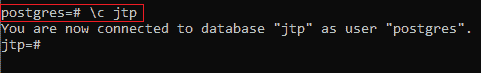

一旦我们创建了一个新的数据库，我们将在下面命令的帮助下创建一个名为***【jti 1】***的临时表:

```

jtp=# create temp table jti1(name varchar);

```

**输出**

一旦我们实现了上面的命令，我们将得到下面的结果:

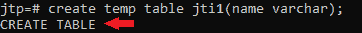

之后，我们将使用 select 命令选择 ***jti1*** 表，如下所示:

```

jtp=# select * from jti1;

```

**输出**

执行上述命令后，我们将得到以下结果:

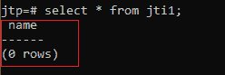

然后，我们将关闭上面的会话，并启动另一个连接到*数据库的会话，并从 ***jti1*** 表中查询数据，如下命令所示:*

 *```

jtp=# select * from jti1;

```

**输出**

执行上述命令后，我们将得到以下结果:

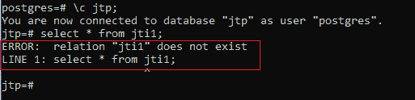

我们看到，在这个会话中，我们看不到 ***jti1*** 表，因为只有第一个会话可以访问它。

然后我们将在以下命令的帮助下退出所有会话:

```

jtp=# \q

```

**输出**

执行上述命令后，我们必须按任意键退出 psql 窗口:

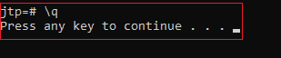

之后，我们将再次登录到数据库服务器，并从 jti1 表中获取数据:

```

test=# SELECT * FROM jti1;

```

**输出**

执行完上面的命令后，我们会得到下面的输出，其中 PostgreSQL 发出了一个错误，因为***【jti 1】***表不存在。当会话结束时，它会自动删除。

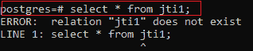

## PostgreSQL 临时表名

临时表可以与永久表共享相似的名称，但这不是强制的。或者，如果我们正在创建一个名称与**永久表**相似的**临时表**，在临时表被移除之前，我们无法检索永久表。

**例如**

在这里，首先我们将借助下面的命令创建一个名为:

```

Jtp=# CREATE TABLE fruits (fruits_name  VARCHAR PRIMARY KEY,  fruits_season VARCHAR NOT NULL);

```

**输出**

一旦我们实现了上面的命令，我们就会得到下面的消息窗口； ***水果*** 表已经创建成功。

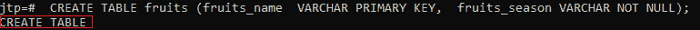

之后，我们将创建一个**临时**表，其名称类似于 ***水果*** 。

```

jtp=# create temporary table fruits ( fruits_name varchar);

```

**输出**

如下图所示，临时表 ***水果*** 已经创建成功。

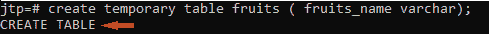

一旦两个表都创建成功，我们将使用 [SELECT 命令](https://www.javatpoint.com/postgresql-select)从 ***水果*** 表中选择 ***记录*** :

```

jtp=# select * from fruits;

```

**输出**

执行完上面的命令后，我们会得到下面的结果，可以看到 PostgreSQL 检索到的是**临时**表 ***水果*** 而不是**永久**一个。

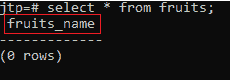

当临时表 ***水果*** 被显式删除时，我们只能在现有会话中拥有永久的 ***水果*** 表。

#### 注意:我们可能不会在 CREATE TEMP TABLE 命令中定义模式，因为 PostgreSQL 会在特定的模式中创建临时表。

如果我们在*数据库中列出表格，我们将只看到临时表格水果，而不是永久表格水果，使用下面的命令:*

 *```

jtp=# \dt

```

**输出**

如下图所示 ***水果*** 临时表的模式为 **pg_temp_3** 。

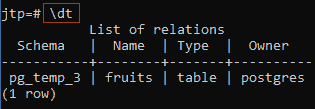

### 如何删除 PostgreSQL 临时表

在这里，我们借助 **Drop table** 命令来删除临时表。

**删除 PostgreSQL 临时表的语法**

以下语法用于删除 PostgreSQL 中的临时表:

```

DROP TABLE temp_table_name;

```

与 [**创建表**命令](https://www.javatpoint.com/postgresql-create-table)相比，[删除表命令](https://www.javatpoint.com/postgresql-drop-table)没有**临时表**的 **TEMP 或**临时关键字概念。

让我们看一个**的例子**来了解一下拆除临时表的工作。

在这里，我们将删除临时表*，它是我们在上面的示例中使用下面的命令创建的:*

 *```

jtp=# drop table fruits;

```

**输出**

执行上述命令后，我们会得到如下消息: ***【水果】*** 表已成功掉落。

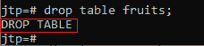

如果我们使用以下命令再次在 **jtp** 数据库中列出表格:

```

jtp=# \d

```

**输出**

一旦我们执行了上面的命令，它将在那个特定的列表中显示永久表 ***【水果】*** :

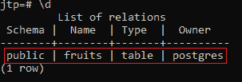

**概述**

*   我们已经了解了**临时表**。
*   在**创建临时表**命令的帮助下，我们**创建**临时临时表。
*   要**删除**临时表，我们使用**删除表**命令。

* * ****