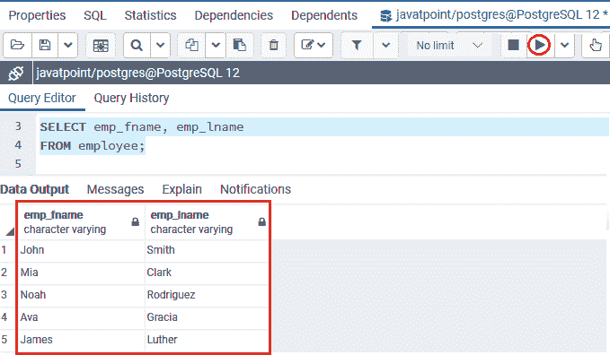
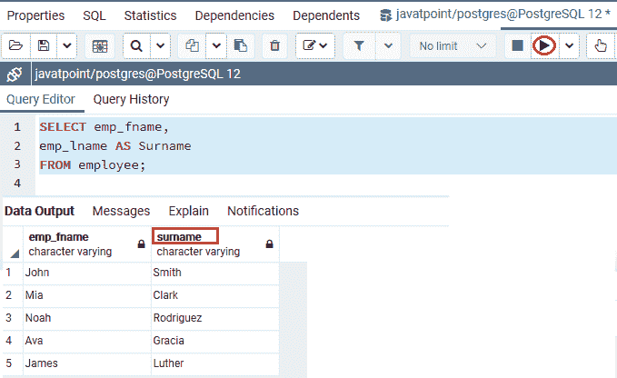
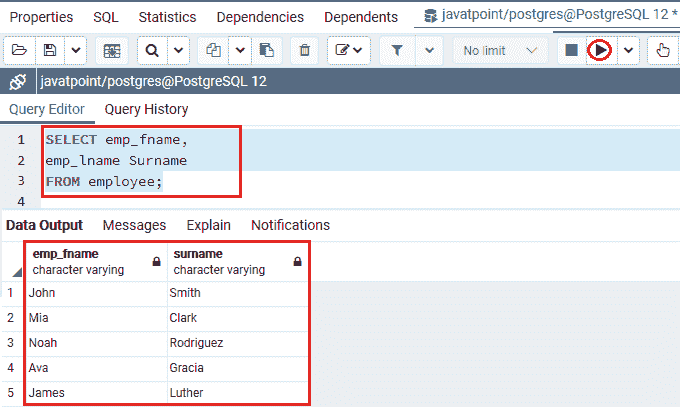
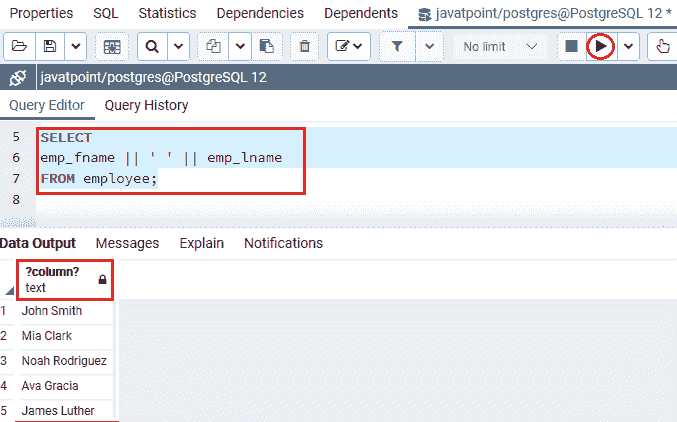
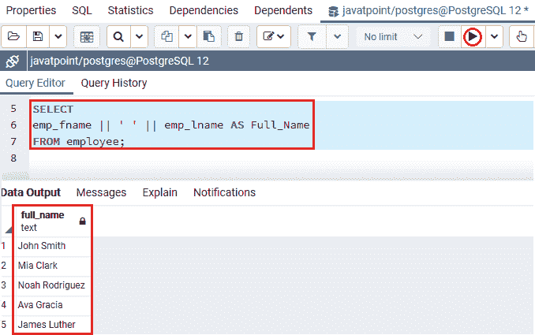

# 列别名

> 原文：<https://www.javatpoint.com/postgresql-column-alias>

在本节中，我们将了解 **PostgreSQL Column Aliasing** 的工作原理，它用于为特定命令中的列赋予一个临时名称。

## 什么是 PostgreSQL 列别名？

在 [PostgreSQL](https://www.javatpoint.com/postgresql-tutorial) 中，列别名用于给特定语句中[选择命令](https://www.javatpoint.com/postgresql-select)的选择列表中的列取一个简称。列别名作为列名的昵称，使列名更易读、更简短。

在整个命令的执行过程中，它暂时存在于**。当列名不便于用户实时使用时，列别名非常有用。**

 **## PostgreSQL 列别名的语法

**后缀 SQL 列别名**的语法如下:

**语法 1**

```sql

SELECT column_name AS alias_name
FROM table_name
Conditions...;

```

**语法 2**

在下面的语法中，我们忽略 **AS** 关键字，因为它是可选的，**列名**被赋予一个别名**别名**。

```sql

SELECT column_name alias_name
FROM table_name;

```

**语法 3**

下面的语法用于显示我们如何在 SELECT 条件中为表达式设置别名。

```sql

SELECT expression AS alias_name
FROM table_name;

```

在上述语法中，我们有以下参数:

| 参数 | 描述 |
| 列名 | **列名**用于定义列的原始名称，我们要在其中执行别名。 |
| 别名 | **别名**用于描述临时名称，该名称被赋予列。 |
| 表名 | **表名**参数用于定义特定表的名称。 |
| 如同 | **AS** 是大多数开发人员在别名列名时使用的可选关键字，但在执行表别名时不使用。 |

**注:**

*   列别名的主要目的是使命令输出的标题更具表现力。
*   **别名参数**仅在 SQL 命令的可能范围内有效。
*   当我们混淆列名时，使用空格是可以接受的。
*   如果**别名**包含空格，我们必须用引号(')将**别名**括起来。

## PostgreSQL 列别名示例

让我们看一些例子来更好地理解 PostgreSQL 列别名。

我们将使用 **Javatpoint 数据库**中的 ***员工*** 表来显示如何使用列别名。

*   **为列分配列别名的示例**

要从 ***员工*** 表中返回所有**员工的 **emp_fname** 和 **emp_lname** ，我们将使用以下命令:**

```sql

SELECT emp_fname, emp_lname
FROM employee;

```

**输出**

执行上述命令后，我们将获得以下输出:



如果我们想要重命名 **emp_lname** 标题名称，那么我们可以在列别名的帮助下给它一个新的名称，如下命令所示:

```sql

SELECT emp_fname, 
emp_lname AS Surname
FROM employee;

```

我们可以在上面的命令中观察到， **emp_lname** 列名已经在 **AS** 关键字的帮助下由**姓氏**重新命名:

**输出**

在执行上述语句时，我们将得到以下结果:



或者我们可以删除 **AS** 关键字，使其更具可读性，如我们在下面的陈述中所观察到的:

```sql

SELECT emp_fname, 
emp_lname Surname
FROM employee;

```

**输出**

执行上述命令后，我们将获得与上面类似的输出:



## 为表达式分配列别名的示例

在下面的示例中，我们将使用为表达式分配列别名。

要获取所有员工的全名，我们将使用连接操作符连接员工的**名、空格和姓氏**，如下命令所示:

```sql

SELECT 
emp_fname || ' ' || emp_lname
FROM employee;

```

#### 注意:在 PostgreSQL 中，我们还可以使用(||)运算符作为串联运算符，这有助于我们将多个字符串组合成一个字符串。

**输出**

在执行上述命令时，我们将获得以下输出:



从上面的截图中我们可以看到，栏目的标题理解不恰当**？专栏？**。

为了解决这个问题，我们可以提供表达式为 **emp_fname || ' ' || emp_lname** 的一个列别名。例如**全称**

```sql

SELECT 
emp_fname || ' ' || emp_lname AS Full_Name
FROM employee;

```

**输出**

执行上述命令后，我们将获得以下输出:



*   **有空格的列别名示例**

如果一个列别名有一个或多个空格，我们需要用双引号(" ")来表示，比如**列名为“列别名”**

在下面的例子中，我们将使用**全名作为“全名”:**

```sql

SELECT 
emp_fname || ' ' || emp_lname "Full Name"
FROM employee;

```

**输出**

在执行上面的命令时，我们将得到下面的命令:


**概述**

在 PostgreSQL 列别名部分，我们学习了以下主题:

*   我们将借助语法 **column_name AS alias_name 或表达式 AS alias_name** 来提供列别名的列或表达式。
*   **AS 关键字**是可选的。
*   我们将使用**双引号(" "**)作为列别名，其中有空格。

* * ***