# PostgreSQL 标识列

> 原文：<https://www.javatpoint.com/postgresql-identity-column>

在本节中，我们将了解 **PostgreSQL IDENTITY 和 GENERATED 约束**的工作原理，该约束用于为特定列生成 PostgreSQL IDENTITY 列，更改 IDENTITY 列的示例，并通过示例了解**序列选项**的工作原理。

我们还将看到向当前表添加标识列的示例，并使用**更改表**命令修改标识列以删除**生成为标识**约束。

## 什么是 PostgreSQL 标识列？

从 [PostgreSQL](https://www.javatpoint.com/postgresql-tutorial) 第 10 版开始，PostgreSQL 开发人员宣布了一个名为 **GENERATED AS IDENTITY** 的新约束，用于自动为列分配唯一的编号。

### PostgreSQL 标识列的语法

**PostgreSQL 生成为标识约束**的语法如下:

```

column_name type GENERATED { ALWAYS | BY DEFAULT } AS IDENTITY[ ( sequence_option ) ]

```

在上面的语法中，我们有以下几点，在实时示例中使用时需要记住:

*   **类型参数**可以是 **SMALLINT、INT、**或 **BIGINT** 。
*   **GENERATED ALWAYS** 用于要求 PostgreSQL 不断地为标识列创建一个值。
*   如果我们试图将这些值更新或插入到**生成的始终作为标识列**中，PostgreSQL 将会出错。
*   但是如果我们为插入或更新提供一个值，那么**就会被用来告诉 PostgreSQL 为标识列创建一个值。**
*   为了使用系统生成的值，PostgreSQL 将使用特定的值插入到标识列中。

### PostgreSQL 标识列的示例

让我们看不同的例子来理解 **PostgreSQL 标识列**是如何工作的。

*   **始终生成的示例**

在 CREATE 命令的帮助下，我们创建了一个新的表***蔬菜****，并使用 INSERT 命令插入了一些值。*

 *要将 ***蔬菜*** 创建到**组织数据库**中，我们使用 **CREATE** 命令。

***【蔬菜】*** 表包含 **veggie_id 和 Veggie_name** 两列，这里我们使用 **Veggie_id** 作为**标识列:**

```

CREATE TABLE Vegetable  (
Veggie_id INT GENERATED ALWAYS AS IDENTITY,
Veggie_name VARCHAR NOT NULL
);

```

**输出**

执行上述命令时，我们将获得以下消息，显示 ***【蔬菜】*** 表已成功创建到**组织**数据库中。

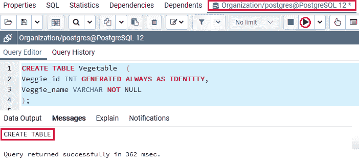

当 ***【蔬菜】*** 表创建成功后，我们将在 insert 命令的帮助下向其中插入一些值。

```

INSERT INTO Vegetable(veggie_name)
VALUES ('Sweet Potato');

```

**输出**

执行上述命令后，我们会得到如下消息窗口，显示该值已成功插入 ***【蔬菜】*** 表中。


我们知道 **Veggie_id** 列有 **GENERATED AS IDENTITY 约束**，这就是 PostgreSQL 为它创建一个值的原因，我们可以在下面的命令中看到:

```

SELECT * FROM Vegetable;

```

**输出**

成功执行上述命令后，我们将获得以下输出，其中显示了 ***【蔬菜】*** 表中存在的所有数据:

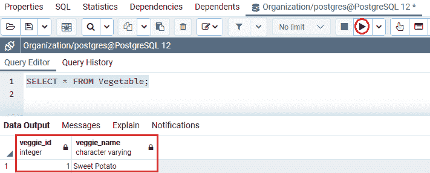

现在，我们将通过为 Veggie_id 和 Veggie_name 列提供值来插入一个新行:

```

INSERT INTO Vegetable(Veggie_id, Veggie_name)
VALUES (2,'Carrot');

```

**输出**

执行上述命令后，Postgresql 会引发以下错误:**我们无法将该值插入到 veggie_id 列**中，因为 **Veggie_id 列**是一个**标识列**，并被描述为 GENERATED ALWAYS。

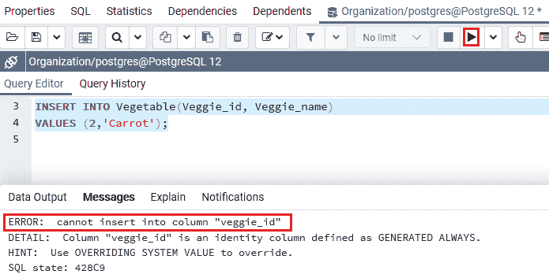

我们可以使用**覆盖系统值**子句来解决以下命令中的上述错误:

```

INSERT INTO Vegetable(Veggie_id, Veggie_name)
OVERRIDING SYSTEM VALUE 
VALUES(2, 'Carrot');

```

**输出**

执行上述命令后，我们会得到如下消息窗口，显示指定值已成功插入 ***【蔬菜】*** 表。

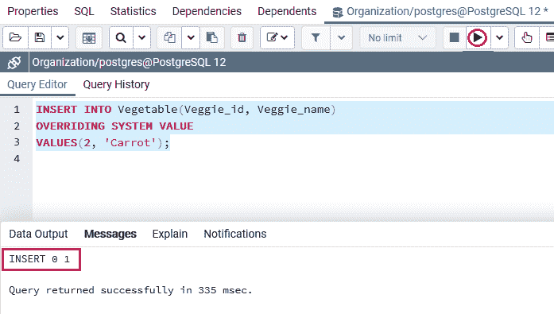

#### 注意:我们可以使用默认生成的身份来代替生成的身份。

### 默认生成为标识的示例

让我们看一些示例来理解默认生成为身份的**是如何工作的。**

**第一步**

首先，我们将删除 ***【蔬菜】*** 表，并使用默认生成为身份的**代替始终生成为身份**来重建它:

```

DROP TABLE Vegetable;

```

**输出**

执行完上面的命令后，我们会得到下面的消息窗口，上面说 ***【蔬菜】*** 表已经投放成功。

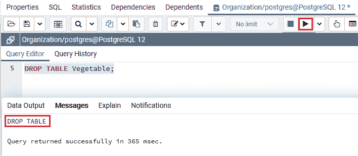

**第二步**

现在，我们将使用默认生成的身份创建一个类似的表，如以下命令所示:

```

CREATE TABLE Vegetable  (
Veggie_id INT GENERATED BY DEFAULT AS IDENTITY,
Veggie_name VARCHAR NOT NULL
);

```

**输出**

在执行上述命令时，我们会得到如下消息窗口，显示 ***【蔬菜】*** 表已经创建成功。

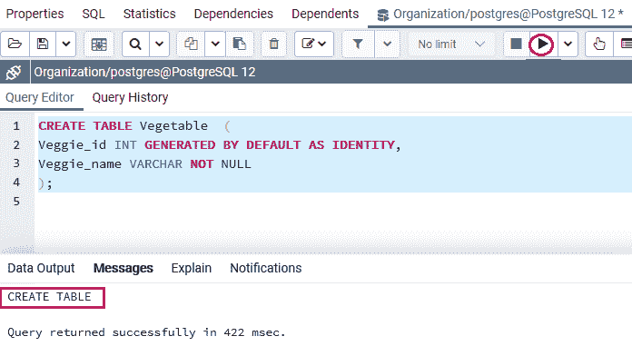

**第三步**

再次成功创建**蔬菜**表格后，我们将使用**插入**命令插入一些值，如下所示:

```

INSERT INTO Vegetable(Veggie_name) 
VALUES('Onion');

```

**输出**

执行上述命令后，我们会得到如下消息窗口，显示该值已成功插入 ***【蔬菜】*** 表中。

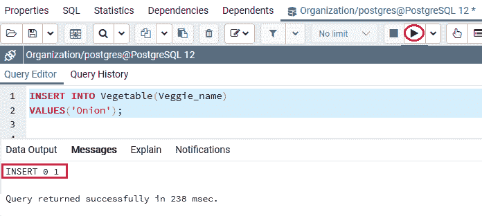

**第四步**

之后，我们将在具有**蔬菜 _id** 的 ***蔬菜*** 表中插入更多的值，如下命令所示:

```

INSERT INTO Vegetable(Veggie_id, Veggie_name) 
VALUES(2, 'Cabbage'),
(3, 'Broccoli'),
(4, 'Tomato'),
(5, 'Avocado');

```

**输出**

执行上述命令后，我们会得到如下消息窗口，显示这四个值已经成功插入 ***【蔬菜】*** 表中。

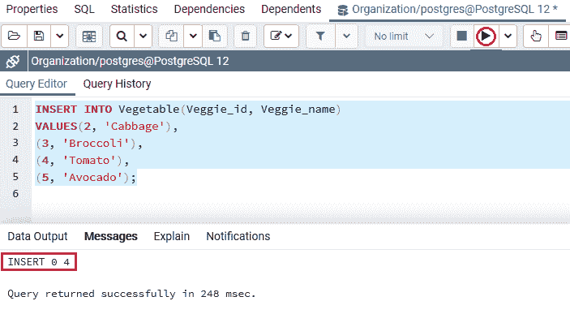

#### 注意:如果我们比较这两个命令，我们可以看到使用“生成的始终为身份”约束*会出现错误*，而“默认生成为身份”约束会成功执行，并且不会产生任何错误。

*   **序列选项示例**

我们可以为系统生成的值定义**序列选项**，因为**生成为身份**约束使用序列对象。

让我们看一个例子，看看序列选项的工作。

在下面的命令中，我们描述了起始值和增量值，如下所示:

```

DROP TABLE Vegetable;

```

**输出**

执行上述命令后，我们会得到如下消息窗口，显示指定的表已经**成功删除**。

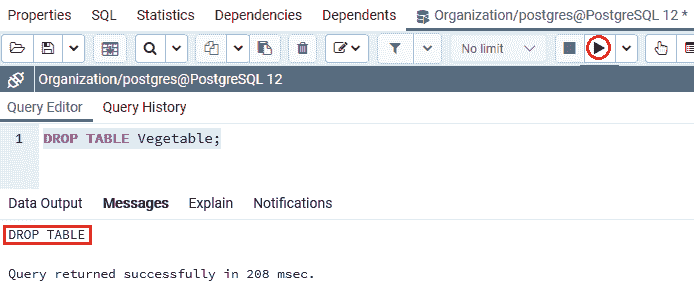

现在，我们将再次创建同一个表( ***【蔬菜】*** )，但这一次，我们使用的是如下命令所示的**开始和增量**参数:

```

CREATE TABLE Vegetable (
Veggie_id INT GENERATED BY DEFAULT AS IDENTITY 
(START WITH 5 INCREMENT BY 5),
Veggie_name VARCHAR NOT NULL);

```

**输出**

执行上述命令时，我们会看到如下消息窗口，显示 ***【蔬菜】*** 表已成功创建到**组织**数据库中。

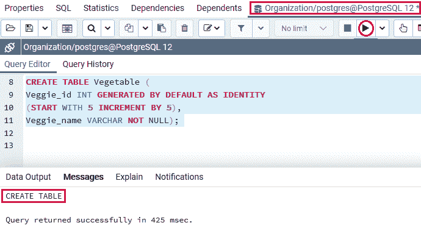

在上面的命令中， **Veggie_id** 列的**系统生成值**以 **5、**开头，**增量**值也是 **5** 。

现在，我们将借助 [**INSERT** 命令](https://www.javatpoint.com/postgresql-insert)在 ***蔬菜*** 表中插入一个新值:

```

INSERT INTO Vegetable(Veggie_name) 
VALUES('Pumpkin');

```

**输出**

执行上述命令后，我们将获得以下输出:

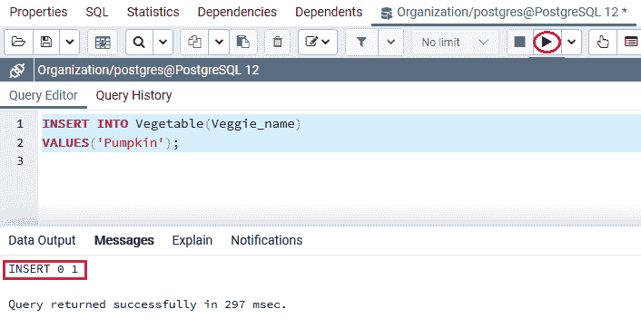

创建并插入 ***【蔬菜】*** 表的值后，我们将使用 [**选择**命令](https://www.javatpoint.com/postgresql-select)返回**蔬菜**表的所有行:

```

SELECT * FROM Vegetable;

```

**输出**

成功执行上述命令后，我们会得到如下输出，显示 **Veggie_id** 列的**起始值**为 **5** :

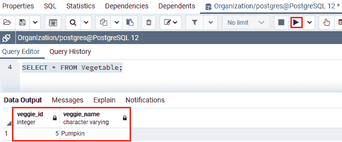

一旦以上命令成功执行，我们将在 ***【蔬菜】*** 表中插入更多的行:

```

INSERT INTO Vegetable(Veggie_name) 
VALUES('Zucchini'),
('White Button Mushroom'),
('Cauliflower');

```

**输出**

执行上述命令后，我们会得到如下消息窗口，显示指定值已成功插入 ***【蔬菜】*** 表。

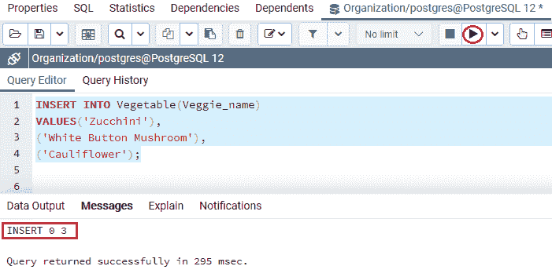

第二行的 **Veggie_id** 的值是 10，因为我们在创建 ***蔬菜*** 表格时使用了**增量**选项:

```

SELECT * FROM Vegetable;

```

**输出**

成功执行上述命令后，我们将得到如下输出，该输出显示了 ***蔬菜*** 表中的所有现有数据:

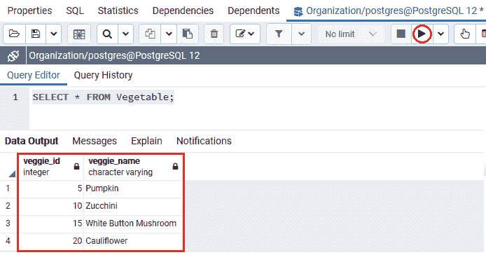

## 向当前表添加标识列

我们可以借助下面 [ALTER TABLE 命令](https://www.javatpoint.com/postgresql-alter-table)的语法将标识列添加到当前表中:

**向当前表添加标识列的语法**

下图用于向现有表中添加标识列:

```

ALTER TABLE table_name 
ALTER COLUMN column_name 
ADD GENERATED { ALWAYS | BY DEFAULT } AS IDENTITY { ( sequence_option ) }

```

**让我们看一个示例来理解以下内容:**

要向现有表中添加标识列，我们必须遵循以下步骤:

### 步骤 1:创建新表

在 CREATE 命令的帮助下，我们创建了一个新的表 ***结构*** 。

要将 ***结构*** 创建到**组织数据库**中，我们使用 **CREATE** 命令。

***采购 _ 明细*** 表包含两列，如 **Str_id 和 Str_name**

```

CREATE TABLE Structure (
    Str_id INT NOT NULL,
    Str_name VARCHAR NOT NULL
);

```

**输出**

执行上述命令时，我们会看到如下消息窗口，显示 ***结构*** 表已成功创建到**组织**数据库中。

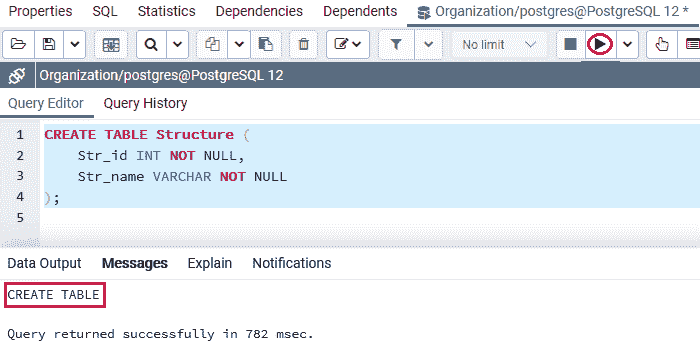

### 步骤 2:将 Str_id 列修改为标识列

在下面的命令中，我们将使用 ALTER Table 命令将 **Str_id** 列更改为标识列:

```

ALTER TABLE Structure
ALTER COLUMN Str_id ADD GENERATED ALWAYS AS IDENTITY;

```

**输出**

执行上述命令后，我们将获得以下消息窗口，显示“结构”表已成功更改。

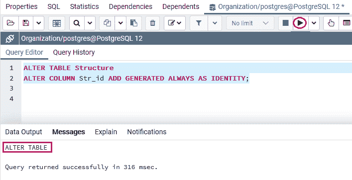

#### 注意:字符串标识列需要有非空约束；因此，可以将其修改为标识列。否则，PostgreSQL 将出现以下错误:

```

ERROR:  column "str_id" of relation "structure" must be declared NOT NULL before an identity can be added
SQL state: 55000

```

## 用 SQL Shell(psql)描述结构表

对于在 **SQL shell(psql)** 工具中描述 ***结构*** 表，我们可以使用以下命令，但是在使用描述命令之前，我们将遵循以下过程:

*   首先，我们将在本地系统中打开 **psql** ，我们将连接到我们想要创建表的数据库。
*   为了连接**组织**数据库，我们将输入以下命令:

```

postgres=# \c Organization 

```

**输出**

执行上述命令后，我们将获得以下输出:


*   现在，我们将在**组织**中输入下面的命令来描述结构表

```

\d Structure

```

**输出**

在执行上面的命令时，我们将检索下面的输出，这是我们从 ***结构*** 表中所期望的:

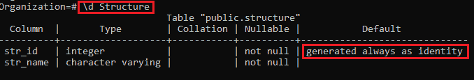

## 更改身份列

ALTER TABLE 命令也用于更改当前标识列的特征，如下图所示:

**更改身份列的语法**

以下语法用于更改标识列:

```

Alter table table_name 
Alter column  column_name 
{ SET GENERATED { ALWAYS| BY DEFAULT } | 
 SET sequence_option | RESTART [ [ WITH] restart ] }

```

让我们看一个示例，以便更好地理解如何使用 ALTER TABLE 命令更改标识列:

在下面的命令中，我们修改了 ***结构*** 表的 **Str_id** 列，使用了**默认生成的**约束:

```

ALTER TABLE Structure 
ALTER COLUMN Str_id SET GENERATED BY DEFAULT;

```

**输出**

执行上述命令后，我们会得到如下消息窗口，显示 ***结构*** 表已被**成功修改**。

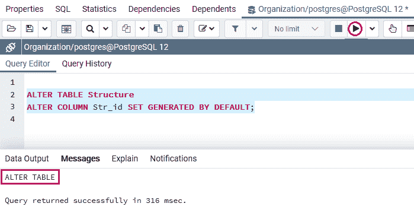

并描述 psql 中 ***结构*** 表的设计；我们将使用与上面类似的命令:

```

\d Structure 

```

**输出**

执行上述语句后，我们将得到如下输出，显示 **Str_id** 列已从 **GENERATED ALWAYS** 修改为 **GENERATED BY DEFAULT** 。

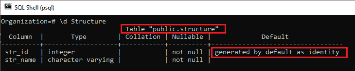

## 删除生成为标识约束

要从当前表中删除 GENERATED AS IDENTITY 约束，我们将使用以下语法:

**删除生成的 AS 标识约束的语法**

下图用于从指定的表中删除生成为标识约束:

```

ALTER TABLE table_name 
ALTER COLUMN column_name 
DROP IDENTITY [ IF EXISTS ] 

```

让我们看一个例子，它显示了移除作为身份约束生成的**的工作。**

在下面的命令中，我们将从 ***结构*** 表的 **Str_id** 列中删除生成的身份约束列:

```

ALTER TABLE Structure
ALTER COLUMN Str_id
DROP IDENTITY IF EXISTS;

```

**输出**

执行上述命令后，我们将得到如下消息窗口，显示**结构**表的 **GENERATED AS IDENTITY 约束**列已成功移除。

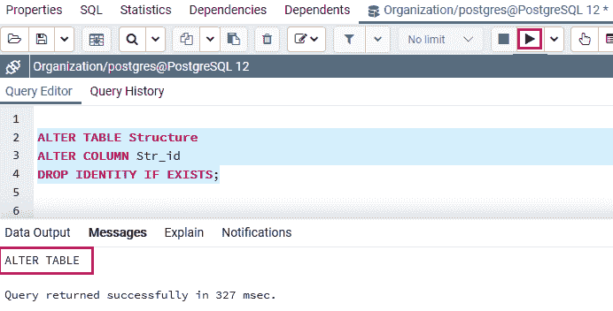

我们将再次使用下面的命令来检查来自 ***结构*** 表的 **Str_id** 列的 **GENERATED AS IDENTITY 约束**列是否已在 SQL shell (PSQL)中成功删除:

```

\d structure 

```

**输出**

执行上述命令后，我们将得到以下结果，显示 **GENERATED AS IDENTITY 约束**列已从**结构**表中删除。

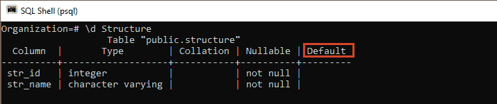

## 概观

在 **PostgreSQL 标识列**部分，我们学习了以下主题:

*   我们学习了 **PostgreSQL 身份列**的工作方式，使用**生成身份**
*   我们已经看到了“生成的始终”约束和“默认生成的 T2”作为身份约束的例子**。**
*   我们通过一些示例了解了**序列选项**的工作原理。
*   我们还可以在 ALTER TABLE 命令的帮助下向现有表中添加标识列。
*   在本节中，我们还将了解如何使用 ALTER TABLE 命令修改 Identity 列。
*   我们使用**更改表**命令删除生成的身份约束。

* * **