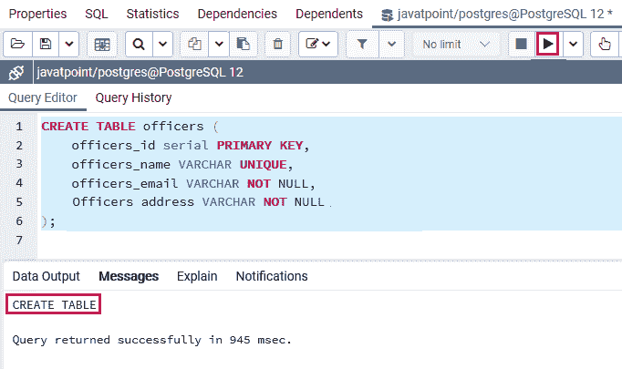
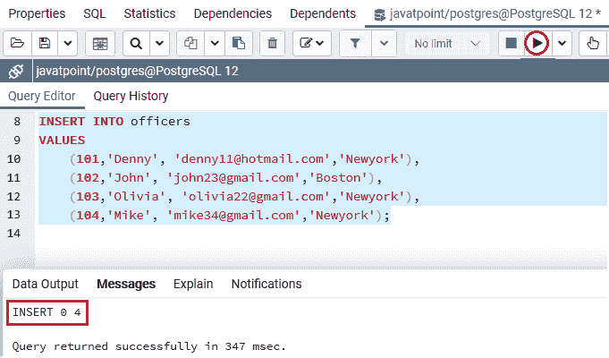
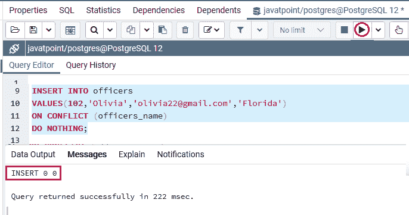
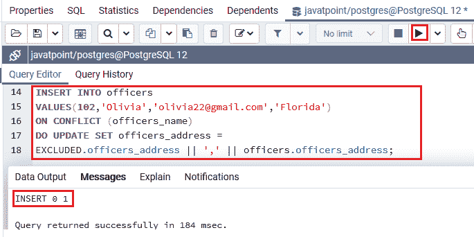
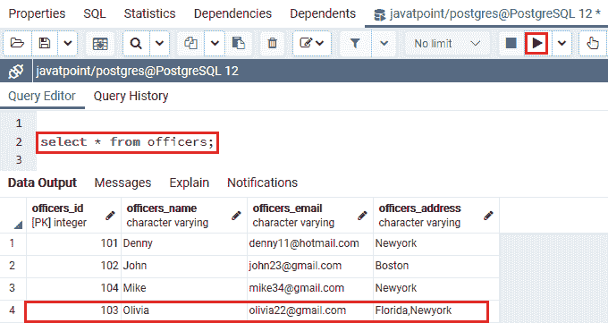

# PostgreSQL Upsert

> 原文：<https://www.javatpoint.com/postgresql-upsert>

在本节中，我们将了解**Postgresql up set**属性的工作原理，该属性用于**插入或修改**数据，如果正在插入的行已经存在于表中，则借助**在冲突时插入**命令。

在 RDBMS(关系数据库管理系统)中，术语 upsert 被称为**合并**。当我们在特定的表中插入一个新行时，如果该行已经存在，PostgreSQL 将升级该行，否则，它将添加新行。而这个过程被称为 upsert，是[插入](https://www.javatpoint.com/postgresql-insert)或者[更新命令](https://www.javatpoint.com/postgresql-update)的组合。

在 [PostgreSQL](https://www.javatpoint.com/postgresql-tutorial) 中，下面的查询用于使用**在冲突时插入**命令将**追加到**表中:

```sql

INSERT INTO table_name(column_list) 
VALUES(value_list)
ON CONFLICT target action;

```

为了支持 upsert 属性，PostgreSQL 在 INSERT 命令中添加了 **ON CONFLICT 目标操作**子句。

在上述命令中，**冲突 _ 目标**可以是以下之一:

| 目标 | 描述 |
| **列名** | 它用于指定特定表中的列名。 |
| **开约束约束 _ 名称** | 在这种情况下，约束名称可以是唯一约束的名称。 |
| **WHERE 谓语** | 带有谓词的 WHERE 子句。 |

在上面的命令中，**冲突 _ 动作**可以是以下之一:

| 行动 | 描述 |
| **什么都不做** | 它定义了如果该行已经出现在表中，我们什么也不做。 |
| **DO UPDATE SET column_1 = value_1，..哪里条件** | 此操作用于更新表中的某些字段。 |

#### 注意:如果我们使用的是 PostgreSQL 的早期版本，我们将需要一个变通方法来实现 upsert 功能，因为 ON CONFLICT 子句只能从 PostgreSQL 9.5 中访问。版本。

## PostgreSQL 追加测试功能示例

为了实时了解 PostgreSQL Upsert 功能的工作原理，我们需要遵循以下流程:

首先，我们将借助下面的 create 命令创建一个名为**客户**的新表，如下所示:

```sql

CREATE TABLE officers (
	officers_id serial PRIMARY KEY,
	officers_name VARCHAR UNIQUE,
	officers_email VARCHAR NOT NULL,
	Officers_address VARCHAR NOT NULL
);

```

**输出**

一旦我们实现了上面的查询，我们将得到下面的消息窗口； ***军官*** 表已经创建成功。



*军官表包含四列，如**军官 _ 身份证、军官 _ 姓名、军官 _ 电子邮件和军官 _ 地址**。*

 *为了保证军官姓名的唯一性，我们对**军官姓名**列使用了**唯一约束**。

创建完 ***军官*** 表格后，我们将使用 insert 命令向其中插入一些数据。

```sql

INSERT INTO officers 
VALUES 
(101,'Denny', 'denny11@hotmail.com','Newyork'),
(102,'John', 'john23@gmail.com','Boston'),
(103,'Olivia', 'olivia22@gmail.com','Newyork'),
(104,'Mike', 'mike34@gmail.com','Newyork');

```

**输出**

一旦我们实现了上面的查询，我们将得到下面的消息窗口；**值**已成功插入 ***军官*** 表中。



让我们假设其中一名军官想要将他们的地址**从纽约更改为佛罗里达**，因此我们可以在 UPDATE 命令的帮助下修改它。

我们使用下面的**冲突时插入**命令来描述向上插入功能:

```sql

INSERT INTO officers (officers_name, officers_addrerss )
VALUES('Olivia','Florida')
ON CONFLICT ON CONSTRAINT officers_name
DO NOTHING;

```

上面的命令定义了如果**军官**表中出现**军官 _ 姓名**，什么都不做或者干脆忽略它。

下面的命令类似于上面的命令，但是由于**插入**命令的目标，它在**唯一约束军官 _ 名称**的地方使用了**军官 _ 名称**列。

```sql

INSERT INTO officers 
VALUES(102,'Olivia','olivia22@gmail.com','Florida')
ON CONFLICT (officers_name)
DO NOTHING;

```

**输出**

执行上述命令后，我们将得到如下消息窗口，显示 **INSERT 0 0** ，这意味着**无所作为**动作将返回 **INSERT 0 0** 进行冲突。因此，插入命令成功，没有插入任何行。



假设当插入一个已经存在的**军官**时，我们想要将**新军官 _ 地址**和**旧军官 _ 地址**结合起来。

在下面的命令中，我们使用 UPDATE 子句作为 INSERT 命令的**动作:**

```sql

INSERT INTO officers 
VALUES(102,'Olivia','olivia22@gmail.com','Florida')
ON CONFLICT (officers_name)
DO UPDATE SET officers_address = 
EXCLUDED.officers_address || ',' || officers.officers_address;

```

**输出**

执行完上面的查询后，我们会得到下面的消息窗口；**值**已成功更新到 ***军官*** 表中。



为了检查，如果上面的上切功能工作正常或不正常，我们将使用[选择命令](https://www.javatpoint.com/postgresql-select)，如下图所示:

```sql

Select * from officers;

```

**输出**

执行上述命令后，我们将获得以下输出:



* * **