# PostgreSQL 子查询

> 原文：<https://www.javatpoint.com/postgresql-subquery>

在本节中，我们将了解 **PostgreSQL 子查询**的工作原理，它允许我们创建一个困难的查询。我们也可以看到**子查询**的**例子**，不同的**子句**如 **SELECT，FROM，WHERE** ，不同的**条件**如 **IN，EXISTS** ，不同的**查询**如 **SELECT，INSERT，UPDATE，DELETE。**

## PostgreSQL 子查询简介

子查询是在另一个查询中使用的命令。相比之下，**内部选择**或**内部语句**称为**子查询**，**外部选择**或**外部语句**称为**主命令**。PostgreSQL 子查询包含在**括号**中。

PostgreSQL 子查询可以与不同的子句一起使用，例如 SELECT、FROM、 [WHERE](https://www.javatpoint.com/postgresql-where-clause) 和 [HAVING 子句](https://www.javatpoint.com/postgresql-having-clause)。

我们还可以将 PostgreSQL 子查询与 [SELECT](https://www.javatpoint.com/postgresql-select) 、 [INSERT](https://www.javatpoint.com/postgresql-insert) 、 [UPDATE](https://www.javatpoint.com/postgresql-update) 、 [DELETE](https://www.javatpoint.com/postgresql-delete) **命令**以及不同的**运算符**组合在一起，如 **<、>、=、< =、> =、** [BETWEEN](https://www.javatpoint.com/postgresql-between-condition) 、 [IN](https://www.javatpoint.com/postgresql-in-condition) 等等。

#### 注意:在 PostgreSQL 中，子查询不允许与 ORDER BY 子句一起使用。但是我们可以使用 GROUP BY 命令代替 ORDER BY 命令来执行类似的功能。

## 具有不同类的 postgresql 子查询示例

让我们看不同的例子来理解 **PostgreSQL 子查询**如何与各种子句一起工作。

### 带有 SELECT 子句的 PostgreSQL 子查询示例

[PostgreSQL](https://www.javatpoint.com/postgresql-tutorial) 子查询也可以与 SELECT **子句**结合使用。

当我们想要借助聚合函数(如**平均值、计数、总和、最大值和最小值函数**)获取计算时，使用子查询，但我们不希望聚合函数用于**主查询**。

这里，我们将展示如何将**子查询**与 SELECT 子句一起使用。

我们从 **javatpoint 数据库**中取出 ***车*** 表，从表中选择特定数据。

```sql

SELECT c1.car_name, c1.car_model,
 	(SELECT MIN (car_id)
   	 FROM car c2
  	 WHERE c1.car_id = c2.car_id) Subquery1
FROM car c1; 

```

**输出**

执行上述命令后，我们将获得以下输出:

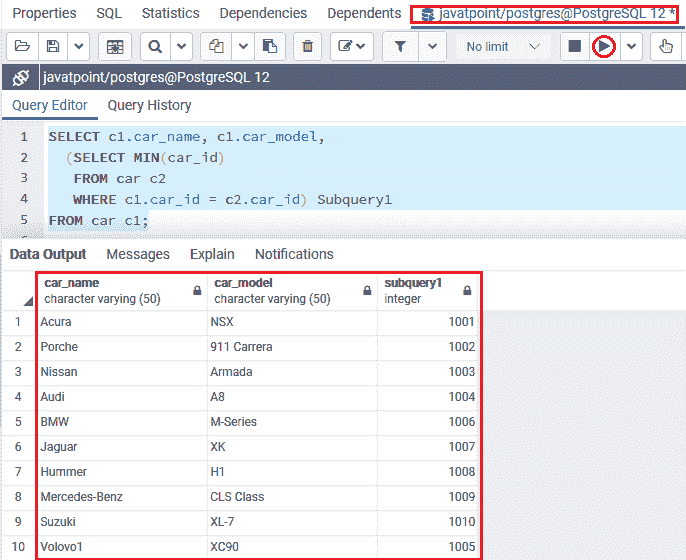

在上面的例子中，我们在**选择**子句中创建了一个**子查询**，如下所示:

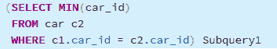

我们将子查询别名为名称**子查询 1** ，这将是用于引用上述子查询或这些字段中任何一个的名称。

#### 注意:子查询中经常使用诸如平均值、计数、总和、最大值和最小值等聚合函数。子查询必须返回一个值，这就是为什么我们在 SELECT 子句中放置子查询。

### 带有 FROM 子句的 PostgreSQL 子查询示例

PostgreSQL 子查询也可以与 **FROM 子句**结合使用。

为此，我们从 **javatpoint 数据库**中获取**课程和课程类别**表，该数据库是我们在 PostgreSQL 教程的前面部分创建的。

```sql

SELECT course.course_name, Subquery2.course_category_id
FROM course,
 	(SELECT course_categories.course_category_id, course_categories.course_category, 
  	COUNT (course_category_id) AS total
  	FROM course_categories
  	GROUP BY course_categories.course_category_id, course_categories.course_category) Subquery2
WHERE Subquery2.course_category_id = course.course_id;

```

**输出**

成功执行上述命令后，我们将获得以下输出:

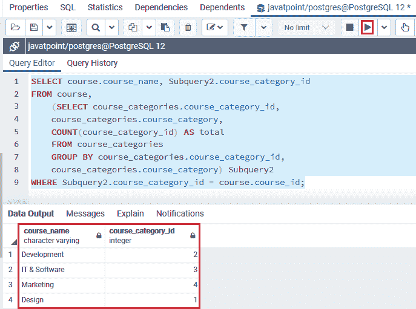

在上面的例子中，我们在 **FROM** 子句中创建了一个**子查询**，如下所示:

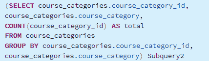

我们将子查询别名为名称**子查询 2** ，它将是用于引用上述子查询或这些字段中任何一个的名称。

### 带有 WHERE 子句的 PostgreSQL 子查询示例

PostgreSQL 子查询最常用于 **WHERE 子句**。这些子查询也被称为**嵌套子查询**。

为此，我们从 **Javatpoint** 数据库中获取 ***客户端和 Client_details*** 表，该数据库是我们在 PostgreSQL 教程的前面部分中创建的。

```sql

SELECT c.client_id, c.client_name, c.client_profession
FROM client c
WHERE c.client_id IN
  	(SELECT cd.client_id
    	FROM client_details cd
    	WHERE cd.client_id < 6
   	AND c.client_name LIKE 'M%');   

```

**输出**

在执行上述命令时，我们将得到以下结果:

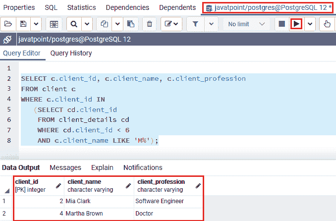

在上面的例子中，我们在如下的 **WHERE** 子句中创建了一个**子查询**:

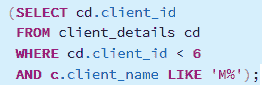

上面的子查询语句将允许我们从 ***client_details*** 表中识别所有**client _ id**小于 **6** 的值，并且 **client_name** 以**“M”**开头。子查询用于在输入条件的帮助下过滤**主查询的**输出。

在下面的命令中，我们使用了一个**内部连接条件**作为**子查询**的替代，如下所示:

```sql

SELECT c.client_id, c.client_name, c.client_profession
FROM client c
INNER JOIN Client_details cd
ON c.client_id= cd.client_id
WHERE cd.client_id < 6
AND c.client_name LIKE 'M%';

```

**输出**

执行上述命令后，我们将获得与上面带有 **WHERE 子句:**的子查询命令类似的结果

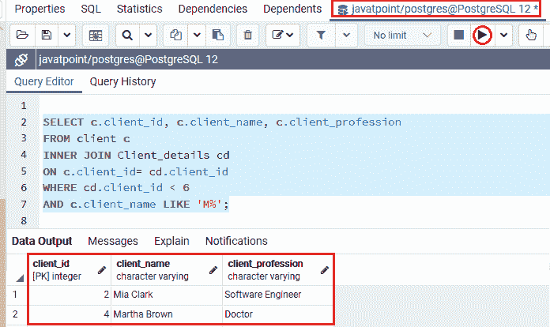

#### 注意:与原始子查询相比，INNER JOIN 条件的执行效率更高，值得注意的是，并非所有子查询都可以在 PostgreSQL 连接的帮助下重写。

## 不同条件下的后置 SQL 子查询示例

让我们看不同的例子来理解 **PostgreSQL 子查询**在不同条件下是如何工作的。

### 带有 EXISTS 条件的 PostgreSQL 子查询示例

**后缀子查询**也可以与 **EXISTS 子句**组合使用。

以下语法用于显示带有[存在条件](https://www.javatpoint.com/postgresql-exists-condition)的子查询的工作情况:

```sql

EXISTS subquery

```

EXISTS 条件只保留子查询返回的行数，而不保留行的内容。因此，我们可以使用 EXISTS 条件的以下语法:

```sql

EXISTS 
(SELECT 1 
FROM table_name 
WHERE condition);

```

*   子查询可以是 EXISTS 条件的输入。如果子查询返回任何一行，则 **EXISTS** 条件将返回 **TRUE** 。
*   如果子查询没有返回任何行，那么 **EXISTS 条件**的输出将返回 **FALSE** 。

让我们看一个示例**示例**以更好地理解带有**存在条件**的**子查询**。

为此，我们从在 PostgreSQL 教程的前面部分中创建的 **javatpoint 数据库**中获取 ***员工*** 和 ***部门*** 表。

```sql

SELECT emp_fname, emp_lname
FROM employee
WHERE EXISTS (
		SELECT 1
		FROM department
		WHERE department.emp_id = employee.emp_id
	);

```

**输出**

执行上述命令后，我们将获得以下输出:

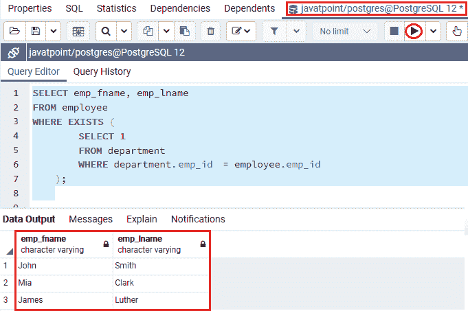

正如我们在上面的截图中看到的，这些命令在 **emp_id** 列上的工作方式类似于 PostgreSQL Inner Join。

但是它至少返回 ***员工*** 表中的一行，虽然 ***部门*** 表中有一些匹配的行。

### 带输入条件的后缀子查询示例

PostgreSQL 子查询也可以与 IN 条件结合使用。

这里，我们使用带有 IN 条件的子查询和 WHERE 子句。

在下面的例子中，我们以类似的表格( ***员工和部门*** )作为上面的例子。

在这里，我们将尝试获取那些 ***员工信息*** ，其在 ***2010-08-22*** 和 ***2010-08-26 之间有 ***加盟 _ 日期*【T7:*****

```sql

SELECT department.emp_id
FROM employee
INNER JOIN department
ON department.emp_id = employee.emp_id
WHERE joining_date 
BETWEEN '2010-08-22' AND '2010-08-26';

```

**输出**

执行上述命令后，我们将得到以下结果:

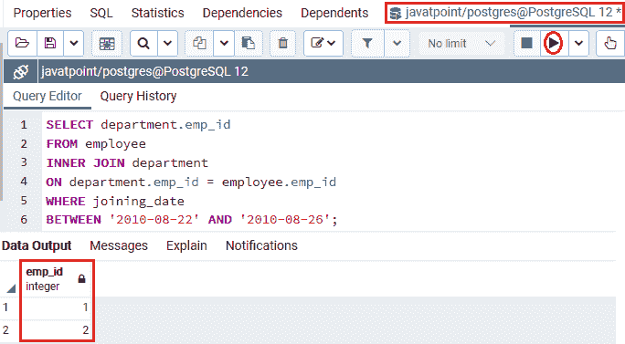

上面的命令将返回不同的行。因此，我们可以将此命令用作以下语句的 **WHERE 子句**中的子查询:

```sql

SELECT job_id, job_description
FROM jobs
WHERE job_id IN (
			SELECT department.emp_id
			FROM employee
			INNER JOIN department 
			ON department.emp_id = employee.emp_id
			WHERE joining_date 
			BETWEEN '2010-08-22' AND '2010-08-26'
			);

```

**输出**

成功执行上述命令后，我们将获得以下输出:

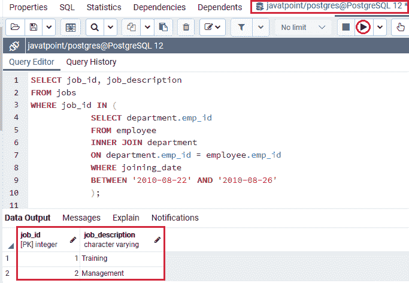

## 带有不同语句的后置 SQL 子查询示例

让我们看不同的例子来理解 **PostgreSQL 子查询**如何与几个语句一起工作。

### 带有 SELECT 语句的 PostgreSQL 子查询示例

我们将使用带有选择命令的**子查询**显示。

为此，我们从**javapoint**数据库中取出 ***Car*** 表，从该表中检索所有记录。

假设我们需要识别那些**车价**高于平均**车价**的车。为此，我们将执行以下两个步骤:

**第一步**

首先，我们用 SELECT 命令和 **(AVG)** 平均功能识别平均**车价**。

以下语句用于从 ***车*** 表中获取平均**车 _ 价**:

```sql

SELECT
AVG (car_price)
FROM car;

```

**输出**

成功执行上述命令后，我们将获得以下输出:

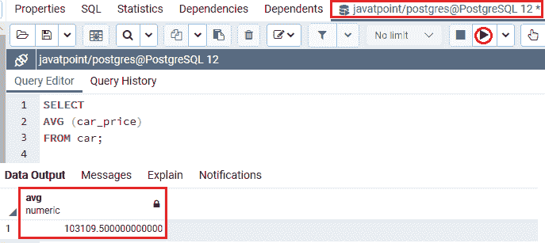

从下面的截图中我们可以看到，平均**车价**为 **103109.500** 。

**第二步**

之后，我们将在第二个 **SELECT 命令**中取第一个命令的输出，从汽车表中识别汽车。

在下面的命令中，我们会得到 **car_id，car_name** 其 **car_price** 大于**的**平均 **car_price** :

```sql

SELECT car_id, car_name, car_price
FROM car
WHERE car_price >103109.5;

```

**输出**

在执行上述命令时，我们将得到以下结果:

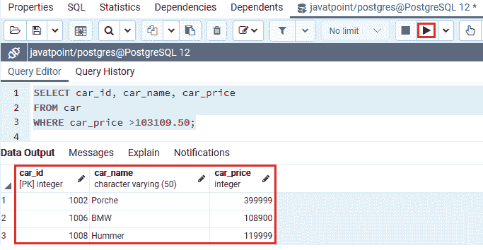

正如我们所看到的，上面的代码设计得不好，因为它需要两步来实现查询。因此，我们需要在单个命令中允许第一个命令输出到第二个命令。

在这种情况下，我们将使用 **PostgreSQL 子查询**的概念，因为子查询是一个命令，它嵌套在其他命令中，如 INSERT、SELECT、UPDATE 和 DELETE。

在 PostgreSQL 教程的这一部分，我们将逐一了解所有语句。

### 带 SELECT 语句的 PostgreSQL 子查询的语法

带有 SELECT 命令的 PostgreSQL 子查询的语法如下:

```sql

SELECT column_name  
FROM table_name  
WHERE column_name expression operator(
SELECT column_name  
FROM able_name 
WHERE condition);  

```

为了创建子查询，我们将第二个命令和 **WHERE 子句**放在括号中作为表达式:

```sql

SELECT car_id, car_name, car_price
FROM car
WHERE car_price >(
     		SELECT
			AVG (car_price)
			FROM
			car );

```

**输出**

执行上述命令后，我们将获得以下输出:

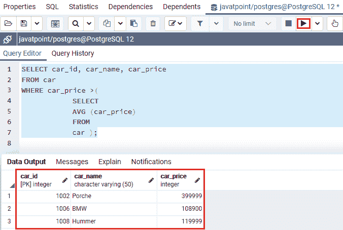

我们可以观察到，在执行这两个命令后，我们将获得类似的输出，但是子查询命令更高效，可读性更好。

#### 注意:PostgreSQL 执行那些包含子查询的命令的顺序如下:

*   首先，它将实现子查询。
*   然后，它将获取输出并将其传递到**外部选择**或**外部查询**。
*   最后，它将执行**外部选择**。

### 带有 INSERT 语句的 PostgreSQL 子查询示例

我们将展示如何在 INSERT 语句中使用**子查询**。在 INSERT 命令中，子查询返回的记录用于插入另一个表。

在 PostgreSQL 子查询中，可以使用任何**日期函数和字符**来更改所选数据。

### 带插入语句的 PostgreSQL 子查询的语法

带有 INSERT 命令的 PostgreSQL 子查询的语法如下:

```sql

INSERT INTO table_name (column1, column2,.. columnN)   
SELECT column_names
FROM table_name  
WHERE VALUE OPERATOR

```

为此，我们从**组织数据库**中取出 ***员工*** 和 ***部门*** 表，并使用**和运算符**将记录从一个表插入到另一个表中。

在下面的例子中，我们将记录从 ***部门*** 表插入到 ***员工*** 表中。

我们从 ***部门*** 表中取**电话**和**地址**列记录， **dept_id** 小于 **5，而部门 _ 名称**为 **OPERATION** 。

```sql

INSERT INTO employee
(phone, address)
SELECT phone, address
FROM department
WHERE dept_id < 5
AND department_name = 'OPERATION';

```

**输出**

执行上述命令后，我们将获得如下消息窗口，显示该值已成功插入 ***员工*** 表中。

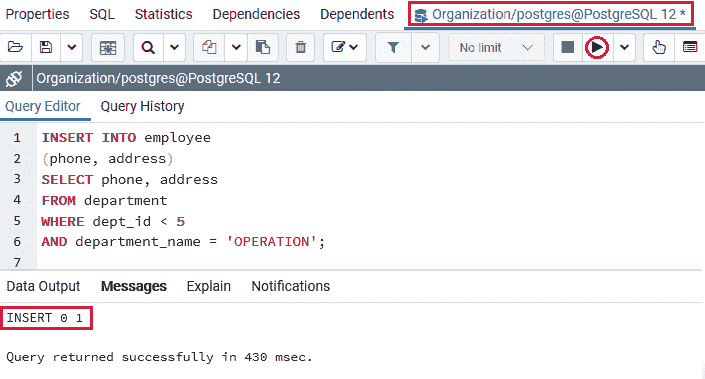

为了检查记录是否已经插入到 ***员工*** 表中，我们将使用如下的 SELECT 命令:

```sql

SELECT * FROM employee;

```

**输出**

执行上述命令后，我们将获得以下输出:

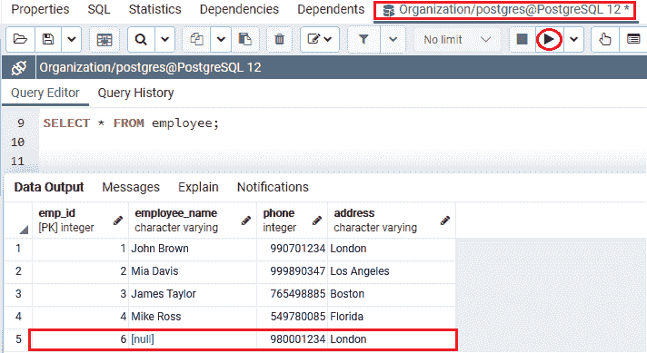

从上面的截图中我们可以看到 **PostgreSQL 子查询**在 ***员工*** 表中插入了一条记录。

### 带有 UPDATE 语句的 PostgreSQL 子查询示例

我们将展示如何在 UPDATE 语句中使用**子查询**。如果我们将子查询与 UPDATE 命令一起使用，那么表中的一列或多列都可以被更新。

### 带 UPDATE 语句的 PostgreSQL 子查询的语法

带有**更新**命令的 PostgreSQL 子查询的语法如下:

```sql

UPDATE table  
SET column_name = new_value  
WHERE VALUE OPERATOR (
   		SELECT column_name 
   		FROM table_name 
   		WHERE condition
);  

```

为此，我们从在 PostgreSQL 教程的前面部分中创建的 **Javatpoint** 数据库中获取 ***夏季水果*** 和 ***冬季水果*** 表。

在以下命令中， **PostgreSQL 子查询**用于从 ***冬季 _ 水果*** 表中的**冬季 _ 水果 _ 名称**列更新 ***夏季 _ 水果*表中的**水果 _ 名称**列值，其中 ***冬季 _ 水果'*** **wf_id** 列等于**

```sql

UPDATE summer_fruits
SET Fruits_name=(SELECT winter_fruits.winter_fruits_name
                     	FROM winter_fruits
                     	WHERE winter_fruits.wf_id = summer_fruits.sf_id);

```

**输出**

执行完上面的命令后，我们会得到下面的输出，在这里我们可以看到 ***【夏 _ 果】*** 表已经更新成功。

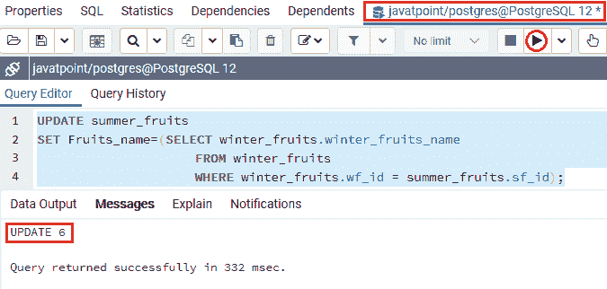

我们现在将使用**选择**命令来检查在 ***夏季水果*** 表中的特定记录是否已经更新:

```sql

SELECT * FROM summer_fruits;

```

**输出**

执行上述命令后，我们将得到以下结果:

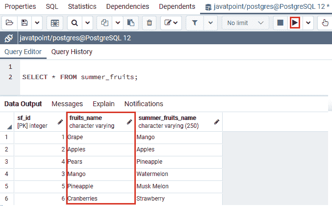

从上面的截图中我们可以看到 ***PostgreSQL 子查询*** 更新了六条记录进入 ***夏 _ 果表*** 。

### 带有 DELETE 语句的 PostgreSQL 子查询示例

我们将展示如何将**子查询**与 DELETE 语句一起使用，就像上面提到的任何其他语句一样。

### 带 DELETE 语句的 PostgreSQL 子查询的语法

带有 **DELETE** 命令的 PostgreSQL 子查询的语法如下:

```sql

DELETE 
FROM table_name  
WHERE value operator (
SELECT column_name  
  	FROM table_name 
   	WHERE condition
);   

```

在下面的例子中，我们从 **Javatpoint** 数据库中获取 ***课程*** 和 ***课程 _ 类别*** 表，并使用 **EXISTS 运算符**从表中删除特定记录。

在下面的命令中， **PostgreSQL 子查询**用于删除 ***课程*** 表中的所有记录，其中**课程 _id** 来自 ***课程*** 表，而**课程 _ 类别 _id** 来自 ***课程 _ 类别*** 表，它们等于**。**

```sql

DELETE FROM Course
WHERE EXISTS (
		SELECT course_name
       		FROM Course_categories
       		WHERE Course.course_id = Course_categories.course_category_id
);

```

**输出**

执行上述命令后，我们将获得如下消息窗口，显示记录已从 ***课程*** 表中成功删除。

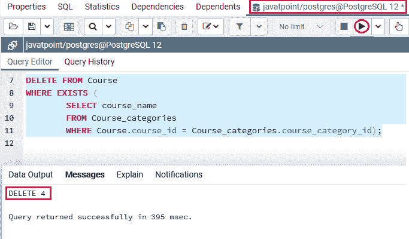

我们现在将使用**选择**命令来检查在 ***课程*** 表格中特定记录是否已被删除:

```sql

SELECT * 
FROM Course;

```

**输出**

成功执行上述命令后，我们将获得以下输出:

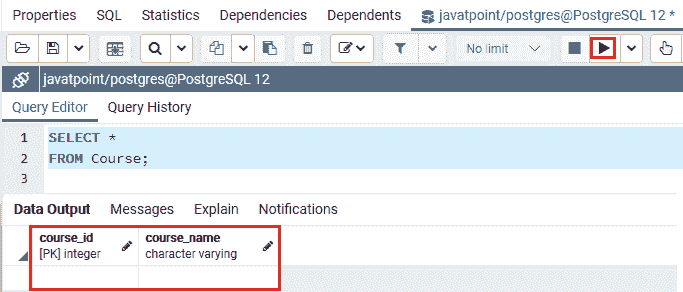

## 概观

PostgreSQL **子查询**的使用帮助我们创建复杂的命令。在 **PostgreSQL 子查询**部分，我们学习了以下主题:

*   我们使用带有 SELECT 子句的**子查询**来选择特定的表记录。
*   我们使用带有 FROM 子句的**子查询**来获取表的列表。
*   我们使用带有 WHERE 子句的**子查询**来过滤输出并应用条件。
*   一旦子查询至少返回一行，我们就使用带有 EXISTS 条件的**子查询**来检查条件是否已经满足。
*   如果表达式匹配值列表中的任何值，我们将**子查询**与 IN 条件一起使用。
*   我们使用**子查询**和 SELECT 命令来获取特定的表记录。
*   我们使用**子查询**和 INSERT 命令将记录从一个表插入到另一个表。
*   我们使用**子查询**和**更新**表的记录。
*   我们使用**子查询**和 DELETE 语句**来移除**特定表的记录。

* * ****