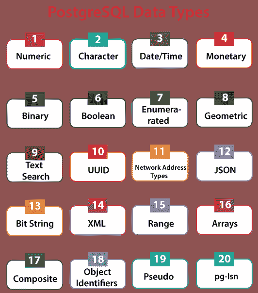
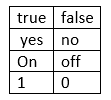

# PostgreSQL 数据类型

> 原文：<https://www.javatpoint.com/postgresql-datatypes>

数据类型指定要存储在表字段中的数据类型。创建表时，对于每一列，必须使用数据类型。它标识特定类型的数据，如整数、布尔、浮点等。

在本节中，我们将讨论 PostgreSQL 中使用的各种数据类型。

在 [PostgreSQL](https://www.javatpoint.com/postgresql-tutorial) 中，每个数据库表都有许多列，并且每列都有精确的数据类型。它支持广泛的数据类型。

此外，用户可以使用创建类型 [SQL](https://www.javatpoint.com/sql-tutorial) 命令创建他们的自定义数据类型。这些数据类型具有以下优点:

*   **性能:**如果我们正确有效地使用这些数据类型来存储数据值，将会提高我们的性能。
*   **验证:**数据类型的正确使用涉及数据的验证和数据类型范围之外的数据的剔除。
*   **紧凑性:**它存储效率高，因为一列可以存储单一类型的值。
*   **一致性:**相同数据类型的列矛盾的活动提供可靠的结果，通常是最快的。

在 PostgreSQL 中，我们有许多组数据类型；让我们逐一了解它们:



*   **数字数据类型**
*   **字符数据类型**
*   **日期/时间数据类型**
*   **货币数据类型**
*   **二进制数据类型**
*   **布尔数据类型**
*   **枚举数据类型**
*   **几何数据类型**
*   **文本搜索数据类型**
*   **UUID 数据类型**
*   **网络地址类型**
*   **JSON 数据类型**
*   **位串类型**
*   **XML 数据类型**
*   **范围数据类型**
*   **阵列**
*   **复合数据类型**
*   **对象标识符类型**
*   **伪数据类型**
*   **pg-Isn 数据类型**

## 数字数据类型

数字数据类型用于将数字数据指定到表中。它包含以下内容:

*   **四字节和八字节浮点数**
*   **两字节、四字节和八字节整数**
*   **可选精度小数**。

下表包含 PostgreSQL 中支持的所有**数值**数据类型:

| 名字 | 描述 | 存储大小 | 范围 |
| 斯莫列特 | 存储整数，小范围。 | 2 字节 | -32768 至+32767 |
| 整数 | 存储整数。当你想存储典型的整数时，使用这个。 | 4 字节 | -2147483648 到+2147483647 |
| 比吉斯本 | 存储整数，大范围。 | 8 字节 | -922337203685 . 4775808 到 922337 . 477788861 |
| 小数 | 用户指定的精确精度 | 可变的 | 小数点前最多 131072 位数字；小数点后最多 16383 位。 |
| 数字的 | 用户指定的精确精度 | 可变的 | 小数点前最多 131072 位数字；小数点后最多 16383 位。
 |
| 真实的 | 可变精度，不精确
 | 4 字节 | 6 位小数精度。 |
| 双倍精密度 | 可变精度，不精确 | 8 字节 | 15 位小数精度 |
| 连续的 | 自动递增整数 | 4 字节 | 1 至 2147483647 |
| 大系列 | 大型自动递增整数 | 8 字节 | 1 到 92233720368547758 . 8888888886 |

## 字符数据类型

在 PostgreSQL 中，我们有各种通用字符数据类型，这些数据类型用于表示字符类型值。

下表包含 PostgreSQL 支持的所有**字符**数据类型:

| 数据类型 | 说明 |
| 字符(大小) | 这里的大小是要存储的字符数。固定长度的字符串。右边的空格填充到相同大小的字符。 |
| 字符(大小) | 这里 size 是要存储的字符数。固定长度的字符串。右边的空格填充到相同大小的字符。 |
| varchar(大小) | 这里 size 是要存储的字符数。可变长度字符串。 |
| 字符变化(大小) | 这里 size 是要存储的字符数。可变长度字符串。 |
| 文本 | 可变长度字符串。 |

## 日期/时间数据类型

PostgreSQL 支持完整的 SQL **日期和时间**数据类型集。日期/时间数据类型用于使用日期和时间值表示列。根据公历，日期被计算在内。

下表包含 PostgreSQL 支持的所有**日期/时间**数据类型:

| 名字 | 描述 | 存储大小 | 最小值 | 最大值 | 解决 |
| 时间戳[ (p) ] [无时区] | 日期和时间(无时区) | 8 字节 | 公元前 4713 年 | 公元 294276 年 | 1 微秒/ 14 位数 |
| 带时区的时间戳[ (p) ] | 日期和时间，带时区 | 8 字节 | 公元前 4713 年 | 公元 294276 年 | 1 微秒/ 14 位数 |
| 日期 | 日期(没有时间) | 4 字节 | 公元前 4713 年 | 公元 5874897 年 | 1 天 |
| 时间[ (p) ] [无时区] | 一天中的时间(无日期) | 8 字节 | 00:00:00 | 24:00:00 | 1 微秒/ 14 位数 |
| 带时区的时间[ (p) ] | 仅一天中的时间，带时区 | 12 字节 | 00:00:00+1459 | 24:00:00-1459 | 1 微秒/ 14 位数 |
| 区间[字段] [ (p) ] | 时间间隔 | 12 字节 | 178000000 年 | 17800 万年 | 1 微秒/ 14 位数 |

## 货币类型:

| 名字 | 描述 | 存储大小 | 范围 |
| 钱 | 货币金额 | 8 字节 | -92233720368547758.08 到+9223720368547758.07 |

## 二进制数据类型

**字节**数据类型允许存储二进制字符串，如下表所示:

| 名字 | 存储大小 | 描述 |
| 字节 | 1 或 4 个字节加上实际的二进制字符串 | 可变长度二进制字符串 |

## 布尔型

PostgreSQL 包含标准的 SQL 类型**布尔型**；布尔类型有许多状态，如**真、假**，以及第三个状态**未知**，由 SQL 空值表示。

| 名字 | 描述 | 存储大小 |
| 布尔 | 它指定真或假的状态。 | 1 字节 |

布尔数据类型输入函数接收**真和假**状态的这些字符串演示:



## 枚举类型

在 PostgreSQL 中，枚举数据类型包括一组静态的有序值。

它类似于与各种编程语言兼容的**枚举**类型。枚举数据类型用外键表示在表中，以确保数据完整性。

**例如:**

```
CREATE TYPE fruits_name AS ENUM
('Mango','Apple','Orange','Strawberry')

```

### 几何数据类型

几何数据类型表示二维空间对象。最基本的类型，即点，构成了所有其他类型的基础。

| 名字 | 存储大小 | 表示 | 描述 |
| 要点 | 16 字节 | 平面上的点 | (x，y) |
| 线条 | 32 字节 | 无限线(未完全实现) | ((x1，y1)，(x2，y2)) |
| lsg(消歧义) | 32 字节 | 有限线段 | ((x1，y1)，(x2，y2)) |
| 包厢 | 32 字节 | 长方形的盒子 | ((x1，y1)，(x2，y2)) |
| 小路 | 16+16n 字节 | 闭合路径(类似于多边形) | ((x1，y1)，...) |
| 小路 | 16+16n 字节 | 开放路径 | [(x1，y1)，...] |
| 多边形 | 40+16n | 多边形(类似于封闭路径) | ((x1，y1)，...) |
| 圆 | 24 字节 | 圆 | (中心点和半径) |

## 文本搜索数据类型

在 PostgreSQL 中，全文搜索数据类型用于搜索自然语言文档的集合。我们有两类与全文搜索兼容的数据类型。

| 数据类型 | 描述 |
| **tsvector** | 它用于在表单中显示文档，从而增强文本搜索。 |
| **t 查询** | 它用于表示文本查询。 |

## UUID 数据类型

UUID 代表通用唯一标识符，是由算法创建的 128 位数字。它是最适合主键的数据类型。UUID 由一组小写的十六进制数字组成，通过多组连字符分隔。

**例如**:

```
a0eebc99-9c0b-4ef8-bb6d-6bb9bd380a11

```

#### 注意:PostgreSQL 也同意采用 UUID 输入的替代形式，如无连字符、全大写、大括号等。

## 网络地址数据类型

PostgreSQL 提供数据类型来存储 **Mac 地址、IPv4 和 IPv6、**，如下表所示。除了纯文本类型之外，它还增强了这些类型以包含网络地址，因为这些类型提供了输入错误检查和特定的函数和运算符。

下表包含 PostgreSQL 支持的所有**网络地址**数据类型:

| 数据类型 | 描述 | 存储大小 |
| 新经济思维研究所 | 它存储 IPv4 和 IPv6 主机和网络。 | 7 或 19 字节 |
| 无类别域间路由选择 | 它用于存储 IPv4 和 IPv6 网络。 | 7 或 19 字节 |
| macaddr | 它存储媒体访问控制地址。 | 6 字节 |

## 数据类型

PostgreSQL 提供了两种数据类型来存储 JSON 数据。

*   JSON
*   JSON

JSON

它是带有 **JSON** 验证的文本数据类型的扩展。在这种情况下，我们可以快速插入数据，但数据检索相对较慢。它以包含空白的方式保存输入的数据。这也是对数据检索的再加工。

JSON

它是 [JSON](https://www.javatpoint.com/json-tutorial) 数据的二进制表示。它还与索引兼容，并改善了空白，使检索更快。在这种情况下，插入很慢，但数据检索更快，并且需要对数据检索进行再处理。

## 位字符串类型

位串数据类型包含两类串，即 **1 和 0**。位掩码可以在这些字符串的帮助下存储。在此，我们有两种 **SQL 位，**如:

*   位变化( **n** )
*   位( **n** )

这里， **n** 为正整数。

## XML 类型

在 PostgreSQL 中，XML 数据类型用于存储 [XML](https://www.javatpoint.com/xml-tutorial) 数据。XML 数据类型的功能是检查输入的 XML 是否格式良好，并且还有对其执行类型安全操作的支持功能。

**例如:**

```
XMLPARSE (DOCUMENT '<?xml version="1.0"?><book><title>PostgreSQL</title><chapter>...</chapter></book>')

```

## 范围类型

这些数据类型用于显示某些元素类型的值的范围，称为范围的子类型。它还表示单个范围值中的几个值元素。在这种情况下，我们也可以创建我们的范围类型。

在 PostgreSQL 中，我们有以下内置范围类型:

| 内置范围类型 | 描述 |
| 奇怪的 | 不带时区的时间戳范围 |
| tstzrange | 带时区的时间戳范围 |
| 日期范围 | 日期范围 |
| int4range | 整数范围 |
| int8range | bigint 的范围 |
| numrange(数字范围) | 数值范围 |

## 数组类型

在这种情况下，PostgreSQL 提供了一列可变长度的表和多维数组。我们可以创建任何用户定义的基本类型、内置类型、复合类型和枚举类型数组。

在这里，我们可以对数组执行各种操作，如声明、插入、访问、修改和搜索。

## 复合类型

在 PostgreSQL 中，复合数据类型用于将行或记录的结构表示为文件名和数据类型的列表。

## 伪数据类型

在 PostgreSQL 中，数据类型是**伪类型，**，用于包含许多特殊用途的条目。它用于声明结果类型或函数的参数，但用作列数据类型不兼容。

下表包含 PostgreSQL 中支持的一些常用的**伪**数据类型:

| 伪数据类型 | 描述 |
| 任何的 | 它表明函数接受任何输入数据类型。 |
| 任何元素 | 它接受任何数据类型。 |
| 无论如何 | 它显示了一个接受任何数组数据类型的函数 |
| 任意枚举 | 它接受任何枚举数据类型 |
| 任何范围 | 它接受任何范围的数据类型 |
| 字符串 | 它用于指定函数接受或返回空终止的 C 字符串。 |
| 语言处理程序 | 过程语言调用处理程序被声明为返回 language_handler。 |
| fdw_handler | fdw(外部数据包装器)处理程序被声明为返回 fdw_handler。 |
| 记录 | 它用于指定接受或返回未指定行类型的函数。 |
| 引发 | 它被声明返回触发器。 |
| pg_ddl_command | 它用于表示事件触发器可用的 DDL 命令。 |
| 空的 | 它用于指定函数不返回值。 |

## 对象标识符类型

这些类型的数据类型被用作几个系统表的主键。 **oid** 类型代表一个对象标识符，当前实现为一个无符号的四字节整数。在大型数据库中，甚至在大型单个表中，它都不足以提供数据库范围的个性化。

对象标识符用于引用系统表。相比之下，oid 类型本身几乎没有可以转换为整数的操作，可以使用标准整数运算符进行操作。

下表包含 PostgreSQL 支持的所有**对象标识符**数据类型:

| 名字 | 描述 | 参考 | 价值示例 |
| 似…的 | 数字对象标识符 | 任何的 | Five hundred and sixty-four thousand one hundred and eighty-two |
| regproc | 函数名 | pg_proc | 总额 |
| regprocendure | 带有参数类型的函数 | pg_proc | 总和(int4) |
| 收割机 | 操作员名 | pg_operator | + |
| 口罩 | 带参数类型的运算符 | pg_operator | *(整数，整数)或-(NONE，整数) |
| regclass | 关系名称 | pg_class | pg_type |
| 注册类型 | 数据类型名称 | pg_type | 整数 |
| getnamespace | 命名空间名称 | pg_namespace | pg _ 目录 |
| regconfig | 文本搜索配置 | pg_ts_config | 英语 |
| 正则词典 | 文本搜索词典 | pg_ts_dict | 简单的 |

## pg_lsn 类型

**pg_lsn** 数据类型可用于存储日志序列号(lsn)数据，即指向 XLOG 中某个位置的指针。它用于表示 XLogRecPtr 和 PostgreSQL 的内部系统类型。pg_lsn 类型与标准比较运算符兼容，如 **>和=。**

**注:**

在使用数据类型时，我们可以参考以下几点:

*   如果我们有一个 IEEE 754 数据源，我们可以使用**浮点数据类型**
*   对于整数数据类型，我们可以使用 **int** 。
*   切勿使用**充电器**。
*   如果我们想限制输入，我们可以应用一个**文本**数据类型。
*   当我们拥有海量的时候，只能用 **bigint** 。

## 概观

*   **字符数据类型**用于存储文本值。
*   **网络地址类型**用于优化网络数据的存储。
*   一个**二进制字符串**是字节或八位字节的分类。
*   PostgreSQL 提供了两种不同类型的数字，比如**浮点数和整数**。
*   **范围**数据类型用于显示某些元素类型的值范围。
*   **布尔**数据类型有三个值，如真、假和空。
*   **UUID** 数据类型是一个 128 位的量，由一个算法生成。
*   **复合**数据类型用于表示行或记录的结构。
*   PostgreSQL，**枚举的数据**类型很少用于展示修改后的信息，如分支机构 id 或国家代码。
*   为了以多种格式定义日期和时间信息，PostgreSQL 提供了**日期和时间**数据类型。
*   **对象标识符**数据类型代表一个对象标识符。
*   PostgreSQL 设计了**文本搜索数据**支持全文搜索。
*   **几何数据**类型用于表示二维空间对象。
*   在 PostgreSQL 中，**伪类型**用于许多特殊用途的条目。
*   **pg_lsn** 数据类型用于存储日志序列号(lsn)数据。

* * *